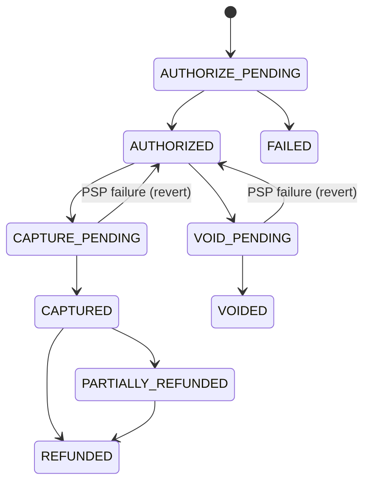
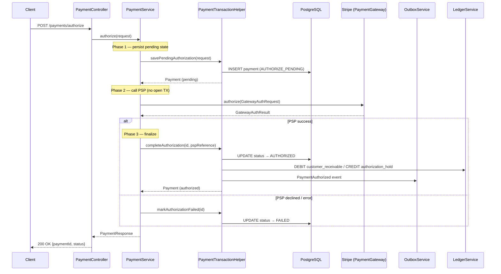
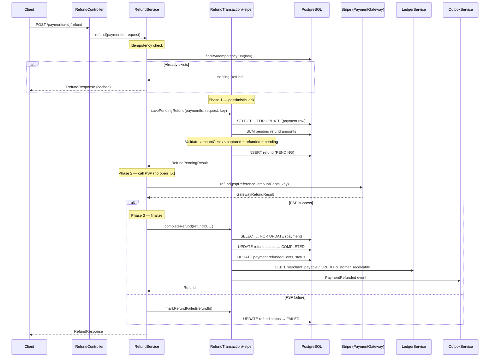
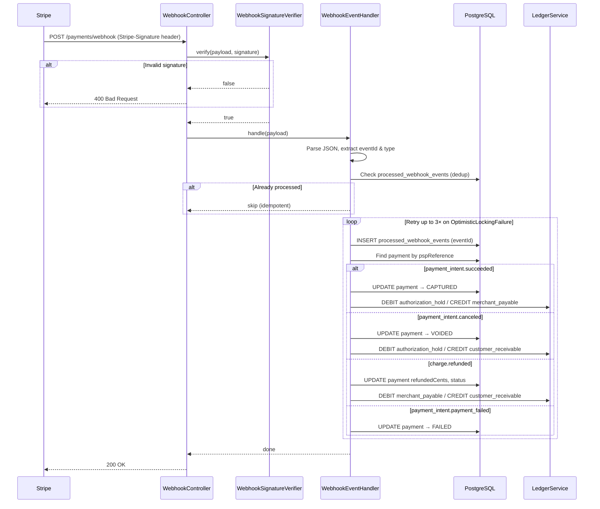
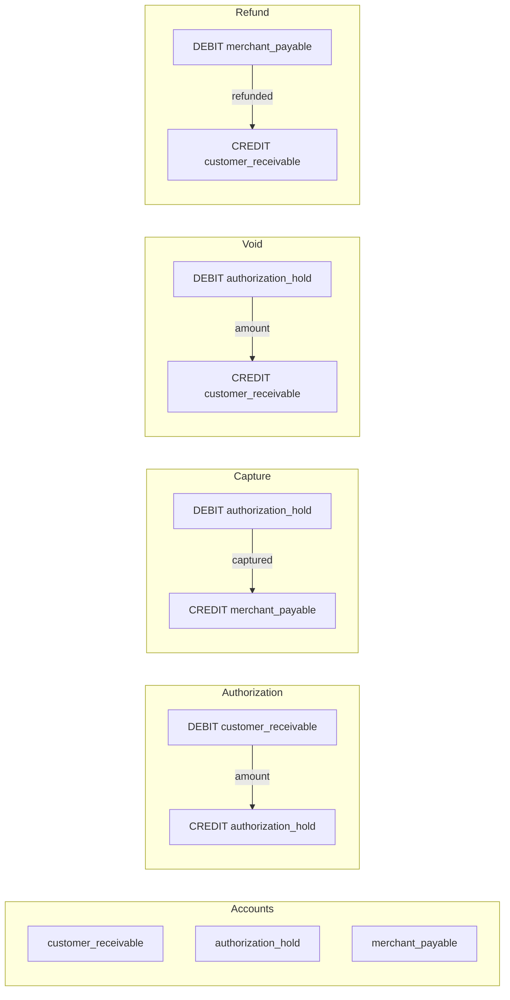
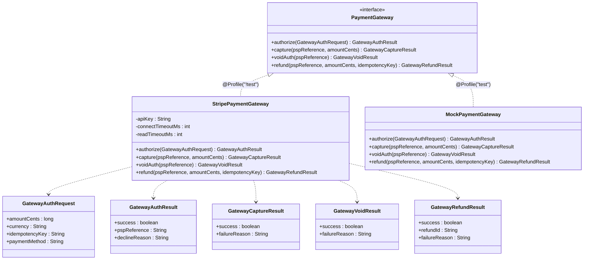
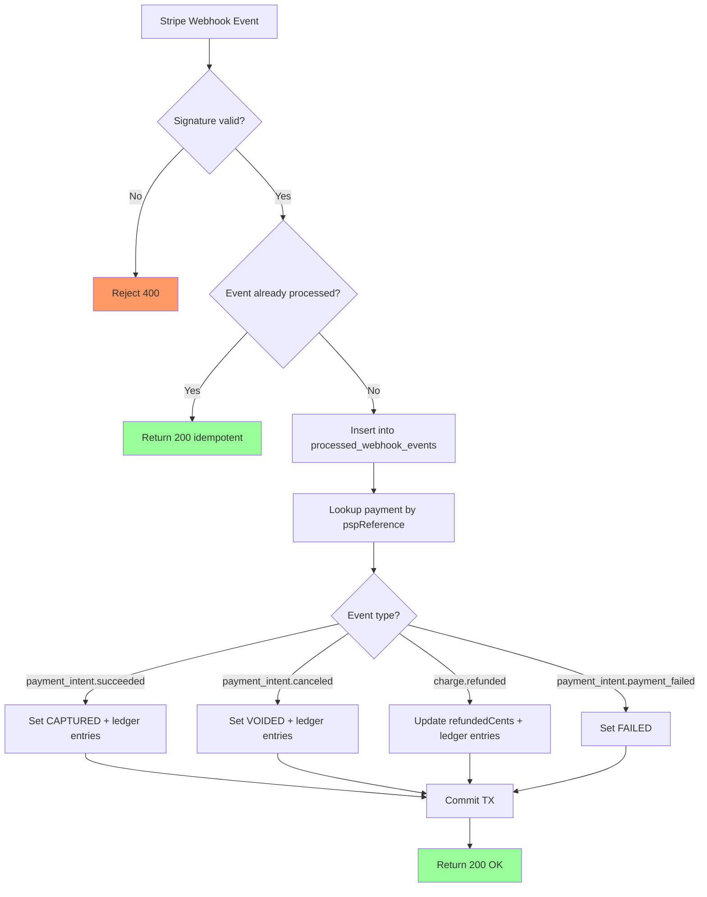
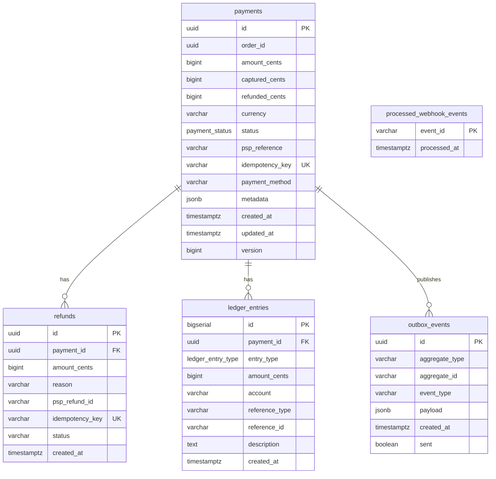

# Payment Service

Handles payment authorization, capture, void, refunds, double-entry ledger bookkeeping, and webhook processing for the InstaCommerce platform. Integrates with **Stripe** as the Payment Service Provider (PSP) and uses the **transactional outbox pattern** for reliable event publishing to Kafka.

## Tech Stack

| Layer | Technology |
|---|---|
| Runtime | Java 21, Spring Boot |
| Database | PostgreSQL (Flyway migrations) |
| Messaging | Kafka (`payment.events` / `payments.events`) via outbox relay |
| PSP | Stripe (`stripe-java 24.18.0`) |
| Auth | JWT (RS256), internal service tokens |
| Observability | Micrometer → OpenTelemetry (traces + metrics), Prometheus, structured JSON logs |
| Scheduling | ShedLock (distributed locking for cron jobs) |
| Testing | JUnit 5, Testcontainers (PostgreSQL) |

---

## High-Level Design (HLD)

The payment service owns authorization, capture, void, refund, ledger, and webhook application for the money path. The state machine below is the top-level HLD view of how payment intent state progresses across synchronous PSP calls and asynchronous webhook completion.

## 1. Payment State Machine



Every mutation that calls the external PSP follows a three-phase pattern:

1. **Save pending state** in a `REQUIRES_NEW` transaction.
2. **Call PSP** outside any transaction (network I/O).
3. **Complete or revert** in another `REQUIRES_NEW` transaction.

This prevents long-held database locks during external calls and ensures the payment always has a valid persisted state even if the process crashes mid-flow.

---

## 2. Payment Authorization Flow



**Idempotency:** If a request arrives with an `idempotencyKey` that already exists, the service returns the existing payment without calling Stripe again. A mismatch on `orderId` or `amountCents` raises `DuplicatePaymentException`.

**Key normalization:** Idempotency keys are trimmed and, if longer than 64 characters (the `VARCHAR(64)` column limit), deterministically compressed to a 64-character lowercase hex SHA-256 digest. This is transparent to callers — they submit raw keys and the service normalizes internally. See `IdempotencyKeys.normalize()` for the implementation.

---

## 3. Refund Flow



The pessimistic `SELECT ... FOR UPDATE` on the payment row during Phase 1 prevents concurrent refund requests from exceeding the captured amount. Pending (in-flight) refunds are summed and subtracted from the available balance.

---

## 4. Webhook Processing Flow



**Signature verification** uses HMAC-SHA256 with a configurable tolerance window (default 300 s). **Deduplication** is two-layered: a pre-check before the transaction, then a unique-constraint insert inside the transaction to handle concurrent delivery.

---

## 5. Double-Entry Ledger Model

Every financial operation records balanced debit/credit pairs so that `SUM(debits) = SUM(credits)` always holds.



| Event | Debit Account | Credit Account | Reference Type |
|---|---|---|---|
| Authorization | `customer_receivable` | `authorization_hold` | `AUTHORIZATION` |
| Capture | `authorization_hold` | `merchant_payable` | `CAPTURE` |
| Void | `authorization_hold` | `customer_receivable` | `VOID` |
| Refund | `merchant_payable` | `customer_receivable` | `REFUND` |

All ledger writes run within `Propagation.MANDATORY` — they must participate in the caller's transaction, ensuring atomicity with the payment state change.

---

## 6. PSP Integration Architecture



**Stripe mapping:**

| Gateway Method | Stripe API |
|---|---|
| `authorize` | `PaymentIntent.create` with `capture_method=manual` |
| `capture` | `PaymentIntent.capture` (with `amount_to_capture`) |
| `voidAuth` | `PaymentIntent.cancel` |
| `refund` | `Refund.create` |

Idempotency keys are forwarded to Stripe's `RequestOptions` so retries are safe. Timeouts are configurable via `stripe.connect-timeout-ms` and `stripe.read-timeout-ms`.

---

## 7. Reconciliation Flow



Webhooks act as the reconciliation mechanism — if the service's own capture/void/refund call succeeds at Stripe but the Phase 3 DB update fails (e.g., process crash), the subsequent Stripe webhook will bring the local state back into sync. The `@Version` optimistic lock on `Payment` combined with retry logic (up to 3 attempts with exponential backoff) handles concurrent webhook + API mutations safely.

---

## 8. API Reference

### Payment Endpoints

| Method | Path | Description | Auth | Request Body |
|---|---|---|---|---|
| `POST` | `/payments/authorize` | Create & authorize a payment | JWT | `AuthorizeRequest` |
| `POST` | `/payments/{id}/capture` | Capture an authorized payment | JWT | `CaptureRequest` (optional) |
| `POST` | `/payments/{id}/void` | Void an authorized payment | JWT | — |
| `GET` | `/payments/{id}` | Get payment details | JWT | — |
| `POST` | `/payments/{id}/refund` | Refund a captured payment | JWT | `RefundRequest` |
| `POST` | `/payments/webhook` | Stripe webhook receiver | Stripe-Signature | Raw JSON payload |

### Request / Response DTOs

**AuthorizeRequest**
```json
{
  "orderId": "uuid",
  "amountCents": 10000,
  "currency": "INR",
  "idempotencyKey": "unique-key",
  "paymentMethod": "pm_card_visa"
}
```

**CaptureRequest** (optional — omit to capture full authorized amount)
```json
{
  "amountCents": 5000
}
```

**RefundRequest**
```json
{
  "amountCents": 3000,
  "reason": "Customer requested",
  "idempotencyKey": "<idempotency-key>"
}
```

**PaymentResponse**
```json
{
  "paymentId": "uuid",
  "status": "AUTHORIZED"
}
```

**RefundResponse**
```json
{
  "refundId": "uuid",
  "status": "COMPLETED",
  "amountCents": 3000
}
```

### Error Response

```json
{
  "code": "PAYMENT_NOT_FOUND",
  "message": "Payment not found: <id>",
  "traceId": "abc123",
  "details": []
}
```

---

## 9. Database Schema

Managed by Flyway migrations (`V1` – `V8`). Schema uses PostgreSQL custom enum types.

### `payments`

```sql
CREATE TABLE payments (
    id              UUID PRIMARY KEY DEFAULT gen_random_uuid(),
    order_id        UUID            NOT NULL,
    amount_cents    BIGINT          NOT NULL,
    captured_cents  BIGINT          NOT NULL DEFAULT 0,
    refunded_cents  BIGINT          NOT NULL DEFAULT 0,
    currency        VARCHAR(3)      NOT NULL DEFAULT 'INR',
    status          payment_status  NOT NULL,  -- enum: AUTHORIZE_PENDING, AUTHORIZED, CAPTURE_PENDING, CAPTURED, VOID_PENDING, VOIDED, PARTIALLY_REFUNDED, REFUNDED, FAILED
    psp_reference   VARCHAR(255),
    idempotency_key VARCHAR(64)     NOT NULL UNIQUE,
    payment_method  VARCHAR(50),
    metadata        JSONB,
    created_at      TIMESTAMPTZ     NOT NULL DEFAULT now(),
    updated_at      TIMESTAMPTZ     NOT NULL DEFAULT now(),
    version         BIGINT          NOT NULL DEFAULT 0      -- optimistic locking
);
-- Indexes: idx_payments_order (order_id), idx_payments_psp (psp_reference)
-- Constraints: chk_amount_positive, chk_refund_le_captured
```

### `refunds`

```sql
CREATE TABLE refunds (
    id              UUID PRIMARY KEY DEFAULT gen_random_uuid(),
    payment_id      UUID        NOT NULL REFERENCES payments(id),
    amount_cents    BIGINT      NOT NULL,
    reason          VARCHAR(255),
    psp_refund_id   VARCHAR(255),
    idempotency_key VARCHAR(64) NOT NULL UNIQUE,
    status          VARCHAR(20) NOT NULL DEFAULT 'PENDING',  -- PENDING, COMPLETED, FAILED
    created_at      TIMESTAMPTZ NOT NULL DEFAULT now()
);
-- Index: idx_refunds_payment (payment_id)
```

### `ledger_entries`

```sql
CREATE TABLE ledger_entries (
    id              BIGSERIAL PRIMARY KEY,
    payment_id      UUID              NOT NULL REFERENCES payments(id),
    entry_type      ledger_entry_type NOT NULL,  -- enum: DEBIT, CREDIT
    amount_cents    BIGINT            NOT NULL,
    account         VARCHAR(50)       NOT NULL,  -- customer_receivable | authorization_hold | merchant_payable
    reference_type  VARCHAR(30)       NOT NULL,  -- AUTHORIZATION | CAPTURE | VOID | REFUND
    reference_id    VARCHAR(255),
    description     TEXT,
    created_at      TIMESTAMPTZ       NOT NULL DEFAULT now()
);
-- Index: idx_ledger_payment (payment_id)
```

### `processed_webhook_events`

```sql
CREATE TABLE processed_webhook_events (
    event_id     VARCHAR(255) PRIMARY KEY,
    processed_at TIMESTAMPTZ  NOT NULL DEFAULT now()
);
```

### `outbox_events`

```sql
CREATE TABLE outbox_events (
    id             UUID PRIMARY KEY DEFAULT gen_random_uuid(),
    aggregate_type VARCHAR(50)  NOT NULL,
    aggregate_id   VARCHAR(255) NOT NULL,
    event_type     VARCHAR(50)  NOT NULL,   -- PaymentAuthorized | PaymentCaptured | PaymentVoided | PaymentRefunded
    payload        JSONB        NOT NULL,
    created_at     TIMESTAMPTZ  NOT NULL DEFAULT now(),
    sent           BOOLEAN      NOT NULL DEFAULT false
);
-- Partial index: idx_outbox_unsent WHERE sent = false
```

### ER Diagram



---

## Low-Level Design (LLD)

## Key Components

| Component | Package | Responsibility |
|---|---|---|
| `PaymentController` | `controller` | REST endpoints for authorize, capture, void, get |
| `RefundController` | `controller` | REST endpoint for refunds |
| `WebhookController` | `controller` | Stripe webhook ingestion |
| `PaymentService` | `service` | Orchestrates the 3-phase payment lifecycle |
| `RefundService` | `service` | Orchestrates the 3-phase refund lifecycle |
| `LedgerService` | `service` | Double-entry bookkeeping (always within caller's TX) |
| `OutboxService` | `service` | Writes domain events to the outbox table (within caller's TX) |
| `PaymentTransactionHelper` | `service` | `REQUIRES_NEW` transaction boundaries for payment ops |
| `RefundTransactionHelper` | `service` | `REQUIRES_NEW` transaction boundaries for refund ops (with pessimistic lock) |
| `PaymentGateway` | `gateway` | Interface abstracting PSP calls |
| `StripePaymentGateway` | `gateway` | Stripe implementation (`@Profile("!test")`) |
| `MockPaymentGateway` | `gateway` | In-memory stub for tests (`@Profile("test")`) |
| `WebhookSignatureVerifier` | `webhook` | HMAC-SHA256 signature + timestamp verification |
| `WebhookEventHandler` | `webhook` | Parses and applies webhook events with dedup + retry |
| `OutboxCleanupJob` | `service` | Scheduled purge of sent outbox events (ShedLock) |

---

## Configuration

Key environment variables (see `application.yml`):

| Variable | Default | Description |
|---|---|---|
| `SERVER_PORT` | `8086` | HTTP port |
| `PAYMENT_DB_URL` | `jdbc:postgresql://localhost:5432/payments` | Database JDBC URL |
| `PAYMENT_DB_USER` | `postgres` | Database username |
| `PAYMENT_DB_PASSWORD` | — | Database password (or via Secret Manager) |
| `STRIPE_API_KEY` | — | Stripe secret key |
| `STRIPE_WEBHOOK_SECRET` | — | Stripe webhook signing secret |
| `STRIPE_CONNECT_TIMEOUT_MS` | `5000` | Stripe connection timeout |
| `STRIPE_READ_TIMEOUT_MS` | `15000` | Stripe read timeout |
| `PAYMENT_JWT_ISSUER` | `instacommerce-identity` | Expected JWT issuer |
| `PAYMENT_JWT_PUBLIC_KEY` | — | RSA public key for JWT verification |
| `INTERNAL_SERVICE_TOKEN` | `dev-internal-token-change-in-prod` | Service-to-service auth token |

---

## Running Locally

```bash
# Start PostgreSQL
docker run -d --name payments-db -e POSTGRES_DB=payments -e POSTGRES_PASSWORD=postgres -p 5432:5432 postgres:16

# Run the service
./gradlew :services:payment-service:bootRun
```

The server starts on port **8086** by default. Flyway runs migrations automatically on startup (`spring.jpa.hibernate.ddl-auto=validate`).

## Testing

```bash
./gradlew :services:payment-service:test
```

## OrderCancelled Consumer (Choreography)

When enabled, payment-service consumes `OrderCancelled` events from the `orders.events` Kafka topic and automatically initiates the appropriate fund-release action based on the current payment state.

### Void-vs-Refund Behavior by Payment State

| Payment State at Event Time | Action | Ledger Effect | Outbox Event |
|---|---|---|---|
| `AUTHORIZED` | **Void** — cancel the authorization hold at Stripe | DEBIT `authorization_hold` / CREDIT `customer_receivable` | `PaymentVoided` |
| `CAPTURED` / `PARTIALLY_REFUNDED` | **Full refund** — refund the captured amount minus any already-refunded amount | DEBIT `merchant_payable` / CREDIT `customer_receivable` | `PaymentRefunded` |
| `VOIDED` / `REFUNDED` / `FAILED` | **No-op** — already terminal, log and skip | — | — |
| `paymentId` missing / blank | **No-op** — cancellation happened before a payment was assigned, so no financial action is required | — | — |
| `AUTHORIZE_PENDING` / `CAPTURE_PENDING` / `VOID_PENDING` | **Retry, then dead-letter** — the listener retries briefly and moves the record to `<topic>.DLT` if the payment never leaves the in-flight state | — | — |

The consumer uses the same three-phase pattern (pending state → PSP call → complete/revert) and idempotency guarantees as the REST-driven void and refund flows documented above. The `paymentId` carried in the `OrderCancelled` payload is used to identify the payment record; malformed payloads, malformed `paymentId` values, and unrecoverable processing failures are routed to the Kafka dead-letter topic instead of being silently dropped or guessed from `orderId`.

### Consumer Configuration

| Variable | Default | Description |
|---|---|---|
| `PAYMENT_CHOREOGRAPHY_ORDER_CANCELLED_CONSUMER_ENABLED` | `false` | Feature gate — set to `true` to activate the consumer |
| `PAYMENT_CHOREOGRAPHY_ORDER_CANCELLED_TOPIC` | `orders.events` | Kafka topic to consume |
| `PAYMENT_CHOREOGRAPHY_ORDER_CANCELLED_CONSUMER_GROUP` | `payment-service-order-cancelled` | Kafka consumer group ID |

The consumer is **off by default** in base and production Helm values and **on in dev** to allow integration testing before wider rollout.

---

## Rollout and Rollback

- stage PSP, webhook, and ledger changes behind compatibility windows because payment mutations are money-path critical
- monitor duplicate authorizations, refund failures, webhook lag, and reconciliation divergence during rollout
- roll back application code before touching additive schema changes; keep idempotency records and ledger history intact for investigation

### OrderCancelled Consumer Rollout

1. **Enable in dev** — `PAYMENT_CHOREOGRAPHY_ORDER_CANCELLED_CONSUMER_ENABLED: "true"` is already set in `values-dev.yaml`. Validate void and refund paths with test cancellations.
2. **Enable in prod** — flip `PAYMENT_CHOREOGRAPHY_ORDER_CANCELLED_CONSUMER_ENABLED` to `"true"` in `values-prod.yaml` once dev validation is complete and monitoring confirms no anomalies.
3. **Rollback** — set the flag back to `"false"` and redeploy. The consumer stops processing new events; any in-flight PSP call completes normally via the existing three-phase pattern. Kafka consumer offsets are retained, so re-enabling will resume from the last committed offset.
4. **Monitoring** — watch for: increased void/refund error rates, ledger imbalance alerts, consumer lag on the `orders.events` topic, growth in `orders.events.DLT`, and Stripe webhook reconciliation mismatches.

---

## Known Limitations

- the OrderCancelled consumer does not yet handle partial-capture scenarios where only a subset of the authorized amount was captured; it issues a full refund of `capturedCents − refundedCents`
- if a cancellation event arrives while authorization, capture, or void processing is still in flight (`AUTHORIZE_PENDING`, `CAPTURE_PENDING`, `VOID_PENDING`), the listener retries briefly and then dead-letters the event for manual investigation rather than forcing recovery inline
- the current contract upgrade keeps `paymentId` additive in `OrderCancelled.v1.json`, so producer-side tests or a future `v2` schema should eventually make the field mandatory for cancellations that are expected to trigger a refund or void
- refund choreography and durable reconciliation hardening are still active follow-up areas from the iter3 money-path review
- shared internal-token posture remains weaker than workload-identity-based service auth and should continue to be treated as an improvement target
