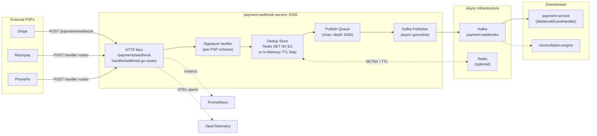
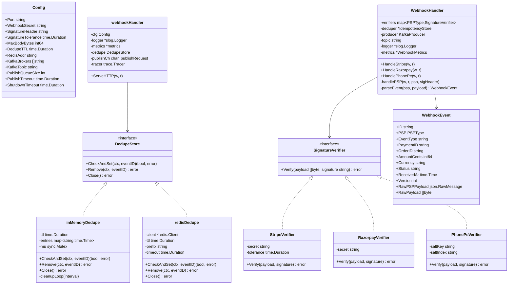
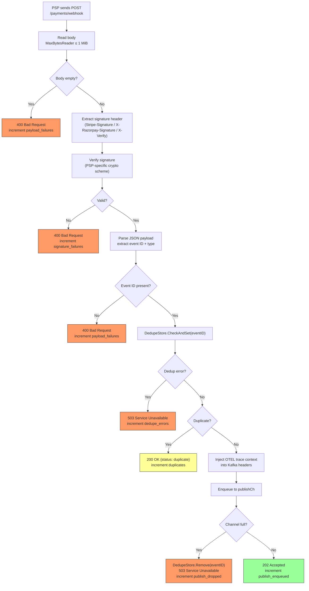
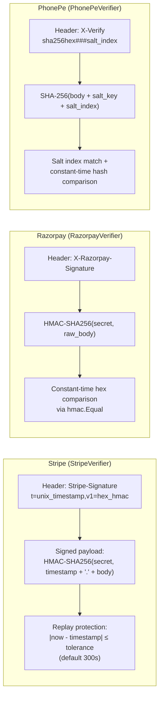
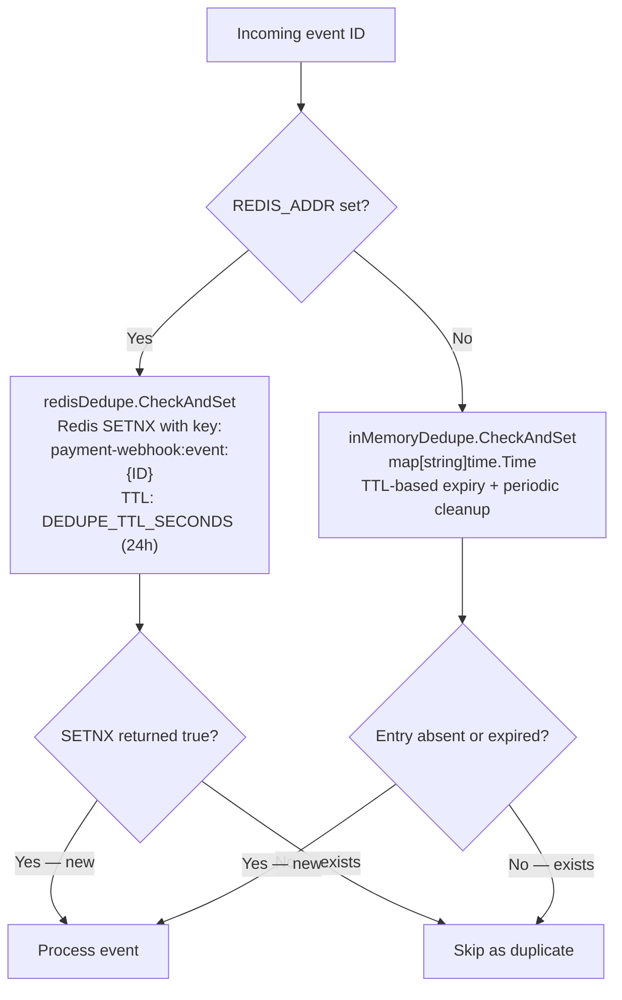

# Payment Webhook Service

> **Go · Multi-PSP Webhook Ingestion Gateway — Signature Verification, Deduplication & Kafka Publication**

Stateless, single-purpose ingestion service that receives webhook callbacks from external Payment
Service Providers (Stripe, Razorpay, PhonePe), verifies cryptographic signatures using PSP-specific
schemes, deduplicates events via Redis `SET NX EX` or an in-memory TTL map, and publishes
PSP-agnostic canonical events to the `payment.webhooks` Kafka topic. Downstream, `payment-service`
consumes these events and reconciles internal payment state.

This service owns **no persistence** — durability is delegated entirely to Kafka. It is designed to
be horizontally scalable behind a load balancer, with the caveat that the in-memory dedup store
provides single-instance-only idempotency (see [Known Limitations](#known-limitations)).

---

## Table of Contents

1. [Service Role & Boundaries](#service-role--boundaries)
2. [High-Level Design](#high-level-design)
3. [Low-Level Design](#low-level-design)
4. [Webhook Ingestion Flow](#webhook-ingestion-flow)
5. [Multi-PSP Signature Verification](#multi-psp-signature-verification)
6. [Deduplication Strategy](#deduplication-strategy)
7. [Event Publication & Kafka Integration](#event-publication--kafka-integration)
8. [Project Structure](#project-structure)
9. [API Reference](#api-reference)
10. [Configuration](#configuration)
11. [Dependencies](#dependencies)
12. [Observability](#observability)
13. [Testing](#testing)
14. [Failure Modes & Recovery](#failure-modes--recovery)
15. [Rollout & Rollback Notes](#rollout--rollback-notes)
16. [Known Limitations](#known-limitations)
17. [Q-Commerce Pattern Comparison](#q-commerce-pattern-comparison)

---

## Service Role & Boundaries

| Concern | Owner |
|---|---|
| PSP callback ingestion, signature verification | **This service** |
| At-most-once dedup within a single node (in-memory) or across nodes (Redis) | **This service** |
| Kafka publication to `payment.webhooks` | **This service** |
| Payment state machine transitions upon webhook receipt | `payment-service` (consumer of `payment.webhooks`) |
| Durable cross-node dedup after Kafka consumption | `payment-service` (`processed_webhook_events` table) |
| Reconciliation of PSP state vs internal ledger | `reconciliation-engine` |

**What this service does NOT own:** payment persistence, order lifecycle, refund execution,
or any direct database writes. It is a pure ingestion-and-relay gateway.

---

## High-Level Design



### Design Principles

- **Stateless & disposable** — no local persistence; restarts lose only in-flight queue items.
- **Fast ACK to PSPs** — signature check + dedup + channel enqueue on the hot path; Kafka write is
  async via a background goroutine. PSPs receive `202 Accepted` before the Kafka write completes.
- **Fail-safe backpressure** — if the publish channel is full, the dedup entry is removed and `503`
  is returned, allowing the PSP to retry and avoiding silent event loss.

---

## Low-Level Design

### Component Diagram



### Dual Handler Layers

The service contains **two handler implementations** that coexist:

| Layer | File | PSP Support | Dedup Backend | Kafka Pattern |
|---|---|---|---|---|
| `main.go` `webhookHandler` | `main.go` | Stripe only (configurable `SignatureHeader`) | `DedupeStore` interface (Redis or in-memory) | Async channel → background `runPublisher` goroutine |
| `handler/` `WebhookHandler` | `handler/webhook.go` | Stripe, Razorpay, PhonePe via `SignatureVerifier` interface | `IdempotencyStore` (in-memory TTL map with `maxSize` eviction) | Synchronous `KafkaProducer.Publish()` call |

The `main.go` handler is wired to the HTTP mux at `/payments/webhook`. The `handler/` package
provides the multi-PSP abstraction with pluggable verifiers and is designed for integration via
separate route registration (e.g., `/webhooks/stripe`, `/webhooks/razorpay`, `/webhooks/phonepe`).

---

## Webhook Ingestion Flow



### Key design decisions in this flow

1. **Dedup entry removal on queue-full** (`main.go:648`) — if the publish channel cannot accept the
   message, the dedup entry is explicitly removed so the PSP retry will be treated as a new event
   rather than silently discarded as a duplicate.
2. **Async Kafka write** — the `202` response is returned before Kafka acknowledgement. The
   background `runPublisher` goroutine drains the channel with a per-message timeout
   (`PUBLISH_TIMEOUT_MS`, default 2s).
3. **OTEL trace propagation** — W3C `traceparent`/`tracestate` headers are injected into Kafka
   message headers via `kafkaHeaderCarrier`, enabling end-to-end distributed traces from PSP
   callback through to `payment-service` consumption.

---

## Multi-PSP Signature Verification

Each PSP uses a distinct cryptographic scheme. The `handler/verify.go` file implements the
`SignatureVerifier` interface per PSP. The `main.go` handler uses its own inline Stripe verification.



| PSP | Algorithm | Replay Protection | Header |
|---|---|---|---|
| Stripe | HMAC-SHA256 over `"<timestamp>.<body>"` | Timestamp tolerance (configurable, default 5 min) | `Stripe-Signature` |
| Razorpay | HMAC-SHA256 over raw body | None (relies on HTTPS + IP allowlisting) | `X-Razorpay-Signature` |
| PhonePe | SHA-256 over `body + saltKey + saltIndex` | Salt index validation | `X-Verify` |

---

## Deduplication Strategy



| Backend | Scope | Failure Mode | Production Suitability |
|---|---|---|---|
| Redis (`SETNX`) | Cross-instance | Redis unavailable → `503` to PSP (safe retry) | ✅ Recommended for multi-instance deployments |
| In-memory map | Single instance | Process restart → dedup window lost; multi-instance → duplicate Kafka messages | ⚠️ Dev/test or single-replica only |

The `handler/dedup.go` `IdempotencyStore` adds a `maxSize` cap with oldest-entry eviction to
prevent unbounded memory growth. The `main.go` in-memory store uses only TTL-based expiry with
periodic cleanup (every `DEDUPE_CLEANUP_SECONDS`).

**Important:** Even when dedup misses a duplicate (e.g., after restart), `payment-service` has a
durable `processed_webhook_events` table that provides a second layer of idempotency at the consumer
side.

---

## Event Publication & Kafka Integration

### Canonical Event Schema (`WebhookEvent`)

Published to topic `payment.webhooks` with `event.ID` as the Kafka message key (ensures
per-event ordering within a partition).

**Schema version 2** (current) — additive extension of v1. The `schema_version` and
`raw_psp_payload` fields are absent in legacy v1 messages, so existing consumers that do
not reference them are unaffected.

```json
{
  "id": "evt_1234",
  "psp": "stripe",
  "event_type": "payment_intent.succeeded",
  "payment_id": "pi_5678",
  "order_id": "ord-abc",
  "amount_cents": 4999,
  "currency": "usd",
  "status": "succeeded",
  "received_at": "2025-01-15T10:30:00Z",
  "schema_version": 2,
  "raw_psp_payload": { "id": "evt_1234", "type": "payment_intent.succeeded", "data": { "..." : "..." } }
}
```

| Field | Since | Description |
|---|---|---|
| `schema_version` | v2 | Integer; absent / 0 in v1 messages. Consumers can branch on this. |
| `raw_psp_payload` | v2 | Verbatim JSON body received from the PSP, embedded as-is (not base64). Use this when canonical fields are too lossy (e.g. refund evidence, dispute metadata). Absent if the payload could not be captured. |

**Kafka headers** injected per message:
- `event_id` — PSP event identifier
- `event_type` — e.g., `payment_intent.succeeded`
- W3C trace context (`traceparent`, `tracestate`) — propagated from the inbound HTTP request via OTEL

### Writer Configuration (`main.go`)

| Setting | Value |
|---|---|
| Balancer | `LeastBytes` |
| Required Acks | `RequireOne` (leader ack) |
| Async | `true` (batched writes) |
| Batch Timeout | `5ms` |

### Downstream Consumers

| Consumer | Purpose | Reference |
|---|---|---|
| `payment-service` (`WebhookEventHandler`) | Reconcile internal payment state; INSERT into `processed_webhook_events` for durable dedup | `docs/reviews/iter3/diagrams/sequence-checkout-payment.md` §6 |
| `reconciliation-engine` | Batch compare PSP exports vs internal ledger | `docs/reviews/iter3/diagrams/lld/checkout-order-payment.md` §4 |

---

## Project Structure

```
payment-webhook-service/
├── main.go                 # HTTP server, Config, Stripe signature verify,
│                           # in-memory/Redis DedupeStore, async Kafka publisher,
│                           # OTEL tracing init, graceful shutdown, readiness checks
├── handler/
│   ├── webhook.go          # Multi-PSP WebhookHandler — routes Stripe/Razorpay/PhonePe
│   │                       # through SignatureVerifier → IdempotencyStore → KafkaProducer
│   ├── verify.go           # SignatureVerifier interface + StripeVerifier, RazorpayVerifier,
│   │                       # PhonePeVerifier implementations
│   ├── dedup.go            # IdempotencyStore — in-memory TTL map with maxSize eviction
│   ├── metrics.go          # WebhookMetrics — Prometheus counters/histograms per PSP
│   └── webhook_transport_test.go  # Transport contract tests for Kafka event envelope
├── Dockerfile              # Multi-stage build: golang:1.22-alpine → alpine:3.20, non-root user
├── go.mod                  # Go 1.23, module: github.com/instacommerce/payment-webhook-service
└── go.sum
```

---

## API Reference

### `POST /payments/webhook`

Primary webhook endpoint (wired in `main.go`). Stripe-focused with configurable `WEBHOOK_SIGNATURE_HEADER`.

**Headers:** `Stripe-Signature: t=<unix_timestamp>,v1=<hex_hmac>`

**Responses:**

| Status | Body | Meaning |
|---|---|---|
| `202 Accepted` | `{"status":"accepted","event_id":"evt_xxx"}` | Enqueued for async Kafka publish |
| `200 OK` | `{"status":"duplicate","event_id":"evt_xxx","duplicate":true}` | Already seen within dedup TTL |
| `400 Bad Request` | `{"error":"..."}` | Invalid signature, empty payload, missing event ID |
| `405 Method Not Allowed` | `{"error":"method not allowed"}` | Non-POST request |
| `413 Request Entity Too Large` | `{"error":"request body too large"}` | Body exceeds `MAX_BODY_BYTES` |
| `503 Service Unavailable` | `{"error":"..."}` | Queue full, Kafka not configured, webhook secret missing, dedup unavailable |

### Handler Layer Endpoints (`handler/webhook.go`)

| Method | PSP | Signature Header | Route (when wired) |
|---|---|---|---|
| `HandleStripe()` | Stripe | `Stripe-Signature` | `/webhooks/stripe` |
| `HandleRazorpay()` | Razorpay | `X-Razorpay-Signature` | `/webhooks/razorpay` |
| `HandlePhonePe()` | PhonePe | `X-Verify` | `/webhooks/phonepe` |

### Operational Endpoints

| Endpoint | Method | Description |
|---|---|---|
| `GET /health` | GET, HEAD | Liveness probe — always returns `{"status":"ok"}` |
| `GET /health/live` | GET, HEAD | Alias for `/health` |
| `GET /ready` | GET, HEAD | Readiness probe — checks webhook secret configured, Kafka writer present, Redis PING (if configured) |
| `GET /health/ready` | GET, HEAD | Alias for `/ready` |
| `GET /metrics` | GET | Prometheus metrics scrape endpoint (`promhttp.Handler()`) |

---

## Configuration

All configuration is environment-variable driven (`main.go:loadConfig()`). No config files.

| Variable | Default | Description |
|---|---|---|
| `PORT` / `SERVER_PORT` | `8106` | HTTP listen port |
| `WEBHOOK_SECRET` / `STRIPE_WEBHOOK_SECRET` | — (required) | PSP webhook signing secret |
| `WEBHOOK_SIGNATURE_HEADER` | `Stripe-Signature` | Signature header name for `main.go` handler |
| `WEBHOOK_TOLERANCE_SECONDS` | `300` | Max signature age in seconds (Stripe replay protection) |
| `MAX_BODY_BYTES` | `1048576` (1 MiB) | Max request body size |
| `DEDUPE_TTL_SECONDS` | `86400` (24h) | Deduplication window |
| `DEDUPE_CLEANUP_SECONDS` | `60` | In-memory expired-entry cleanup interval |
| `REDIS_ADDR` | — (optional) | Redis address; enables Redis-backed dedup when set |
| `REDIS_PASSWORD` | — | Redis password |
| `REDIS_DB` | `0` | Redis database index |
| `REDIS_TIMEOUT_MS` | `50` | Redis dial/read/write timeout |
| `KAFKA_BROKERS` | — (required) | Comma/semicolon/space-separated Kafka broker list |
| `KAFKA_TOPIC` | `payment.webhooks` | Kafka destination topic |
| `PUBLISH_QUEUE_SIZE` | `1000` | Async publish channel buffer depth |
| `PUBLISH_TIMEOUT_MS` | `2000` | Per-message Kafka write timeout |
| `SHUTDOWN_TIMEOUT_SECONDS` | `15` | Graceful shutdown timeout for HTTP server + publisher drain |
| `LOG_LEVEL` | `info` | Log level (`debug`, `info`, `warn`, `error`) |
| `OTEL_EXPORTER_OTLP_ENDPOINT` | — | OTLP HTTP endpoint for distributed tracing |
| `OTEL_EXPORTER_OTLP_TRACES_ENDPOINT` | — | Override for traces-specific OTLP endpoint |

**Hardcoded HTTP server timeouts** (`main.go`):

| Timeout | Value |
|---|---|
| `ReadHeaderTimeout` | 5s |
| `ReadTimeout` | 10s |
| `WriteTimeout` | 10s |
| `IdleTimeout` | 60s |

---

## Dependencies

| Dependency | Version | Purpose |
|---|---|---|
| Go | 1.23 (`go.mod`), Dockerfile uses 1.22-alpine | Runtime |
| `github.com/segmentio/kafka-go` | v0.4.47 | Kafka producer (async writer with `LeastBytes` balancer) |
| `github.com/redis/go-redis/v9` | v9.5.1 | Redis-backed dedup via `SETNX` with TTL |
| `github.com/prometheus/client_golang` | v1.19.0 | Prometheus metrics registration and HTTP handler |
| `go.opentelemetry.io/otel` | v1.24.0 | Distributed tracing (SDK, OTLP HTTP exporter, `net/http` instrumentation) |
| `go.opentelemetry.io/contrib/instrumentation/net/http/otelhttp` | v0.49.0 | Automatic HTTP handler span creation |

No external service SDKs (Stripe SDK, Razorpay SDK, etc.) — signature verification is implemented
from first principles using `crypto/hmac` and `crypto/sha256` from the Go standard library.

---

## Observability

### Metrics (`main.go`)

Registered on the default `prometheus.DefaultRegisterer`. Scraped at `GET /metrics`.

| Metric | Type | Labels | Description |
|---|---|---|---|
| `payment_webhook_requests_total` | Counter | `endpoint`, `status` | Total HTTP requests by endpoint and status code |
| `payment_webhook_request_duration_seconds` | Histogram | `endpoint` | Request latency (buckets: 1ms–1s) |
| `payment_webhook_signature_failures_total` | Counter | — | Signature verification failures |
| `payment_webhook_payload_failures_total` | Counter | — | Payload decode / empty body failures |
| `payment_webhook_duplicates_total` | Counter | — | Duplicate events skipped by dedup store |
| `payment_webhook_dedupe_errors_total` | Counter | — | Dedup store errors (Redis timeout, etc.) |
| `payment_webhook_publish_enqueued_total` | Counter | — | Events successfully enqueued to publish channel |
| `payment_webhook_publish_dropped_total` | Counter | — | Events dropped due to full publish channel |
| `payment_webhook_publish_success_total` | Counter | — | Events successfully written to Kafka |
| `payment_webhook_publish_errors_total` | Counter | — | Kafka write failures |
| `payment_webhook_publish_queue_depth` | Gauge | — | Current publish channel occupancy |

### Metrics (`handler/metrics.go`)

Registered via caller-provided `prometheus.Registerer`. Used by the multi-PSP `WebhookHandler`.

| Metric | Type | Labels | Description |
|---|---|---|---|
| `payment_webhook_events_received_total` | Counter | `psp`, `event_type` | Raw webhook requests by PSP |
| `payment_webhook_events_processed_total` | Counter | `psp`, `event_type` | Successfully processed events |
| `payment_webhook_events_duplicate_total` | Counter | `psp`, `event_type` | Deduplicated events by PSP |
| `payment_webhook_events_failed_total` | Counter | `psp`, `reason` | Failed events by PSP and failure reason (`read_body`, `no_verifier`, `signature`, `parse`, `marshal`, `publish`) |
| `payment_webhook_verify_latency_seconds` | Histogram | `psp` | Signature verification latency (buckets: 0.1ms–100ms) |
| `payment_webhook_process_latency_seconds` | Histogram | `psp` | End-to-end processing latency (buckets: 1ms–1s) |

### Tracing

- **Provider:** OpenTelemetry SDK with OTLP HTTP exporter, batched span export.
- **Service name:** `payment-webhook-service` (set via `semconv.ServiceName`).
- **HTTP instrumentation:** All routes wrapped with `otelhttp.NewHandler`.
- **Kafka publish spans:** Created per message in `runPublisher` with attributes:
  `messaging.system=kafka`, `messaging.destination=<topic>`, `event.id`, `event.type`.
- **Trace propagation:** W3C TraceContext + Baggage injected into Kafka message headers via
  `kafkaHeaderCarrier` implementing `propagation.TextMapCarrier`.
- **Structured logs:** JSON via `slog.NewJSONHandler`; `trace_id` and `span_id` enriched on log
  entries when a valid span context exists (`loggerWithTrace`).
- **Noop fallback:** If no `OTEL_EXPORTER_OTLP_ENDPOINT` is set, a `NoopTracerProvider` is
  installed — no overhead, no crash.

### Recommended Alerts

| Alert | Condition | Severity |
|---|---|---|
| Signature failure spike | `rate(payment_webhook_signature_failures_total[5m]) > 0.1` | Page — possible secret rotation issue or spoofed traffic |
| Publish queue saturation | `payment_webhook_publish_queue_depth > 800` | Warning — approaching backpressure threshold |
| Kafka publish errors | `rate(payment_webhook_publish_errors_total[5m]) > 0` | Page — events accepted but not reaching Kafka |
| Dedup store errors | `rate(payment_webhook_dedupe_errors_total[5m]) > 0` | Warning — Redis connectivity issues |
| High duplicate rate | `rate(payment_webhook_duplicates_total[5m]) / rate(payment_webhook_requests_total[5m]) > 0.5` | Warning — PSP may be aggressively retrying |

---

## Testing

### Build & Run Locally

```bash
# Build
cd services/payment-webhook-service
go build -o payment-webhook .

# Run (minimum viable config)
WEBHOOK_SECRET="whsec_test_secret" \
KAFKA_BROKERS="localhost:9092" \
./payment-webhook

# With Redis dedup
WEBHOOK_SECRET="whsec_test_secret" \
KAFKA_BROKERS="localhost:9092" \
REDIS_ADDR="localhost:6379" \
./payment-webhook
```

### Docker

```bash
docker build -t payment-webhook-service .
docker run -e WEBHOOK_SECRET="whsec_..." -e KAFKA_BROKERS="localhost:9092" \
  -p 8106:8106 payment-webhook-service
```

> **Note:** The Dockerfile `EXPOSE 8120` does not match the default `PORT=8106`. The service
> listens on `PORT` regardless of `EXPOSE`; ensure port mapping matches `PORT`.

### Smoke Test

```bash
# Health
curl -s http://localhost:8106/health | jq .
# {"status":"ok"}

# Readiness
curl -s http://localhost:8106/ready | jq .
# {"status":"ready"}  (or 503 if Kafka/secret not configured)

# Webhook (will fail signature unless you compute a valid HMAC)
curl -X POST http://localhost:8106/payments/webhook \
  -H "Stripe-Signature: t=$(date +%s),v1=invalid" \
  -d '{"id":"evt_test","type":"payment_intent.succeeded"}'
# {"error":"invalid signature"}
```

### Automated Tests

```bash
cd services/payment-webhook-service
go test -race ./...
go build ./...
```

Per CI (`.github/workflows/ci.yml`), the Go validation runs `go test ./...` and `go build ./...`
for each Go module triggered by path filters. Changes to `services/go-shared` trigger revalidation
of all Go modules.

---

## Failure Modes & Recovery

| Failure | Behavior | Recovery |
|---|---|---|
| **Invalid signature** | `400` returned; `signature_failures` metric incremented. PSP may retry. | Check if webhook secret was rotated; update `WEBHOOK_SECRET`. |
| **Redis unavailable at startup** | Falls back to in-memory dedup; logs error. Service starts. | Fix Redis; restart to re-establish connection. |
| **Redis unavailable at runtime** | `CheckAndSet` returns error → `503` to PSP. | PSP retries. Redis recovery auto-resumes. |
| **Kafka unavailable at startup** | `writer` is `nil`, readiness returns `503`, every webhook returns `503`. | Service is not ready; Kubernetes will not route traffic. |
| **Kafka write failure** | `publish_errors` incremented; event is lost (async, no retry in publisher). | PSP retries (gets past dedup if TTL expired or entry was cleaned). Durable reconciliation via `reconciliation-engine`. |
| **Publish queue full** | Dedup entry removed, `503` returned, `publish_dropped` incremented. | PSP retries as a fresh event. Indicates sustained Kafka latency or undersized queue. |
| **Process crash / restart** | In-memory dedup entries lost; in-flight channel items lost. | PSP retries deliver events again. `payment-service` `processed_webhook_events` provides durable dedup. |
| **OOM / body too large** | `MaxBytesReader` limits body to `MAX_BODY_BYTES` (1 MiB); returns `413`. | No action needed; malformed/oversized payloads are rejected. |

### Graceful Shutdown Sequence (`main.go`)

1. Receive `SIGINT` / `SIGTERM`.
2. `server.Shutdown(ctx)` — stop accepting new connections, drain in-flight HTTP requests.
3. `close(publishCh)` — signal publisher goroutine to stop.
4. `waitWithTimeout(&publishWg, ShutdownTimeout)` — wait for publisher to drain remaining items.
5. `writer.Close()` — flush and close Kafka writer.
6. `shutdownTracer(ctx)` — flush pending OTEL spans.

---

## Rollout & Rollback Notes

### Rolling Deploy

- The service is stateless; standard rolling deployment is safe.
- Readiness probe (`/ready`) gates traffic until webhook secret + Kafka writer are configured.
- During rollout, old and new instances may both process events — this is safe because dedup (Redis)
  and downstream `processed_webhook_events` prevent double-processing.

### Secret Rotation

1. Update `WEBHOOK_SECRET` in the secret store.
2. Rolling restart picks up new secret.
3. **Risk window:** During rotation, events signed with the old secret will fail verification on new
   instances. Stripe supports [multiple endpoint secrets](https://stripe.com/docs/webhooks/signatures)
   — but this service verifies against a single secret. Mitigation: perform rotation during low-traffic
   windows or implement dual-secret verification.

### Rollback

- Deploy previous container image. No database migrations to revert.
- If Kafka topic schema changed (unlikely — the service publishes raw PSP payloads from `main.go`
  and canonical `WebhookEvent` JSON from `handler/`), coordinate with `payment-service` consumer.

---

## Known Limitations

| # | Limitation | Severity | Mitigation / Planned Fix |
|---|---|---|---|
| L1 | **In-memory dedup is single-instance only.** Multi-replica deployment without `REDIS_ADDR` will produce duplicate Kafka messages. | HIGH | Set `REDIS_ADDR` in production. Tracked as risk R5 in `docs/reviews/iter3/diagrams/lld/checkout-order-payment.md`. |
| L2 | **Async Kafka publish with no retry.** If `writer.WriteMessages` fails, the event is lost from this service's perspective. | HIGH | PSP retry + `payment-service` `processed_webhook_events` + `reconciliation-engine` provide defense-in-depth. |
| L3 | **Single webhook secret.** No support for dual-secret rotation or per-PSP secrets in `main.go` handler (the `handler/` layer does support per-PSP secrets via separate verifier instances). | MEDIUM | Extend `main.go` to accept multiple secrets or migrate fully to `handler/` layer. |
| L4 | **`main.go` handler is Stripe-only.** Multi-PSP support exists in `handler/` package but the wired HTTP mux only registers `/payments/webhook` with Stripe verification. | MEDIUM | Wire `handler/WebhookHandler` routes for Razorpay/PhonePe endpoints. |
| L5 | **No DLQ for failed Kafka publishes.** Failed messages are logged and metric'd but not persisted. | MEDIUM | Add file-based or separate-topic DLQ for retry. |
| L6 | **Dockerfile `EXPOSE 8120` mismatches default `PORT=8106`.** Cosmetic but potentially confusing. | LOW | Update Dockerfile `EXPOSE` to match `PORT`. |
| L7 | **`handler/IdempotencyStore` uses O(n) eviction** (`evictOldestLocked` scans entire map). | LOW | Acceptable at current scale; replace with LRU or sharded map if event volume grows significantly. |

---

## Q-Commerce Pattern Comparison

The payment-webhook ingestion pattern in this service aligns with common practices in high-throughput
q-commerce/fintech systems, with some notable differences:

| Aspect | This Service | Typical Q-Commerce Pattern |
|---|---|---|
| **Ingestion isolation** | Separate Go microservice, no shared process with payment state machine | ✅ Same — webhook receivers are isolated from transaction services to avoid blast-radius coupling |
| **Signature verification** | First-principles HMAC/SHA-256, no PSP SDK dependency | ✅ Common for Go services; Java/Python services often use official SDKs |
| **Dedup layer** | Two-tier: ingestion-time (Redis/in-memory) + consumer-time (DB) | ✅ Standard — at-least-once Kafka + idempotent consumer is the norm |
| **Async publish** | Channel-buffered, fire-and-forget to Kafka (no write-ahead) | ⚠️ Some systems use a local WAL or transactional outbox to avoid event loss on crash; this service relies on PSP retry instead |
| **Multi-PSP support** | Code-complete in `handler/` but not fully wired to HTTP mux | Most Indian q-commerce platforms (Swiggy, Zepto, Blinkit) wire UPI/Razorpay/PhonePe/Paytm from day one |
| **Reconciliation** | Separate `reconciliation-engine` service (Go) | ✅ Standard — batch reconciliation as a separate concern |

*Grounding: architecture review in `docs/reviews/payment-service-review.md` and LLD in
`docs/reviews/iter3/diagrams/lld/checkout-order-payment.md`.*
