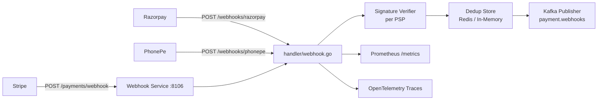
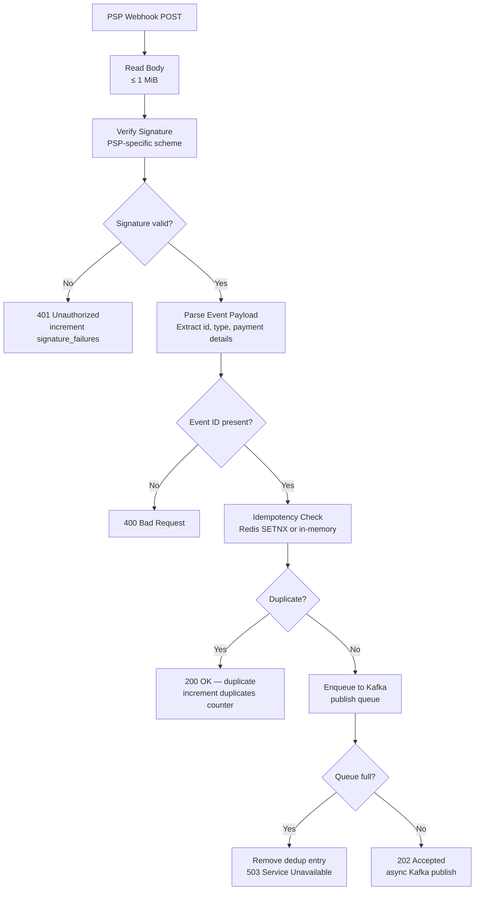
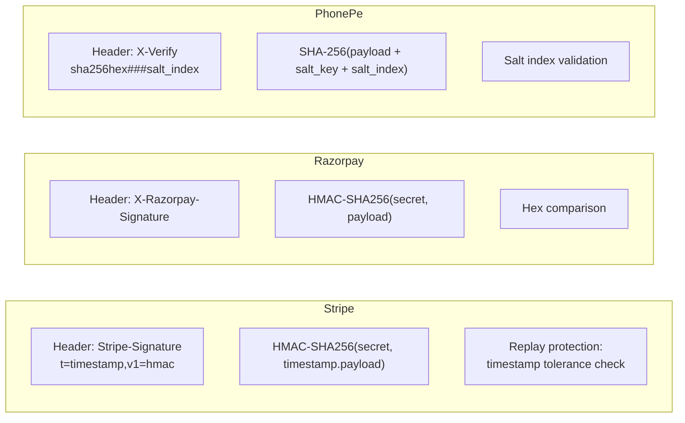
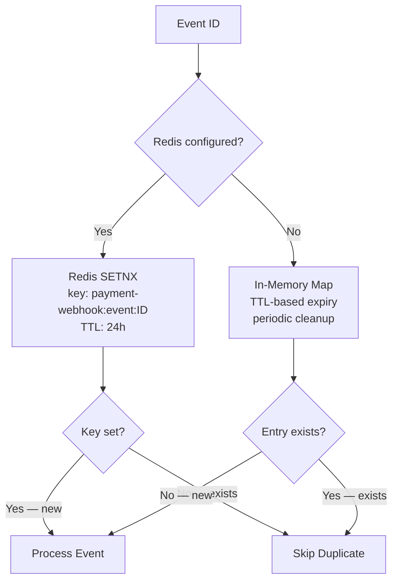

# Payment Webhook Service

> **Go · Multi-PSP Webhook Receiver with Signature Verification & Deduplication**

Receives payment webhook callbacks from multiple Payment Service Providers (Stripe, Razorpay, PhonePe), verifies cryptographic signatures using PSP-specific schemes, deduplicates events via Redis or in-memory store, and publishes canonical payment events to Kafka for downstream processing.

## Architecture



## Webhook Processing Flow



## Multi-PSP Signature Verification



## Deduplication Strategy



## Project Structure

```
payment-webhook-service/
├── main.go                 # HTTP server, Stripe signature verify, in-memory/Redis dedup, Kafka publisher
├── handler/
│   ├── webhook.go          # Multi-PSP WebhookHandler (Stripe, Razorpay, PhonePe routing)
│   ├── verify.go           # SignatureVerifier implementations per PSP
│   ├── dedup.go            # IdempotencyStore — in-memory TTL-based deduplication
│   └── metrics.go          # WebhookMetrics — Prometheus counters/histograms per PSP
├── Dockerfile
└── go.mod
```

## API Reference

### `POST /payments/webhook`

Main webhook endpoint (main.go — Stripe-focused).

**Headers:** `Stripe-Signature: t=<timestamp>,v1=<hmac>`

**Response:**
- `202` — Event accepted for Kafka publishing
- `200` — Duplicate event (already processed)
- `400` — Invalid signature or payload
- `503` — Publish queue full or dependencies unavailable

### Handler Layer (handler/webhook.go)

| Endpoint | PSP | Signature Header |
|---|---|---|
| `HandleStripe()` | Stripe | `Stripe-Signature` |
| `HandleRazorpay()` | Razorpay | `X-Razorpay-Signature` |
| `HandlePhonePe()` | PhonePe | `X-Verify` |

### `GET /health` · `GET /health/live`

Returns `{"status":"ok"}`.

### `GET /ready` · `GET /health/ready`

Checks webhook secret configuration, Kafka connectivity, and Redis availability.

### `GET /metrics`

Prometheus metrics endpoint.

## Configuration

| Variable | Default | Description |
|---|---|---|
| `PORT` / `SERVER_PORT` | `8106` | HTTP listen port |
| `WEBHOOK_SECRET` / `STRIPE_WEBHOOK_SECRET` | — | PSP webhook signing secret |
| `WEBHOOK_SIGNATURE_HEADER` | `Stripe-Signature` | Signature header name |
| `WEBHOOK_TOLERANCE_SECONDS` | `300` | Max signature age (replay protection) |
| `MAX_BODY_BYTES` | `1048576` | Max request body size |
| `DEDUPE_TTL_SECONDS` | `86400` | Deduplication window (24h) |
| `DEDUPE_CLEANUP_SECONDS` | `60` | In-memory cleanup interval |
| `REDIS_ADDR` | — | Redis address (enables Redis-backed dedup) |
| `REDIS_PASSWORD` | — | Redis password |
| `REDIS_DB` | `0` | Redis database index |
| `REDIS_TIMEOUT_MS` | `50` | Redis operation timeout |
| `KAFKA_BROKERS` | — | Comma-separated Kafka broker list |
| `KAFKA_TOPIC` | `payment.webhooks` | Kafka destination topic |
| `PUBLISH_QUEUE_SIZE` | `1000` | Async publish queue depth |
| `PUBLISH_TIMEOUT_MS` | `2000` | Kafka write timeout |
| `SHUTDOWN_TIMEOUT_SECONDS` | `15` | Graceful shutdown timeout |
| `LOG_LEVEL` | `info` | Log level |
| `OTEL_EXPORTER_OTLP_ENDPOINT` | — | OTLP endpoint for tracing |

## Key Metrics

| Metric | Type | Description |
|---|---|---|
| `payment_webhook_requests_total` | Counter | Requests by endpoint/status |
| `payment_webhook_request_duration_seconds` | Histogram | Request latency |
| `payment_webhook_signature_failures_total` | Counter | Signature verification failures |
| `payment_webhook_duplicates_total` | Counter | Duplicate events skipped |
| `payment_webhook_publish_enqueued_total` | Counter | Events queued for Kafka |
| `payment_webhook_publish_dropped_total` | Counter | Events dropped (queue full) |
| `payment_webhook_publish_success_total` | Counter | Events published to Kafka |
| `payment_webhook_publish_errors_total` | Counter | Kafka publish failures |
| `payment_webhook_publish_queue_depth` | Gauge | Current publish queue depth |
| `payment_webhook_events_received_total` | Counter | Events received by PSP (handler layer) |
| `payment_webhook_verify_latency_seconds` | Histogram | Signature verification latency by PSP |
| `payment_webhook_process_latency_seconds` | Histogram | End-to-end processing latency by PSP |

## Build & Run

```bash
# Local
go build -o payment-webhook .
WEBHOOK_SECRET="whsec_..." KAFKA_BROKERS="localhost:9092" ./payment-webhook

# Docker
docker build -t payment-webhook-service .
docker run -e WEBHOOK_SECRET="..." -e KAFKA_BROKERS="..." -p 8106:8106 payment-webhook-service
```

## Dependencies

- Go 1.22+
- `github.com/redis/go-redis/v9` (Redis dedup store)
- `github.com/segmentio/kafka-go` (Kafka producer)
- `github.com/prometheus/client_golang` (metrics)
- OpenTelemetry SDK + OTLP HTTP exporter
