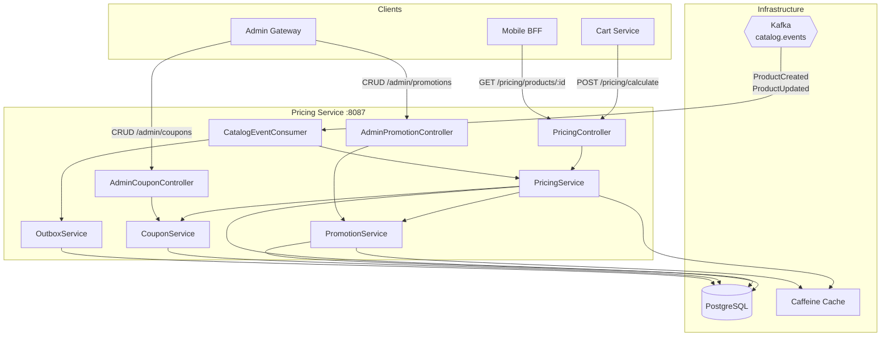
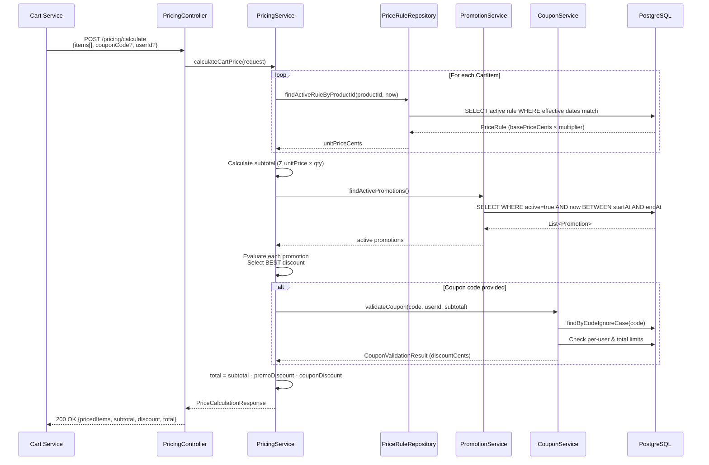
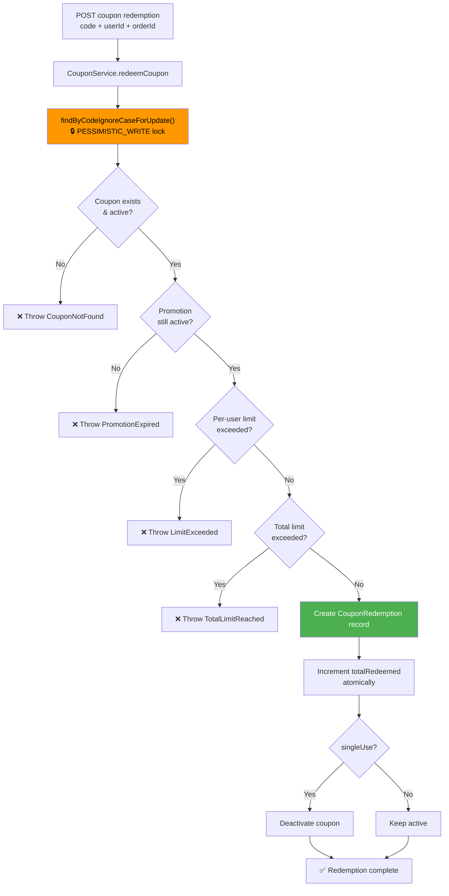
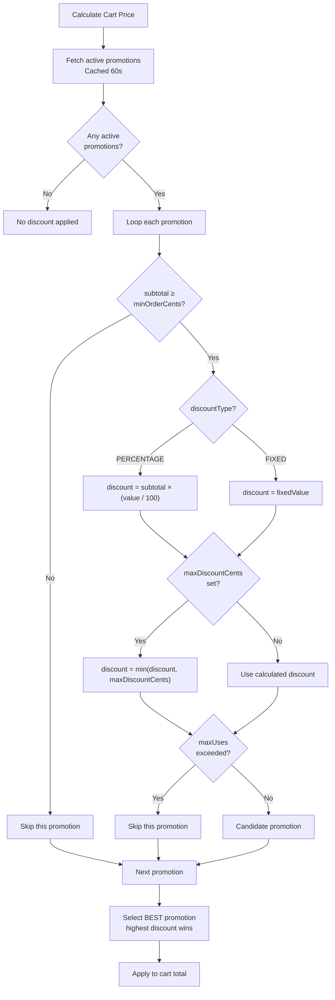
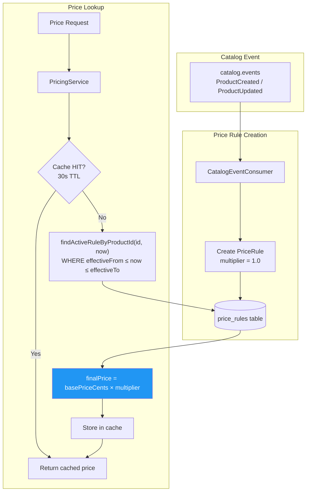
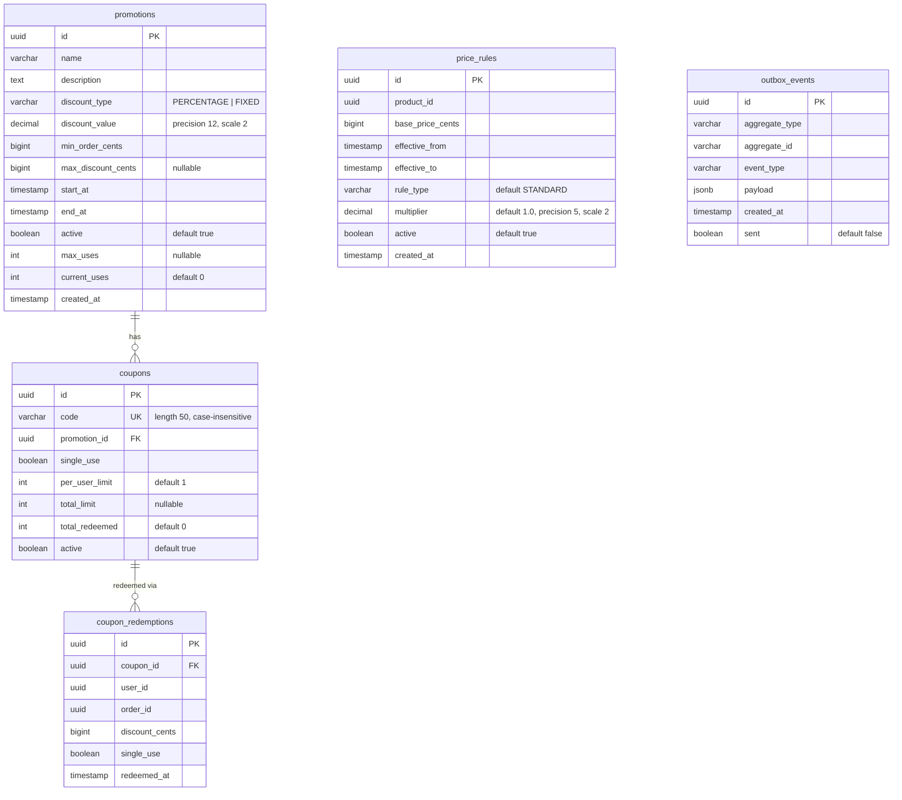

# 💰 Pricing Service

> **Dynamic pricing engine with promotions, coupons, and price rules — driven by catalog events and protected by rate limiting.**

| Property | Value |
|----------|-------|
| **Port** | `8087` |
| **Database** | PostgreSQL |
| **Messaging** | Kafka (`catalog.events`) |
| **Cache** | Caffeine (in-memory) |
| **Auth** | JWT (RS256) + Rate Limiting (Resilience4j) |

---

## Table of Contents

- [Architecture](#architecture)
- [Service Components](#service-components)
- [Pricing Calculation Flow](#pricing-calculation-flow)
- [Coupon Redemption](#coupon-redemption)
- [Promotion Evaluation](#promotion-evaluation)
- [Price Rule Engine](#price-rule-engine)
- [API Reference](#api-reference)
- [Database Schema](#database-schema)
- [Configuration](#configuration)
- [Running Locally](#running-locally)

---

## High-Level Design (HLD)



---

## Low-Level Design (LLD)

### Service Components

| Component | Package | Responsibility |
|-----------|---------|---------------|
| **PricingController** | `controller` | Public endpoints: cart pricing calculation, single product price |
| **AdminPromotionController** | `controller` | CRUD for promotions (admin-only, rate-limited) |
| **AdminCouponController** | `controller` | CRUD for coupons (admin-only, rate-limited) |
| **PricingService** | `service` | Core pricing logic: applies price rules, best promotion, and coupons |
| **PromotionService** | `service` | Promotion lifecycle management, discount calculation |
| **CouponService** | `service` | Coupon validation, redemption with pessimistic locking |
| **CatalogEventConsumer** | `kafka` | Creates base price rules from catalog product events |
| **OutboxService** | `service` | Transactional outbox for domain event publishing |
| **OutboxCleanupJob** | `service` | Scheduled cleanup of sent outbox events (every 6 hours) |

---

## Pricing Calculation Flow



---

## Coupon Redemption



### Validation Rules

| Rule | Description |
|------|-------------|
| **Coupon active** | `coupon.active = true` |
| **Promotion active** | Linked promotion within `startAt`–`endAt` window |
| **Min order** | `cartTotal ≥ promotion.minOrderCents` |
| **Per-user limit** | `COUNT(redemptions WHERE userId) < coupon.perUserLimit` |
| **Total limit** | `coupon.totalRedeemed < coupon.totalLimit` (if set) |
| **Single use** | Coupon deactivated after first redemption |

---

## Promotion Evaluation



---

## Price Rule Engine



### Price Rule Fields

| Field | Description |
|-------|-------------|
| `basePriceCents` | Base price in cents |
| `multiplier` | Price multiplier (default: `1.0`, e.g., `0.8` = 20% off) |
| `ruleType` | `STANDARD` (default), extensible for surge/time-based |
| `effectiveFrom` / `effectiveTo` | Time window for rule validity |
| `active` | Soft-delete flag |

---

## API Reference

### Public Endpoints

| Method | Endpoint | Description | Rate Limit |
|--------|----------|-------------|------------|
| `POST` | `/pricing/calculate` | Calculate cart price with promotions & coupons | 100 req/min |
| `GET` | `/pricing/products/{id}` | Get single product price | 100 req/min |

### Admin Endpoints (requires `ROLE_ADMIN`)

| Method | Endpoint | Description | Rate Limit |
|--------|----------|-------------|------------|
| `GET` | `/admin/promotions` | List all promotions | 50 req/min |
| `GET` | `/admin/promotions/{id}` | Get promotion by ID | 50 req/min |
| `POST` | `/admin/promotions` | Create promotion | 50 req/min |
| `PUT` | `/admin/promotions/{id}` | Update promotion | 50 req/min |
| `DELETE` | `/admin/promotions/{id}` | Deactivate promotion (soft delete) | 50 req/min |
| `GET` | `/admin/coupons` | List all coupons | 50 req/min |
| `GET` | `/admin/coupons/lookup?code={code}` | Look up coupon by code | 50 req/min |
| `POST` | `/admin/coupons` | Create coupon | 50 req/min |
| `DELETE` | `/admin/coupons/{id}` | Deactivate coupon | 50 req/min |

### `POST /pricing/calculate`

**Request:**
```json
{
  "items": [
    { "productId": "uuid", "quantity": 2 },
    { "productId": "uuid", "quantity": 1 }
  ],
  "couponCode": "SAVE20",
  "userId": "uuid"
}
```

**Response:**
```json
{
  "pricedItems": [
    { "productId": "uuid", "unitPriceCents": 499, "quantity": 2, "lineTotalCents": 998 },
    { "productId": "uuid", "unitPriceCents": 1299, "quantity": 1, "lineTotalCents": 1299 }
  ],
  "subtotalCents": 2297,
  "discountCents": 459,
  "totalCents": 1838,
  "appliedPromotions": [
    { "promotionId": "uuid", "name": "Summer Sale", "discountCents": 229 }
  ],
  "appliedCoupon": {
    "code": "SAVE20",
    "discountCents": 230
  }
}
```

### `GET /pricing/products/{id}`

**Response:**
```json
{
  "productId": "uuid",
  "unitPriceCents": 499,
  "currency": "USD"
}
```

### `POST /admin/promotions`

**Request:**
```json
{
  "name": "Summer Sale",
  "description": "20% off all items",
  "discountType": "PERCENTAGE",
  "discountValue": 20.00,
  "minOrderCents": 1000,
  "maxDiscountCents": 5000,
  "startAt": "2025-06-01T00:00:00Z",
  "endAt": "2025-08-31T23:59:59Z",
  "maxUses": 10000
}
```

### `POST /admin/coupons`

**Request:**
```json
{
  "code": "SAVE20",
  "promotionId": "uuid",
  "singleUse": false,
  "perUserLimit": 1,
  "totalLimit": 5000
}
```

---

## Database Schema



### Concurrency Control

- **Coupon redemption** uses `PESSIMISTIC_WRITE` lock (`SELECT ... FOR UPDATE`) to prevent race conditions
- **Outbox cleanup** uses ShedLock for distributed single-execution guarantee

---

## Configuration

### Environment Variables

| Variable | Default | Description |
|----------|---------|-------------|
| `SERVER_PORT` | `8087` | HTTP port |
| `PRICING_DB_URL` | `jdbc:postgresql://localhost:5432/pricing` | PostgreSQL connection URL |
| `PRICING_DB_USER` | `pricing` | Database username |
| `PRICING_DB_PASSWORD` | — | Database password |
| `KAFKA_BOOTSTRAP_SERVERS` | `localhost:9092` | Kafka broker addresses |
| `PRICING_JWT_ISSUER` | `instacommerce-identity` | Expected JWT issuer |
| `PRICING_JWT_PUBLIC_KEY` | — | RSA public key (PEM) |
| `TRACING_PROBABILITY` | `1.0` | OpenTelemetry sampling rate |

### Cache Configuration

| Cache Name | Max Size | TTL | Purpose |
|------------|----------|-----|---------|
| `productPrices` | 10,000 | 30s | Individual product prices |
| `activePromotions` | 500 | 60s | Active promotion list |
| `priceRules` | 10,000 | 30s | Price rule lookups |

### Rate Limiting (Resilience4j)

| Limiter | Limit | Window | Scope |
|---------|-------|--------|-------|
| `pricingLimiter` | 100 requests | 60 seconds | Public pricing endpoints |
| `adminLimiter` | 50 requests | 60 seconds | Admin CRUD endpoints |

### Security

- **Public endpoints:** `/pricing/**`, `/actuator/**`
- **Admin endpoints:** `/admin/**` → requires `ROLE_ADMIN`
- **Kafka consumer group:** `pricing-service-catalog`
- **Dead Letter Topic:** `catalog.events.DLT`

---

## Running Locally

### Prerequisites

- **Java 21+**
- **PostgreSQL 15+**
- **Kafka** (for catalog event consumption)

### 1. Start dependencies

```bash
docker compose up -d postgres kafka
```

### 2. Run the service

```bash
# From repository root
./gradlew :services:pricing-service:bootRun
```

### 3. Verify

```bash
# Health check
curl http://localhost:8087/actuator/health

# Get product price
curl http://localhost:8087/pricing/products/{productId}

# Calculate cart price
curl -X POST http://localhost:8087/pricing/calculate \
  -H "Content-Type: application/json" \
  -d '{"items":[{"productId":"uuid","quantity":2}]}'

# List promotions (requires admin JWT)
curl http://localhost:8087/admin/promotions \
  -H "Authorization: Bearer <admin-jwt>"
```

### Connection Pool (HikariCP)

| Setting | Value |
|---------|-------|
| Maximum pool size | 20 |
| Minimum idle | 10 |
| Connection timeout | 3s |

## Testing

```bash
# Run tests
./gradlew :services:pricing-service:test
```

### Build & Test

```bash
# Build
./gradlew :services:pricing-service:build

# Run tests
./gradlew :services:pricing-service:test
```

---

## Observability

| Aspect | Technology |
|--------|-----------|
| **Tracing** | OpenTelemetry → OTLP exporter |
| **Metrics** | Micrometer → Prometheus (`/actuator/prometheus`) |
| **Health** | Spring Actuator (`/actuator/health`) |
| **Logging** | Logstash JSON format |
| **Graceful Shutdown** | 30s timeout per lifecycle phase |

### Scheduled Jobs

| Job | Schedule | Lock | Description |
|-----|----------|------|-------------|
| `outbox-cleanup` | Every 6 hours | ShedLock (5–30 min) | Deletes sent outbox events older than 7 days |

---

## Rollout and Rollback

- introduce pricing-rule or promotion-evaluation changes with contract compatibility for cart and checkout callers
- monitor quote drift, promotion redemption anomalies, and outbox lag during rollout
- roll back application behavior before attempting destructive migration rollback; keep additive schema paths available

## Known Limitations

- pricing correctness still depends on tighter quote-authority semantics with cart and checkout, as called out in the iter3 decision-plane review
- promotion and coupon behavior must stay aligned with downstream order and loyalty accounting to avoid hidden revenue leakage
