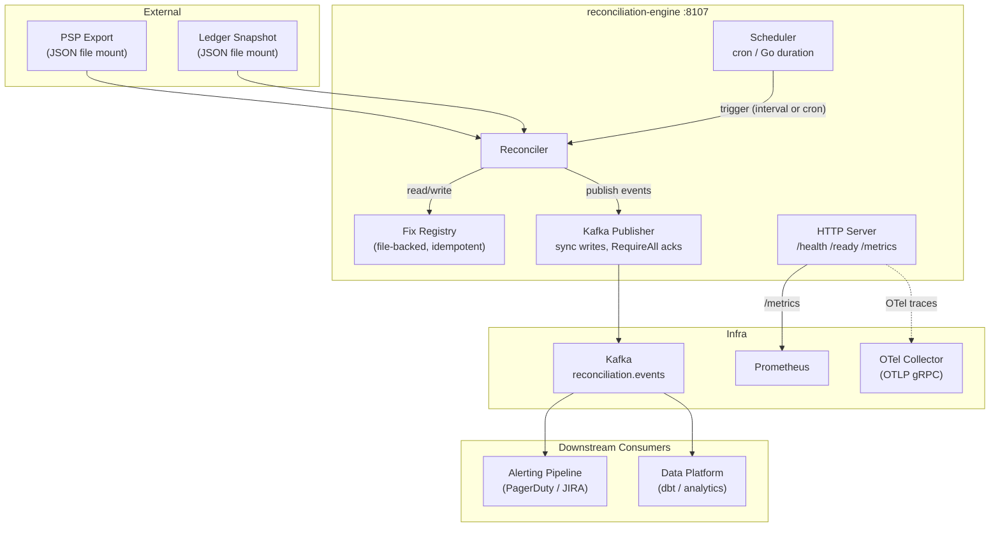
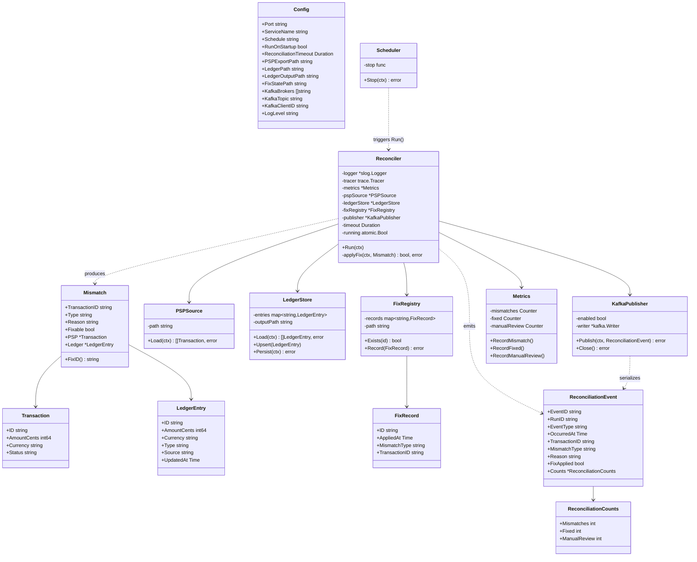
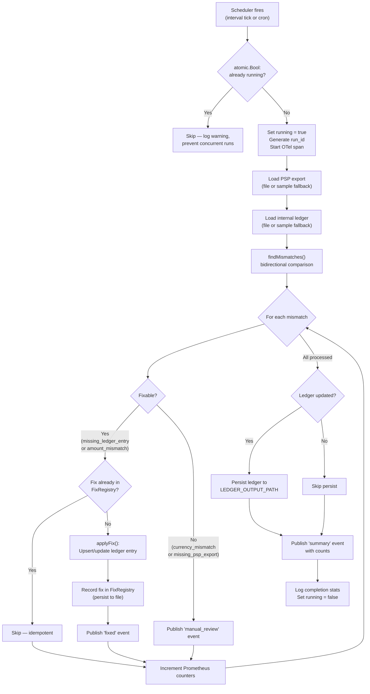
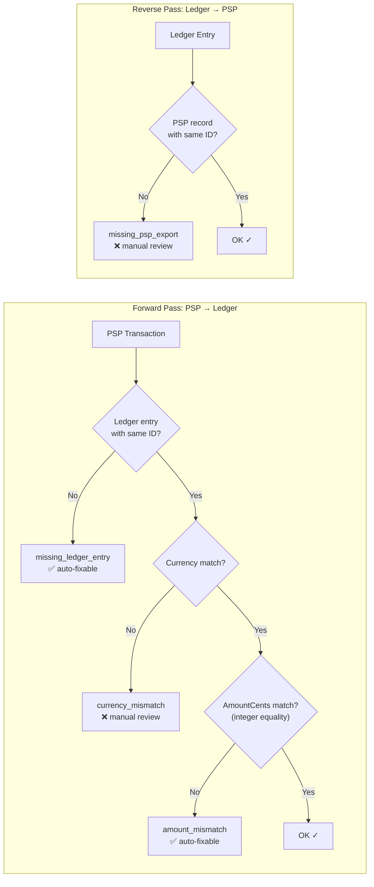
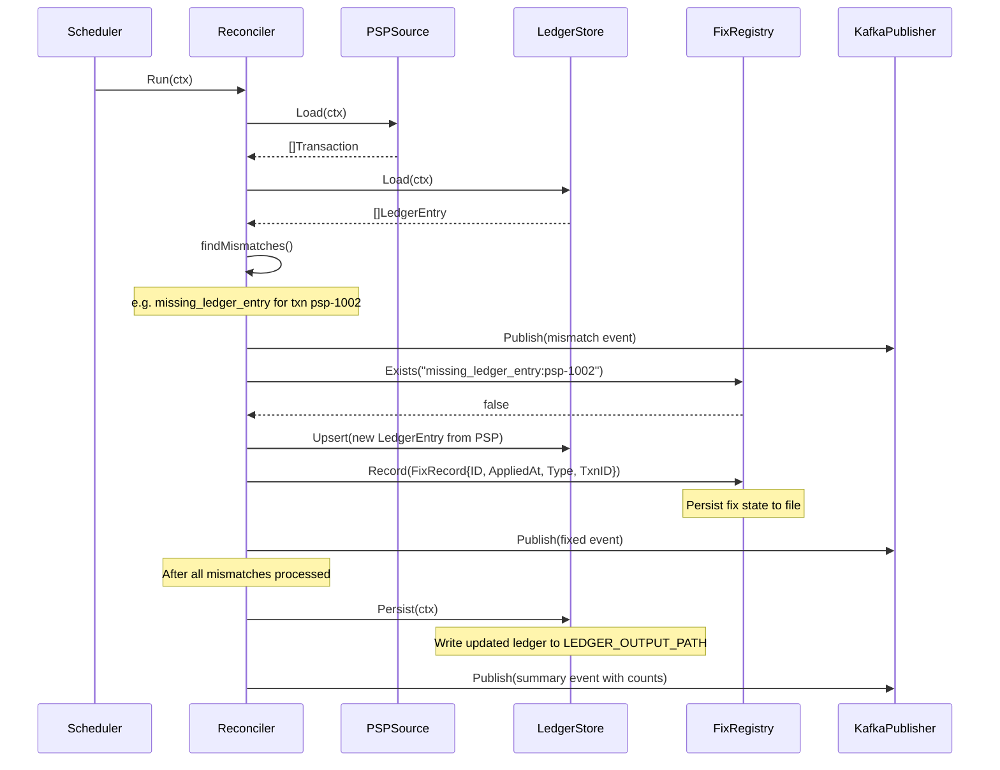

# Reconciliation Engine

> **Go · Scheduled Financial Reconciliation · Port 8107**

Batch reconciliation service in the InstaCommerce money path. Runs on a configurable schedule (Go duration or cron), compares PSP (Payment Service Provider) export data against an internal ledger snapshot, detects four classes of mismatch, idempotently auto-fixes safe discrepancies, and publishes structured reconciliation events to Kafka. Sits alongside `payment-service`, `payment-webhook-service`, and `checkout-orchestrator-service` in the Transactional Core cluster (see `docs/reviews/iter3/services/transactional-core.md §5`).

**Current maturity:** The reconciliation logic is architecturally sound—bidirectional mismatch detection, idempotent fix registry, structured event emission—but **operationally disconnected from live data**. Both PSP and ledger inputs are file-based JSON mounts; there is no mechanism today to export these files from the running `payment-service` or PSP API. The principal-level review classifies this as a functional scaffold awaiting live-data integration (see [Known Limitations](#known-limitations--target-state) below).

---

## Table of Contents

- [Service Role and Boundaries](#service-role-and-boundaries)
- [High-Level Design (HLD)](#high-level-design-hld)
- [Low-Level Design (LLD)](#low-level-design-lld)
- [Reconciliation Flow](#reconciliation-flow)
- [Mismatch Detection](#mismatch-detection)
- [Auto-Fix and Settlement Flow](#auto-fix-and-settlement-flow)
- [Runtime and Configuration](#runtime-and-configuration)
- [Kafka Events](#kafka-events)
- [API Reference](#api-reference)
- [Dependencies](#dependencies)
- [Observability](#observability)
- [Testing](#testing)
- [Failure Modes](#failure-modes)
- [Rollout and Rollback Notes](#rollout-and-rollback-notes)
- [Known Limitations and Target State](#known-limitations--target-state)
- [Industry Comparison Note](#industry-comparison-note)

---

## Service Role and Boundaries

| Aspect | Detail |
|---|---|
| **Domain** | Financial reconciliation — PSP vs. internal ledger |
| **Authority** | Read-only consumer of PSP export and ledger snapshot; writes fix-state locally and publishes events to Kafka |
| **Does not own** | Payment state, ledger-of-record, order lifecycle, refund initiation |
| **Upstream inputs** | PSP export JSON file (mounted), ledger JSON file (mounted) |
| **Downstream outputs** | Kafka topic `reconciliation.events`, updated ledger JSON (if fixes applied), fix-state JSON |
| **Cluster** | Transactional Core (`checkout-orchestrator-service`, `order-service`, `payment-service`, `payment-webhook-service`) |
| **Port** | 8107 |
| **Language** | Go 1.24 (single-binary, ~1 050 LOC in `main.go`) |

---

## High-Level Design (HLD)

System context showing reconciliation-engine's position relative to data sources, Kafka, and operational endpoints.



---

## Low-Level Design (LLD)

### Component / Struct Diagram

All types reside in `main.go`. The `Reconciler` orchestrates a run by composing `PSPSource`, `LedgerStore`, `FixRegistry`, `KafkaPublisher`, and `Metrics`.



### Project Structure

```
reconciliation-engine/
├── main.go         # All types and logic: Config, Reconciler, Scheduler,
│                   # PSPSource, LedgerStore, FixRegistry, KafkaPublisher,
│                   # Metrics, HTTP handlers, helpers (~1 050 LOC)
├── Dockerfile      # Multi-stage: golang:1.26-alpine → alpine:3.23, non-root
├── go.mod          # Go 1.24, kafka-go, cron/v3, prometheus, OTel SDK
└── go.sum
```

---

## Reconciliation Flow

End-to-end flow for a single scheduled reconciliation run.



---

## Mismatch Detection

The `findMismatches()` function performs a bidirectional comparison between PSP transactions and ledger entries, keyed by transaction ID.



| Mismatch Type | Direction | Fixable | Fix Action |
|---|---|---|---|
| `missing_ledger_entry` | PSP → Ledger | ✅ Yes | Upsert new ledger entry from PSP data (Type=`payment`, Source=`psp_export`) |
| `amount_mismatch` | PSP → Ledger | ✅ Yes | Update ledger entry amount to match PSP (Source=`reconciliation_adjustment`) |
| `currency_mismatch` | PSP → Ledger | ❌ No | Requires human investigation |
| `missing_psp_export` | Ledger → PSP | ❌ No | Requires human investigation (possible orphan ledger entry) |

**Precision note:** All amounts are integer cents (`int64`). Comparison uses strict integer equality with no tolerance band. The transactional-core review recommends adding a configurable `RECONCILIATION_TOLERANCE_CENTS` for multi-currency rounding scenarios (see [Known Limitations](#known-limitations--target-state)).

---

## Auto-Fix and Settlement Flow

Sequence diagram showing the fix-application path for a single auto-fixable mismatch.



**Idempotency:** Fix IDs are deterministic: `{mismatch_type}:{transaction_id}` (e.g. `missing_ledger_entry:psp-1002`). The fix registry checks for prior application before every fix. Re-runs against the same data produce no duplicate fixes or events.

**Settlement boundary:** This service does **not** perform settlement (fund movement). It detects and corrects ledger-level discrepancies. Actual fund settlement is handled by the PSP and reflected through webhook flows in `payment-webhook-service` → `payment-service`.

---

## Runtime and Configuration

### Environment Variables

| Variable | Default | Description |
|---|---|---|
| `PORT` / `SERVER_PORT` | `8107` | HTTP listen port (`PORT` takes precedence) |
| `RECONCILIATION_SCHEDULE` | `5m` | Schedule: Go duration (e.g. `5m`, `30m`) or cron expression (e.g. `0 */6 * * *`) |
| `RECONCILIATION_RUN_ON_STARTUP` | `true` | Run a reconciliation cycle immediately on service start |
| `RECONCILIATION_TIMEOUT` | `2m` | Per-run context timeout; long-running comparisons are cancelled |
| `PSP_EXPORT_PATH` | _(empty → sample data)_ | Path to PSP export JSON file |
| `LEDGER_PATH` | _(empty → sample data)_ | Path to internal ledger JSON file |
| `LEDGER_OUTPUT_PATH` | _(defaults to `LEDGER_PATH`)_ | Write path for updated ledger after fixes |
| `FIX_STATE_PATH` | _(empty → in-memory only)_ | Path to fix registry state file for cross-restart idempotency |
| `KAFKA_BROKERS` | _(empty → disabled)_ | Comma/semicolon/space-separated Kafka broker addresses |
| `KAFKA_TOPIC` | `reconciliation.events` | Kafka topic for reconciliation events |
| `KAFKA_CLIENT_ID` | `reconciliation-engine` | Kafka client identifier |
| `LOG_LEVEL` | `info` | Log level: `debug`, `info`, `warn`, `error` |
| `OTEL_SERVICE_NAME` | `reconciliation-engine` | OpenTelemetry service name |
| `OTEL_EXPORTER_OTLP_ENDPOINT` | _(empty → stdout traces)_ | OTLP gRPC endpoint (also reads `OTEL_EXPORTER_OTLP_TRACES_ENDPOINT`) |

### Helm / Kubernetes Defaults

From `deploy/helm/values.yaml`:

| Setting | Value |
|---|---|
| Replicas | 2 (HPA: 2–6, target CPU 70%) |
| CPU request / limit | 500m / 1000m |
| Memory request / limit | 512Mi / 1024Mi |
| Readiness probe | `GET /health/ready` |
| Liveness probe | `GET /health/live` |

### Build and Run

```bash
# Local build and run
cd services/reconciliation-engine
go build -o reconciliation-engine .
PSP_EXPORT_PATH="./psp.json" LEDGER_PATH="./ledger.json" ./reconciliation-engine

# Docker
docker build -t reconciliation-engine .
docker run -e PSP_EXPORT_PATH="/data/psp.json" \
           -e LEDGER_PATH="/data/ledger.json" \
           -v ./data:/data -p 8107:8107 reconciliation-engine

# Run tests (none currently; see Testing section)
go test -race ./...
```

### Graceful Shutdown

On `SIGINT`/`SIGTERM`, the service performs an ordered 20-second shutdown:

1. Cancel scheduler context (stops new runs; in-flight run continues)
2. Stop HTTP server (drain connections)
3. Close Kafka writer (flush pending writes)
4. Flush OTel trace provider

---

## Kafka Events

Published to the `reconciliation.events` topic (configurable via `KAFKA_TOPIC`).

| Event Type | When | Key Fields |
|---|---|---|
| `mismatch` | Each mismatch detected | `transaction_id`, `mismatch_type`, `reason` |
| `fixed` | After a mismatch is auto-fixed | `transaction_id`, `mismatch_type`, `fix_applied: true` |
| `manual_review` | Non-fixable mismatch (currency / missing PSP) | `transaction_id`, `mismatch_type`, `reason` |
| `summary` | End of each run | `counts: {mismatches, fixed, manual_review}` |

**Kafka message key:** `transaction_id` when present, otherwise `event_id`. This ensures per-transaction ordering within a partition.

**Writer config:** Synchronous writes (`Async: false`), `RequireAll` acks, `LeastBytes` balancer, 5-second per-publish timeout.

**Event schema** (from `ReconciliationEvent` struct):

```json
{
  "event_id": "event-1719849600000000000-a1b2c3",
  "run_id": "run-1719849600000000000-d4e5f6",
  "event_type": "mismatch",
  "occurred_at": "2026-07-01T12:00:00Z",
  "transaction_id": "psp-1001",
  "mismatch_type": "amount_mismatch",
  "reason": "amount mismatch",
  "fix_applied": false,
  "counts": null
}
```

**Note:** Events do not currently follow the standard InstaCommerce envelope (`event_id`, `aggregate_id`, `schema_version`, `source_service`, `correlation_id`) defined in `contracts/README.md`. No schema exists in `contracts/` for reconciliation events. This is a known gap (see [Known Limitations](#known-limitations--target-state)).

---

## API Reference

| Endpoint | Method | Response | Notes |
|---|---|---|---|
| `/health` | GET, HEAD | `{"status":"ok"}` | Always healthy if process is running |
| `/health/live` | GET, HEAD | `{"status":"ok"}` | Liveness probe (same as `/health`) |
| `/ready` | GET, HEAD | `{"status":"ready"}` or 503 `{"status":"not_ready"}` | Ready after scheduler starts |
| `/health/ready` | GET, HEAD | _(same as `/ready`)_ | Readiness probe |
| `/metrics` | GET | Prometheus exposition format | Via `promhttp.Handler()` |

All endpoints return `405 Method Not Allowed` with `Allow: GET, HEAD` for other HTTP methods.

**HTTP server timeouts:** ReadHeader 5s, Read 15s, Write 15s, Idle 60s.

---

## Dependencies

| Dependency | Version | Purpose |
|---|---|---|
| Go | 1.24+ (`go.mod`) | Runtime |
| `github.com/robfig/cron/v3` | v3.0.1 | Cron expression scheduling |
| `github.com/segmentio/kafka-go` | v0.4.50 | Kafka producer (sync writes, RequireAll acks) |
| `github.com/prometheus/client_golang` | v1.19.0 | Prometheus metrics |
| `go.opentelemetry.io/otel` | v1.41.0 | OTel SDK tracing |
| `go.opentelemetry.io/otel/exporters/otlp/otlptrace/otlptracegrpc` | v1.41.0 | OTLP gRPC trace export |
| `go.opentelemetry.io/otel/exporters/stdout/stdouttrace` | v1.41.0 | Stdout fallback trace export |
| `log/slog` | stdlib | Structured JSON logging |

**Not used:** `services/go-shared`. This service is self-contained and does not import the shared Go packages for auth, config, health, Kafka, or observability. This means it does not inherit shared middleware, circuit-breaker patterns, or HTTP client resilience from the platform layer.

---

## Observability

### Metrics

| Metric | Type | Labels | Description |
|---|---|---|---|
| `reconciliation_mismatches_total` | Counter | — | Total mismatches detected across all runs |
| `reconciliation_fixed_total` | Counter | — | Total mismatches auto-fixed |
| `reconciliation_manual_review_total` | Counter | — | Total mismatches requiring human review |

**Recommended additions** (per transactional-core review §8): `reconciliation_run_duration_seconds` (histogram), `reconciliation_ledger_fetch_error_total`, `reconciliation_psp_fetch_error_total`.

### Tracing

Each reconciliation run creates a parent span `reconciliation.run` with attributes `run_id`, `reconciliation.mismatches`, `reconciliation.fixed`, `reconciliation.manual_review`. Each auto-fix creates a child span `reconciliation.fix` with `transaction_id` and `mismatch_type`. Errors are recorded on spans via `span.RecordError()`.

OTel exporter selection: if `OTEL_EXPORTER_OTLP_ENDPOINT` (or `OTEL_EXPORTER_OTLP_TRACES_ENDPOINT`) is set, uses gRPC OTLP; otherwise falls back to pretty-printed stdout.

### Logging

Structured JSON via `log/slog` to stdout. Fields: `service`, `run_id`, `trace_id`, `span_id` (when OTel context is active), `transaction_id`, `mismatch_type`.

---

## Testing

**Current state:** There are no test files in this module. The `go test ./...` command will pass (no test files = no failures) but provides zero coverage.

**Recommended testing approach** (aligned with repo Go conventions):

- **Unit tests** for `findMismatches()`: deterministic, pure function, easy to table-test with edge cases (empty inputs, all-match, all-mismatch, bidirectional mismatches).
- **Unit tests** for `applyFix()`: verify idempotency via `FixRegistry.Exists()`, verify ledger upsert correctness, verify error paths (nil PSP/Ledger pointers).
- **Integration test** for `KafkaPublisher.Publish()`: use a local Kafka (e.g. via Testcontainers) or verify disabled-mode no-op behavior.
- **Scheduler tests**: verify cron vs. duration parsing, run-on-startup behavior, concurrent-run prevention.

Validate locally:

```bash
cd services/reconciliation-engine
go test -race ./...
go build ./...
```

---

## Failure Modes

| Failure | Behavior | Recovery |
|---|---|---|
| **PSP export file missing/unreadable** | Run logs error and returns early; no events published | Fix file mount; next scheduled run retries |
| **Ledger file missing/unreadable** | Run logs error and returns early | Fix file mount; next scheduled run retries |
| **Kafka broker unreachable** | `Publish()` returns error (5s timeout); run continues but events are lost | Fix Kafka connectivity; re-run produces same events (idempotent detection) |
| **Kafka not configured** (`KAFKA_BROKERS` empty) | Publisher created in disabled mode; all `Publish()` calls are no-ops | Configure brokers; restart service |
| **Fix registry file write fails** | Fix is applied in-memory but `persistLocked()` logs a warning; on restart the fix is re-applied (safe due to idempotency) | Fix filesystem permissions |
| **Ledger persist fails** | Ledger updates exist in-memory but not on disk; lost on restart, re-applied next run | Fix filesystem permissions; fixes are idempotent |
| **Concurrent run attempt** | `atomic.Bool` CAS prevents overlap; second trigger is skipped with a warning log | No action needed; this is intentional |
| **Run exceeds timeout** | Context cancelled; in-progress work stops; partial results may be published | Increase `RECONCILIATION_TIMEOUT` or investigate data volume |
| **OTel endpoint unreachable** | Falls back to stdout exporter at startup; non-fatal | Configure endpoint or accept stdout traces |

**No circuit-breaker or retry on Kafka publish failures within a run.** If Kafka is degraded, mismatch/fixed/manual_review events for that run are silently dropped (error logged). The summary event is attempted regardless.

---

## Rollout and Rollback Notes

**CI:** Path-filtered in `.github/workflows/ci.yml` under `services/reconciliation-engine/**`. Built and tested as part of the Go service matrix: `go test ./...` then `go build ./...`. Deploy-name mapping is 1:1 (`reconciliation-engine` → `reconciliation-engine`).

**Deployment:** Helm chart in `deploy/helm/` with environment overrides in `values-dev.yaml` / `values-prod.yaml`. ArgoCD syncs from `argocd/`. HPA scales 2–6 replicas based on CPU.

**Canary gate** (per transactional-core review §7.6): Before promoting a money-path deploy past 1% traffic, verify that the reconciliation engine reports **no new mismatches**. A mismatch rate > 0.01% is a rollback trigger with a 30-minute investigation budget.

**Rollback:** Standard Kubernetes rollback via ArgoCD or `kubectl rollout undo`. The service is stateless in Kubernetes (file state is on mounted volumes). Rolling back the binary does not roll back fix-registry state; this is safe because the fix registry is append-only and fixes are idempotent.

**Money-path release rules** (transactional-core review §7): Changes to reconciliation mismatch rules should use feature flag + shadow mode + reconciliation diff test before full rollout.

---

## Known Limitations / Target State

These are documented gaps from principal-level review (`docs/reviews/iter3/services/transactional-core.md §5`, `docs/reviews/iter3/benchmarks/global-operator-patterns.md §2.2`):

| # | Limitation | Impact | Target State |
|---|---|---|---|
| 1 | **File-based inputs** — PSP export and ledger are JSON file mounts, not live data | Reconciliation is not authoritative; requires external file-generation pipeline that does not exist | Replace `LedgerStore` with HTTP client fetching from `payment-service` (`GET /internal/reconciliation/ledger?since=&until=`); replace or supplement `PSPSource` with PSP report API |
| 2 | **File-based fix application** — fixes mutate a local JSON file, not the payment-service ledger | Fixes are not reflected in the source-of-truth database | Apply fixes via `POST /internal/reconciliation/ledger/fix` to payment-service (within DB transaction + outbox event) |
| 3 | **No event contract in `contracts/`** | Events do not follow standard envelope; no schema governance | Add `contracts/schemas/reconciliation/v1/reconciliation-event.json` with standard envelope fields |
| 4 | **No `go-shared` integration** | Misses shared auth, resilient HTTP, health, and observability middleware | Migrate to `go-shared` packages for config, health, metrics, and Kafka |
| 5 | **No tolerance band for amount comparison** | ±1 cent PSP rounding in multi-currency scenarios triggers false positives | Add `RECONCILIATION_TOLERANCE_CENTS` env var (default 0) |
| 6 | **No run-duration metric** | Cannot alert on reconciliation runs that are slow or timing out | Add `reconciliation_run_duration_seconds` histogram |
| 7 | **No alerting integration for `manual_review` events** | Events published but no consumer wired to PagerDuty/JIRA | Add Kafka consumer in monitoring pipeline |
| 8 | **No tests** | Zero test coverage | Add unit tests for `findMismatches`, `applyFix`, scheduler, and Kafka publisher |
| 9 | **Dockerfile EXPOSE mismatch** | `ENV PORT=8107` but `EXPOSE 8126` in Dockerfile | Correct `EXPOSE` to `8107` |

**Three-tier reconciliation target** (transactional-core review §5.4 recommendation):

1. **Real-time:** Webhook events update ledger immediately (existing `payment-webhook-service` flow)
2. **Intraday:** Reconciliation-engine every 30 minutes against live payment-service DB
3. **Settlement (T+1):** Reconciliation against PSP settlement file with strict amount matching

---

## Industry Comparison Note

The following observations are grounded in `docs/reviews/iter3/benchmarks/global-operator-patterns.md`:

- **DoorDash** runs a stuck-payment reconciler every 2 minutes, querying the PSP for any payment in an intermediate state older than 5 minutes. InstaCommerce's reconciliation-engine does not currently perform stuck-state recovery; that responsibility is unimplemented (no `CAPTURE_PENDING` sweep job exists in the codebase).
- **Instacart** maintains a `CAPTURE_PENDING` interim state with a background job to reconcile payments stuck in that window. InstaCommerce's `payment-service` has intermediate states but no automated recovery job.
- **Gopuff** uses Temporal durable workflows to ensure payment capture and inventory deduction are never separated. InstaCommerce's `checkout-orchestrator-service` uses Temporal for this purpose, but the reconciliation-engine operates independently of the workflow engine.

The current implementation's file-based architecture is classified as a "⚠️ stub" by the global benchmark review. The reconciliation logic (bidirectional mismatch detection, idempotent auto-fix, structured event emission) is architecturally aligned with industry patterns, but achieving production-grade finance-ops requires the live-data integration described in the target state above.
