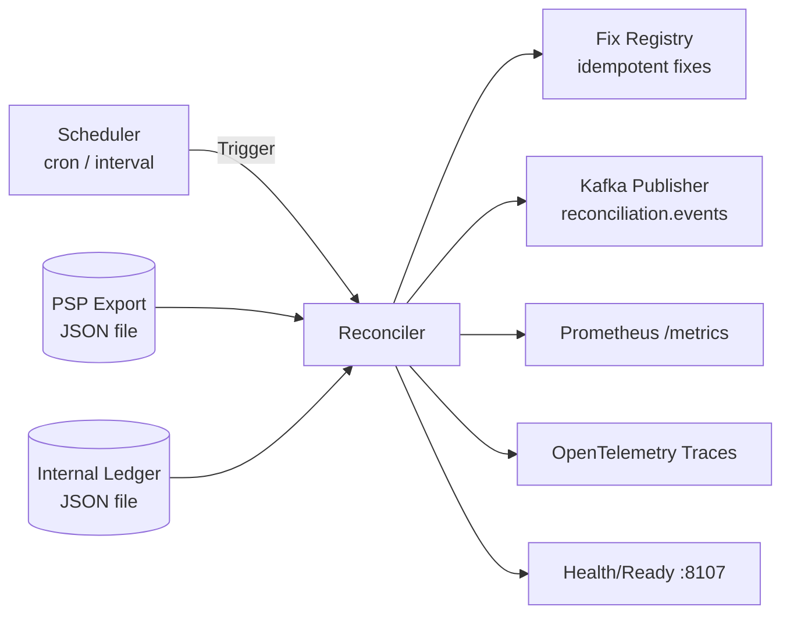
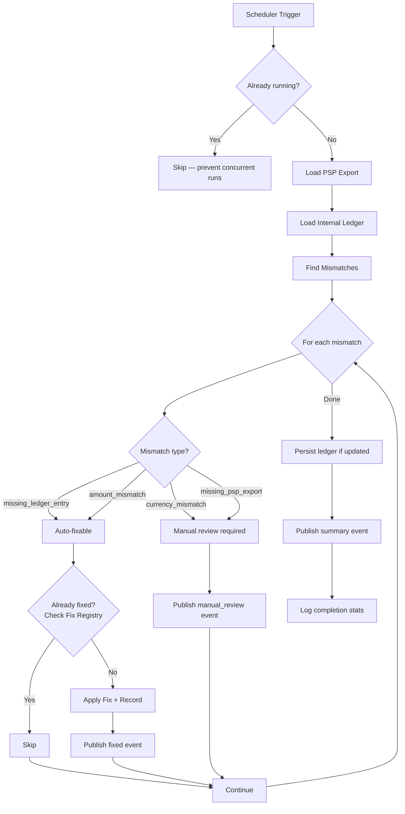
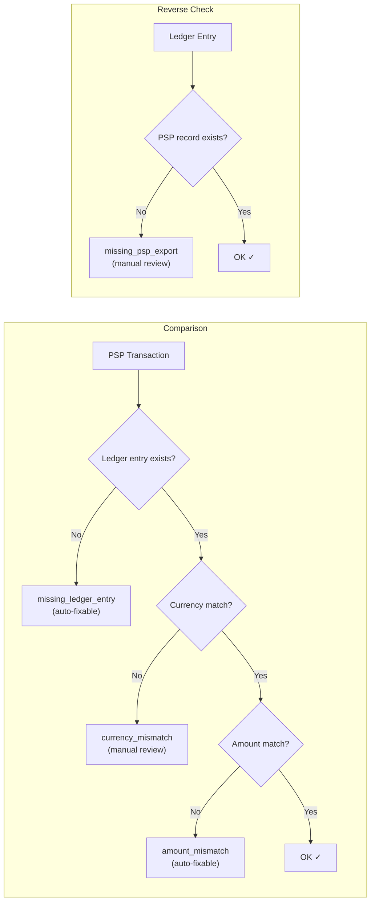
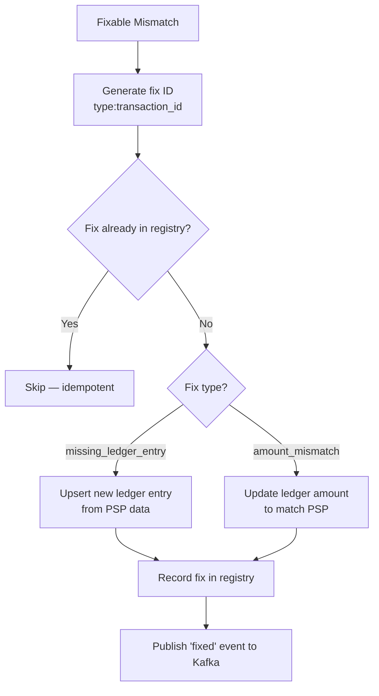

# Reconciliation Engine

> **Go · Scheduled Financial Reconciliation with Auto-Fix**

Runs scheduled reconciliation cycles that compare PSP (Payment Service Provider) export data against the internal ledger, detects mismatches (missing entries, amount discrepancies, currency conflicts), auto-fixes safe discrepancies, and publishes reconciliation events to Kafka. Supports cron and interval-based scheduling.

## Architecture



## Reconciliation Workflow



## Mismatch Detection



## Auto-Fix Flow



## Project Structure

```
reconciliation-engine/
├── main.go         # Reconciler, Scheduler, PSPSource, LedgerStore, FixRegistry, KafkaPublisher
├── Dockerfile
└── go.mod
```

## Configuration

| Variable | Default | Description |
|---|---|---|
| `PORT` / `SERVER_PORT` | `8107` | HTTP listen port |
| `RECONCILIATION_SCHEDULE` | `5m` | Schedule: Go duration (`5m`) or cron expression |
| `RECONCILIATION_RUN_ON_STARTUP` | `true` | Run immediately on start |
| `RECONCILIATION_TIMEOUT` | `2m` | Per-run timeout |
| `PSP_EXPORT_PATH` | — | Path to PSP export JSON file |
| `LEDGER_PATH` | — | Path to ledger JSON file |
| `LEDGER_OUTPUT_PATH` | — | Output path for updated ledger (defaults to `LEDGER_PATH`) |
| `FIX_STATE_PATH` | — | Path to fix registry state file |
| `KAFKA_BROKERS` | — | Comma-separated Kafka broker list |
| `KAFKA_TOPIC` | `reconciliation.events` | Kafka event topic |
| `KAFKA_CLIENT_ID` | `reconciliation-engine` | Kafka client ID |
| `LOG_LEVEL` | `info` | Log level |
| `OTEL_SERVICE_NAME` | `reconciliation-engine` | OTel service name |
| `OTEL_EXPORTER_OTLP_ENDPOINT` | — | OTLP gRPC endpoint (falls back to stdout) |

## Kafka Events

Events published to the `reconciliation.events` topic:

| Event Type | Description |
|---|---|
| `mismatch` | Mismatch detected (includes transaction ID, type, reason) |
| `fixed` | Mismatch auto-fixed successfully |
| `manual_review` | Mismatch requires human intervention |
| `summary` | Run summary with counts (mismatches, fixed, manual_review) |

**Event Schema:**
```json
{
  "event_id": "event-1234567890-abcdef",
  "run_id": "run-1234567890-abcdef",
  "event_type": "mismatch",
  "occurred_at": "2025-01-01T10:00:00Z",
  "transaction_id": "psp-1001",
  "mismatch_type": "amount_mismatch",
  "reason": "amount mismatch",
  "fix_applied": false,
  "counts": null
}
```

## Key Metrics

| Metric | Type | Description |
|---|---|---|
| `reconciliation_mismatches_total` | Counter | Total mismatches detected |
| `reconciliation_fixed_total` | Counter | Total auto-fixed mismatches |
| `reconciliation_manual_review_total` | Counter | Total mismatches sent for manual review |

## API Reference

### `GET /health` · `GET /health/live`

Returns `{"status":"ok"}`.

### `GET /ready` · `GET /health/ready`

Returns `{"status":"ready"}` when scheduler is running.

### `GET /metrics`

Prometheus metrics endpoint.

## Build & Run

```bash
# Local
go build -o reconciliation-engine .
PSP_EXPORT_PATH="./psp.json" LEDGER_PATH="./ledger.json" ./reconciliation-engine

# Docker
docker build -t reconciliation-engine .
docker run -e PSP_EXPORT_PATH="/data/psp.json" -e LEDGER_PATH="/data/ledger.json" \
  -v ./data:/data -p 8107:8107 reconciliation-engine
```

## Dependencies

- Go 1.22+
- `github.com/robfig/cron/v3` (cron scheduling)
- `github.com/segmentio/kafka-go` (Kafka publisher)
- `github.com/prometheus/client_golang` (metrics)
- OpenTelemetry SDK + OTLP gRPC exporter (with stdout fallback)
