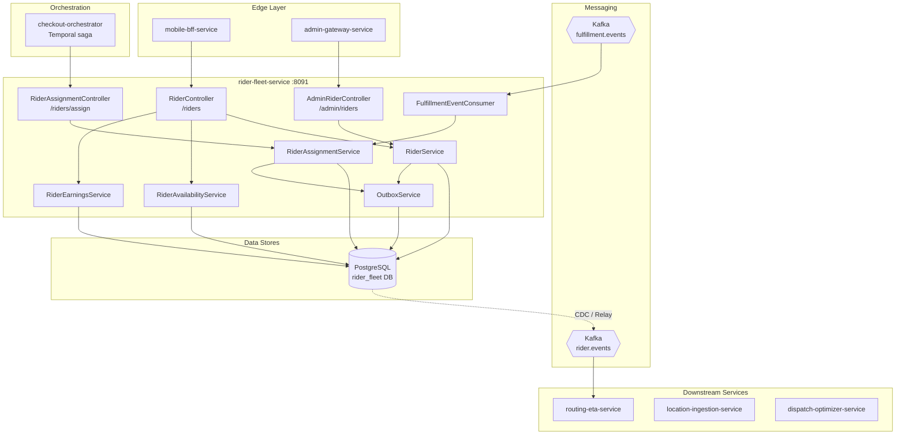
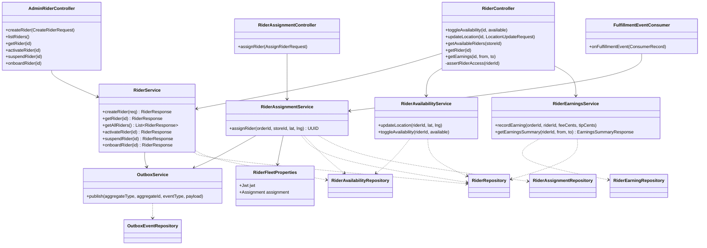
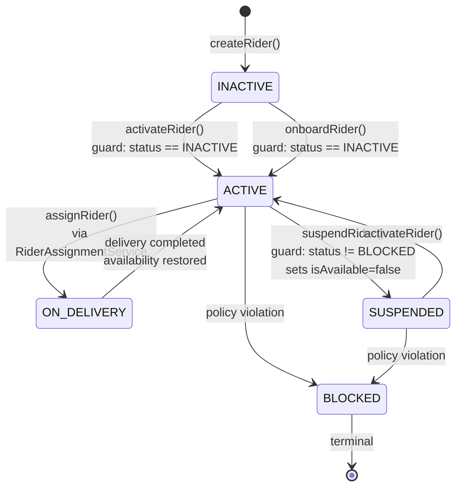
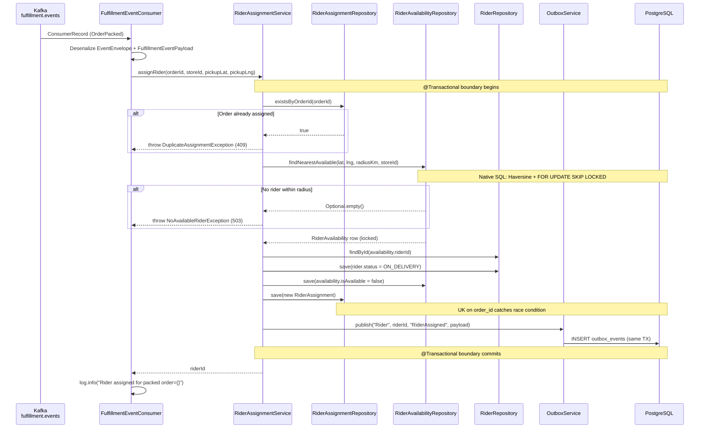
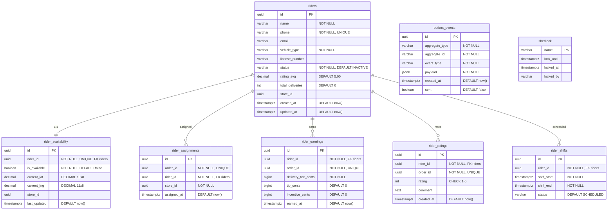

# Rider Fleet Service

> **Java 21 · Spring Boot 3 · PostgreSQL · Kafka · Port 8091**

Single assignment authority for the InstaCommerce rider lifecycle. Owns rider
creation, onboarding, activation/suspension, proximity-based assignment,
real-time availability and location tracking, and per-delivery earnings
accounting. All state mutations publish events via the transactional outbox
pattern; the service consumes `fulfillment.events` to trigger automatic rider
assignment on `OrderPacked`.

**Source of truth:** `services/rider-fleet-service/src/main/java`, Flyway migrations V1–V8,
`application.yml`, `contracts/`, `docs/reviews/rider-fleet-service-review.md`,
`docs/reviews/iter3/diagrams/lld/fulfillment-dispatch-eta.md`.

---

## Contents

1. [Service Role and Boundaries](#1-service-role-and-boundaries)
2. [High-Level Design](#2-high-level-design)
3. [Low-Level Design](#3-low-level-design)
4. [Rider Lifecycle and State Machine](#4-rider-lifecycle-and-state-machine)
5. [Assignment Flow](#5-assignment-flow)
6. [Availability and Location Management](#6-availability-and-location-management)
7. [Earnings](#7-earnings)
8. [API Reference](#8-api-reference)
9. [Database Schema](#9-database-schema)
10. [Kafka Integration](#10-kafka-integration)
11. [Runtime and Configuration](#11-runtime-and-configuration)
12. [Dependencies](#12-dependencies)
13. [Observability](#13-observability)
14. [Security](#14-security)
15. [Testing](#15-testing)
16. [Build and Run](#16-build-and-run)
17. [Failure Modes](#17-failure-modes)
18. [Rollout and Rollback Notes](#18-rollout-and-rollback-notes)
19. [Known Limitations](#19-known-limitations)
20. [Q-Commerce Pattern Comparison](#20-q-commerce-pattern-comparison)

---

## 1. Service Role and Boundaries

### Owns

| Domain | Tables | Events Published |
|--------|--------|------------------|
| Rider entity + lifecycle | `riders` | `RiderCreated`, `RiderActivated`, `RiderSuspended`, `RiderOnboarded` |
| Assignment authority | `rider_assignments` | `RiderAssigned` |
| Availability + location | `rider_availability` | — (inline with rider events) |
| Earnings accounting | `rider_earnings` | — |
| Ratings (schema only) | `rider_ratings` | — |
| Shift scheduling (schema only) | `rider_shifts` | — |
| Transactional outbox | `outbox_events` | Relayed to Kafka `rider.events` via CDC / outbox relay |
| Distributed locking | `shedlock` | — |

### Does NOT Own

| Concern | Owning Service |
|---------|----------------|
| Order lifecycle, packing | `fulfillment-service` (port 8087) |
| Delivery tracking, ETA computation | `routing-eta-service` (port 8092) |
| Real-time GPS ingestion at scale | `location-ingestion-service` (port 8105, Go) |
| Dispatch optimization (multi-objective solver) | `dispatch-optimizer-service` (port 8102, Go, stateless) |
| Payment, payout, settlement | `payment-service` |
| Customer-facing rider tracking | `mobile-bff-service` → `routing-eta-service` WebSocket |

### Integration Contracts

- **Inbound Kafka:** `fulfillment.events` — reacts to `OrderPacked` to trigger `assignRider()`.
- **Outbound Kafka (via outbox):** `rider.events` — consumed by `routing-eta-service`, `notification-service`, analytics.
- **Sync callers:** `checkout-orchestrator-service` (Temporal) and `mobile-bff-service` call `POST /riders/assign` and `GET /riders/available`.

---

## 2. High-Level Design



### System Context

The service sits in the **Fulfillment & Logistics layer** alongside `fulfillment-service`,
`routing-eta-service`, `dispatch-optimizer-service`, and `location-ingestion-service`.
Within this layer, `rider-fleet-service` is the **single assignment authority**: it owns
rider state, availability, and the `rider_assignments` table. `dispatch-optimizer-service`
is a stateless advisor consulted via sync HTTP but never mutates state.

---

## 3. Low-Level Design

### Component / Class Diagram



### Key Design Decisions

| Decision | Rationale |
|----------|-----------|
| Transactional outbox (`Propagation.MANDATORY`) | Guarantees event is written in same DB transaction as state change; CDC/relay handles Kafka delivery. |
| `FOR UPDATE OF ra SKIP LOCKED` on `rider_availability` | Prevents two concurrent assignments from claiming the same rider row without blocking. |
| Unique constraint on `rider_assignments.order_id` | Database-level guard against duplicate assignment for the same order. |
| `RiderAssignmentService.assignRider()` checks `existsByOrderId` before query | Application-level idempotency check; DB constraint is the safety net on race. |
| Haversine in native SQL with configurable radius | Avoids PostGIS dependency for MVP; radius configurable via `rider-fleet.assignment.default-radius-km`. |
| Store-scoped assignment | `rider_availability.store_id = :storeId` ensures riders are only assigned within their home store. |
| Caffeine local cache (1000 entries, 60s TTL) | Configured in `application.yml` but no `@Cacheable` annotations are used in code; effectively dormant. |

---

## 4. Rider Lifecycle and State Machine

### Status Enum

Defined in `RiderStatus.java`: `INACTIVE`, `ACTIVE`, `ON_DELIVERY`, `SUSPENDED`, `BLOCKED`.

### State Transitions



### Transition Guards (from code)

| From | To | Method | Guard Logic |
|------|----|--------|-------------|
| — | `INACTIVE` | `RiderService.createRider()` | Always; rider starts `INACTIVE`, creates `RiderAvailability` row with `isAvailable=false` |
| `INACTIVE` | `ACTIVE` | `RiderService.activateRider()` | `rider.getStatus() != INACTIVE` → throws `InvalidRiderStateException` (409) |
| `INACTIVE` | `ACTIVE` | `RiderService.onboardRider()` | Same guard as `activateRider()`; both emit different outbox events (`RiderActivated` vs `RiderOnboarded`) |
| `ACTIVE` | `ON_DELIVERY` | `RiderAssignmentService.assignRider()` | Native query filters `r.status = 'ACTIVE'` and `ra.is_available = true` |
| `*` (not `BLOCKED`) | `SUSPENDED` | `RiderService.suspendRider()` | `rider.getStatus() == BLOCKED` → throws `InvalidRiderStateException`; also sets `availability.isAvailable = false` |
| `SUSPENDED` | `ACTIVE` | `RiderService.activateRider()` | **Note:** current code only allows `INACTIVE → ACTIVE`; `SUSPENDED → ACTIVE` path requires `activateRider()` guard relaxation |

**Observation:** `activateRider()` and `onboardRider()` both enforce `status == INACTIVE` and both transition to `ACTIVE`. The distinction is semantic: they publish different outbox event types. There is no intermediate onboarding workflow state (`DOCUMENTS_PENDING`, `BACKGROUND_CHECK`, etc.) in the current implementation.

---

## 5. Assignment Flow

### Trigger

`FulfillmentEventConsumer` listens on Kafka topic `fulfillment.events` (group `rider-fleet-service`). When it receives an `EventEnvelope` with `eventType == "OrderPacked"`, it deserializes `FulfillmentEventPayload` and calls `RiderAssignmentService.assignRider()`.

### Sequence Diagram



### Assignment Algorithm Detail

The `findNearestAvailable` native query in `RiderAvailabilityRepository`:

1. **Filter:** `is_available = true`, `store_id = :storeId`, `r.status = 'ACTIVE'`, non-null lat/lng.
2. **Distance:** Haversine formula (`6371 * acos(...)`) computes great-circle distance in km.
3. **Radius:** Configurable via `rider-fleet.assignment.default-radius-km` (default 5.0 km).
4. **Ordering:** Distance ascending, then `r.rating_avg` descending (higher-rated rider wins ties).
5. **Limit:** `LIMIT 1` — selects the single nearest eligible rider.
6. **Concurrency:** `FOR UPDATE OF ra SKIP LOCKED` — if the row is already locked by another transaction, it is skipped and the next-nearest rider is selected.

### Concurrency Protection Layers

| Layer | Mechanism | Protects Against |
|-------|-----------|------------------|
| Application check | `existsByOrderId(orderId)` | Duplicate assignment for same order (fast path) |
| Row-level lock | `FOR UPDATE OF ra SKIP LOCKED` | Two concurrent assignments claiming same rider |
| Unique constraint | `uk_rider_assignments_order_id` on `rider_assignments.order_id` | Race condition on `existsByOrderId` + concurrent insert |
| Exception handling | `DataIntegrityViolationException` → `DuplicateAssignmentException` | Catch constraint violation and convert to domain exception |

---

## 6. Availability and Location Management

### Toggle Availability

`POST /riders/{id}/availability?available=true|false` → `RiderAvailabilityService.toggleAvailability()`:
- Guard: rider must be `ACTIVE`; otherwise throws `InvalidRiderStateException` (409).
- Updates `rider_availability.is_available`.

### Location Update

`POST /riders/{id}/location` with `{ "lat": ..., "lng": ... }` → `RiderAvailabilityService.updateLocation()`:
- Validates rider exists.
- Updates `current_lat`, `current_lng` on `rider_availability` row; `@PreUpdate` sets `last_updated`.
- **Note:** Location writes go directly to PostgreSQL. At high rider counts, this becomes a bottleneck (see [Known Limitations](#19-known-limitations)).

### Available Riders Query

`GET /riders/available?storeId={id}` → queries `RiderAvailabilityRepository.findByIsAvailableTrueAndStoreId()`.
Returns list of `RiderAvailability` entities (including GPS coordinates). Secured to `ROLE_INTERNAL` or `ROLE_ADMIN`.

---

## 7. Earnings

### Recording

`RiderEarningsService.recordEarning(orderId, riderId, feeCents, tipCents)` creates a `RiderEarning` row.
`incentiveCents` defaults to 0 — the field exists in schema but is not populated by `recordEarning()`.

**Note:** `recordEarning()` is not currently wired to any Kafka consumer or controller. It exists as an internal method ready for integration with a delivery-complete event flow.

### Summary

`GET /riders/{id}/earnings?from=...&to=...` → `RiderEarningsService.getEarningsSummary()`:
- Executes four separate SQL aggregates: `sumDeliveryFeeCents`, `sumTipCents`, `sumIncentiveCents`, `countByRiderIdAndEarnedAtBetween`.
- Returns `EarningsSummaryResponse(totalEarningsCents, totalDeliveryFeeCents, totalTipCents, totalIncentiveCents, deliveryCount, fromDate, toDate)`.
- All amounts are stored and returned in **cents** (integer arithmetic, no floating-point).

---

## 8. API Reference

### RiderController — `/riders`

| Method | Path | Auth | Description |
|--------|------|------|-------------|
| `POST` | `/{id}/availability?available={bool}` | Rider-self / ADMIN / INTERNAL | Toggle rider availability |
| `POST` | `/{id}/location` | Rider-self / ADMIN / INTERNAL | Update GPS coordinates |
| `GET` | `/available?storeId={id}` | INTERNAL, ADMIN | List available riders for a store |
| `GET` | `/{id}` | Rider-self / ADMIN / INTERNAL | Get rider details |
| `GET` | `/{id}/earnings?from={iso}&to={iso}` | Rider-self / ADMIN / INTERNAL | Earnings summary for date range |

Rider-self access: JWT `sub` must match the `{id}` path variable, or caller must have `ROLE_ADMIN`/`ROLE_INTERNAL`.

### RiderAssignmentController — `/riders`

| Method | Path | Auth | Description |
|--------|------|------|-------------|
| `POST` | `/assign` | INTERNAL | Assign nearest available rider to an order |

**Request body (`AssignRiderRequest`):**

```json
{
  "orderId": "uuid",
  "storeId": "uuid",
  "pickupLat": 12.9716,
  "pickupLng": 77.5946
}
```

All fields are `@NotNull`.

**Response:**

```json
{
  "riderId": "uuid",
  "orderId": "uuid"
}
```

### AdminRiderController — `/admin/riders`

| Method | Path | Auth | Description |
|--------|------|------|-------------|
| `POST` | `/` | ADMIN | Create rider (returns 201) |
| `GET` | `/` | ADMIN | List all riders |
| `GET` | `/{id}` | ADMIN | Get rider by ID |
| `POST` | `/{id}/activate` | ADMIN | `INACTIVE → ACTIVE` transition |
| `POST` | `/{id}/suspend` | ADMIN | Suspend rider (any non-BLOCKED state) |
| `POST` | `/{id}/onboard` | ADMIN | `INACTIVE → ACTIVE` transition (onboard semantics) |

**CreateRiderRequest:**

```json
{
  "name": "Ravi Kumar",
  "phone": "+919876543210",
  "email": "ravi@example.com",
  "vehicleType": "MOTORCYCLE",
  "licenseNumber": "KA01AB1234",
  "storeId": "uuid"
}
```

`name`, `phone` are `@NotBlank`; `email` is `@Email`; `vehicleType` is `@NotNull` (`BICYCLE | MOTORCYCLE | CAR`); `licenseNumber` and `storeId` are optional.

### Error Response Format

All errors use a consistent JSON envelope from `GlobalExceptionHandler`:

```json
{
  "code": "RIDER_NOT_FOUND",
  "message": "Rider not found: <id>",
  "traceId": "abc123...",
  "timestamp": "2025-01-15T10:30:00Z",
  "details": []
}
```

| Error Code | HTTP Status | Trigger |
|------------|-------------|---------|
| `RIDER_NOT_FOUND` | 404 | Rider ID does not exist |
| `INVALID_RIDER_STATE` | 409 | State transition guard violation |
| `ASSIGNMENT_DUPLICATE` | 409 | Order already has an assignment |
| `NO_AVAILABLE_RIDER` | 503 | No rider within radius for store |
| `VALIDATION_ERROR` | 400 | Bean validation / constraint violation |
| `TOKEN_INVALID` | 401 | JWT verification failure |
| `AUTHENTICATION_REQUIRED` | 401 | Missing or no Bearer token |
| `ACCESS_DENIED` | 403 | Insufficient role or rider-self check fails |
| `INTERNAL_ERROR` | 500 | Unhandled exception (logged with stack trace) |

---

## 9. Database Schema

8 Flyway migrations (V1–V8) manage schema evolution. `spring.jpa.hibernate.ddl-auto=validate`
ensures the JPA model matches the migrated schema at startup.



### Indexes

| Table | Index | Type |
|-------|-------|------|
| `riders` | `idx_riders_status_store (status, store_id)` | B-tree |
| `riders` | `idx_riders_phone (phone)` | B-tree |
| `rider_availability` | `idx_rider_availability_available_store (is_available, store_id)` | B-tree |
| `rider_assignments` | `idx_rider_assignments_rider_id (rider_id)` | B-tree |
| `rider_earnings` | `idx_rider_earnings_rider_earned (rider_id, earned_at)` | B-tree |
| `rider_ratings` | `idx_rider_ratings_rider (rider_id)` | B-tree |
| `rider_shifts` | `idx_rider_shifts_rider_status (rider_id, status)` | B-tree |
| `outbox_events` | `idx_outbox_unsent (sent) WHERE sent = false` | Partial B-tree |

---

## 10. Kafka Integration

| Direction | Topic | Consumer Group | Trigger / Events |
|-----------|-------|----------------|------------------|
| **Consume** | `fulfillment.events` | `rider-fleet-service` | `OrderPacked` → `RiderAssignmentService.assignRider()` |
| **Produce** | `rider.events` (via outbox + CDC relay) | — | `RiderCreated`, `RiderActivated`, `RiderSuspended`, `RiderOnboarded`, `RiderAssigned` |

### Event Envelope

Consumed events use `EventEnvelope(id, aggregateId, eventType, payload)` (record type, `@JsonIgnoreProperties(ignoreUnknown = true)`).
Published outbox events use `OutboxEvent(aggregateType, aggregateId, eventType, payload)`.

### Error Handling

`KafkaErrorConfig` configures `DefaultErrorHandler` with:
- `DeadLetterPublishingRecoverer` → publishes to `{topic}.DLT`
- `FixedBackOff(1000ms, 3 attempts)`

The `FulfillmentEventConsumer` also has a try/catch that logs `error` on deserialization or processing failures — exceptions are swallowed at the consumer level (they do not propagate to the error handler).

---

## 11. Runtime and Configuration

### Environment Variables

| Variable | `application.yml` Key | Default | Description |
|----------|-----------------------|---------|-------------|
| `SERVER_PORT` | `server.port` | `8091` | HTTP listen port |
| `RIDER_DB_URL` | `spring.datasource.url` | `jdbc:postgresql://localhost:5432/rider_fleet` | PostgreSQL JDBC URL |
| `RIDER_DB_USER` | `spring.datasource.username` | `postgres` | DB username |
| `RIDER_DB_PASSWORD` | `spring.datasource.password` | — | DB password (GCP Secret Manager: `sm://db-password-rider-fleet`) |
| `KAFKA_BOOTSTRAP_SERVERS` | `spring.kafka.bootstrap-servers` | `localhost:9092` | Kafka brokers |
| `RIDER_KAFKA_GROUP` | `spring.kafka.consumer.group-id` | `rider-fleet-service` | Consumer group |
| `RIDER_ASSIGNMENT_RADIUS_KM` | `rider-fleet.assignment.default-radius-km` | `5.0` | Max distance (km) for nearest-rider Haversine search |
| `RIDER_JWT_ISSUER` | `rider-fleet.jwt.issuer` | `instacommerce-identity` | Expected JWT issuer claim |
| `RIDER_JWT_PUBLIC_KEY` | `rider-fleet.jwt.public-key` | — | RSA public key (GCP Secret Manager: `sm://jwt-rsa-public-key`) |
| `OTEL_EXPORTER_OTLP_TRACES_ENDPOINT` | `management.otlp.tracing.endpoint` | `http://otel-collector.monitoring:4318/v1/traces` | OTLP traces endpoint |
| `OTEL_EXPORTER_OTLP_METRICS_ENDPOINT` | `management.otlp.metrics.endpoint` | `http://otel-collector.monitoring:4318/v1/metrics` | OTLP metrics endpoint |
| `TRACING_PROBABILITY` | `management.tracing.sampling.probability` | `1.0` | Trace sampling rate |
| `ENVIRONMENT` | `management.metrics.tags.environment` | `dev` | Environment tag for metrics |

### Connection Pool (HikariCP)

| Setting | Value |
|---------|-------|
| `maximum-pool-size` | 20 |
| `minimum-idle` | 5 |
| `connection-timeout` | 5000 ms |
| `max-lifetime` | 1800000 ms (30 min) |

### Caching

`spring.cache.caffeine.spec = maximumSize=1000,expireAfterWrite=60s` — configured but no `@Cacheable` annotations exist in service code; the cache is effectively dormant.

### Scheduled Jobs

| Job | Cron | ShedLock | Description |
|-----|------|----------|-------------|
| `OutboxCleanupJob.cleanupProcessedEvents()` | `0 0 */6 * * *` (every 6h) | `name=outbox-cleanup`, lockAtLeast=5m, lockAtMost=30m | Deletes `outbox_events` where `sent = true` and `created_at` older than 7 days |

### Graceful Shutdown

`server.shutdown=graceful` with `spring.lifecycle.timeout-per-shutdown-phase=30s`.

---

## 12. Dependencies

| Dependency | Version/Source | Purpose |
|------------|---------------|---------|
| Java | 21 (Temurin JRE Alpine) | Runtime |
| Spring Boot 3 | `spring-boot-starter-web`, `-data-jpa`, `-security`, `-validation`, `-actuator`, `-cache` | Application framework |
| Spring Kafka | `spring-kafka` | Kafka consumer + producer |
| PostgreSQL | `postgresql` (runtime) | Primary data store |
| Flyway | `flyway-core`, `flyway-database-postgresql` | Schema migrations (V1–V8) |
| Caffeine | `caffeine` | Local cache (configured, not actively used) |
| Resilience4j | `resilience4j-spring-boot3:2.2.0` | Circuit breaker (declared, ready for optimizer integration) |
| ShedLock | `shedlock-spring:5.10.2`, `shedlock-provider-jdbc-template:5.10.2` | Distributed scheduler locking |
| JJWT | `jjwt-api:0.12.5`, `jjwt-impl`, `jjwt-jackson` | JWT RSA public-key verification |
| Micrometer | `micrometer-tracing-bridge-otel`, `micrometer-registry-otlp` | Distributed tracing + metrics export |
| Logstash Logback | `logstash-logback-encoder:7.4` | Structured JSON logging |
| GCP Secret Manager | `spring-cloud-gcp-starter-secretmanager` | Secrets injection (`sm://` URIs) |
| Cloud SQL Socket Factory | `postgres-socket-factory:1.15.0` | GCP Cloud SQL IAM-based connectivity |
| **Test** | | |
| Spring Boot Test | `spring-boot-starter-test` | JUnit 5 + MockMvc |
| Spring Security Test | `spring-security-test` | Security test utilities |
| Testcontainers | `postgresql:1.19.3`, `junit-jupiter:1.19.3` | PostgreSQL integration testing |

---

## 13. Observability

### Health Probes

| Endpoint | Type | Checks |
|----------|------|--------|
| `/actuator/health/liveness` | Liveness | `livenessState` |
| `/actuator/health/readiness` | Readiness | `readinessState`, `db` (PostgreSQL connectivity) |
| `/actuator/health` | Combined | `show-details: always` |

Docker `HEALTHCHECK` uses liveness endpoint with 30s interval, 5s timeout, 3 retries.

### Metrics

- **Prometheus:** `/actuator/prometheus` endpoint enabled.
- **OTLP export:** Traces and metrics exported to the OpenTelemetry collector.
- **Tags:** All metrics tagged with `service=rider-fleet-service` and `environment=${ENVIRONMENT}`.
- **Actuator endpoints exposed:** `health`, `info`, `prometheus`, `metrics`.

### Logging

Structured JSON via `logstash-logback-encoder`. Key log points:
- `RiderService`: rider creation, activation, suspension, onboarding (INFO).
- `RiderAssignmentService`: successful assignment with rider/order/store IDs (INFO).
- `RiderAvailabilityService`: location updates (DEBUG), availability toggles (INFO).
- `RiderEarningsService`: earning recording (INFO).
- `FulfillmentEventConsumer`: assignment success (INFO), processing failure (ERROR with exception).
- `OutboxCleanupJob`: cleanup count (INFO).

### Trace Context

`TraceIdProvider` resolves trace IDs from (in priority order): `MDC.traceId`, `X-B3-TraceId`, `X-Trace-Id`, `traceparent`, `X-Request-Id`. W3C `traceparent` format is parsed to extract the trace ID segment. All error responses include `X-Trace-Id` header.

---

## 14. Security

### Authentication

JWT Bearer tokens verified using RSA public key (`JwtKeyLoader` supports PEM and raw Base64 formats). Issuer validated against `rider-fleet.jwt.issuer` (default `instacommerce-identity`). Roles extracted from JWT `roles` claim and normalized to `ROLE_*` prefix.

### Authorization Matrix

| Path Pattern | Required Role | Notes |
|-------------|---------------|-------|
| `/actuator/**`, `/error` | Unauthenticated | Permitted for health/metrics |
| `/admin/**` | `ROLE_ADMIN` | Admin rider management |
| `POST /riders/assign` | `ROLE_INTERNAL` | Service-to-service assignment |
| `GET /riders/available` | `ROLE_INTERNAL` or `ROLE_ADMIN` | Available riders query |
| All other `/riders/**` | Authenticated | `assertRiderAccess()` validates JWT `sub` == `{id}` or caller has `ROLE_ADMIN`/`ROLE_INTERNAL` |

### Session Policy

Stateless (`SessionCreationPolicy.STATELESS`). CORS configured via `riderfleet.cors.allowed-origins` (default: `http://localhost:3000,https://*.instacommerce.dev`).

---

## 15. Testing

### Infrastructure

- **Test framework:** JUnit 5 (`useJUnitPlatform()`) via Spring Boot Test.
- **Testcontainers:** PostgreSQL 1.19.3 + JUnit Jupiter integration declared in `build.gradle.kts`.
- **Security testing:** `spring-security-test` available.

### Current State

**No test files exist** (`src/test/java` is empty). Testcontainers is declared as a dependency but unused.

### Recommended Test Coverage

| Priority | Test | Type | What It Validates |
|----------|------|------|-------------------|
| P0 | `RiderAssignmentServiceTest` | Integration (Testcontainers) | Concurrent assignment, `SKIP LOCKED`, duplicate order guard, no-rider-available |
| P0 | `FulfillmentEventConsumerTest` | Integration | Kafka message deserialization, `OrderPacked` triggers assignment |
| P0 | `RiderServiceTest` | Unit + Integration | State machine transitions, invalid state guards, outbox event publication |
| P1 | `RiderAvailabilityRepositoryTest` | Repository (Testcontainers) | Haversine spatial query correctness, radius filtering, ordering by distance then rating |
| P1 | `SecurityConfigTest` | MockMvc | Endpoint authorization matrix, JWT validation, rider-self access |
| P1 | `RiderEarningsServiceTest` | Integration | Earnings aggregation correctness, date-range queries |

### Running Tests

```bash
./gradlew :services:rider-fleet-service:test
# Single class:
./gradlew :services:rider-fleet-service:test --tests "com.instacommerce.riderfleet.service.RiderAssignmentServiceTest"
```

---

## 16. Build and Run

```bash
# Build (skip tests)
./gradlew :services:rider-fleet-service:build -x test

# Run locally (requires PostgreSQL + Kafka from docker-compose)
docker-compose up -d  # starts pg, kafka, etc.
./gradlew :services:rider-fleet-service:bootRun

# Docker build
docker build -t rider-fleet-service services/rider-fleet-service/
docker run -p 8091:8091 \
  -e RIDER_DB_URL=jdbc:postgresql://host.docker.internal:5432/rider_fleet \
  -e KAFKA_BOOTSTRAP_SERVERS=host.docker.internal:9092 \
  -e RIDER_JWT_PUBLIC_KEY="<base64-encoded-rsa-public-key>" \
  rider-fleet-service
```

### Docker Image

Multi-stage build: `gradle:8.7-jdk21` (build) → `eclipse-temurin:21-jre-alpine` (runtime).
Non-root user (`app:1001`). ZGC garbage collector (`-XX:+UseZGC`). Max heap 75% of container RAM (`-XX:MaxRAMPercentage=75.0`).

---

## 17. Failure Modes

| Failure | Detection | Impact | Mitigation |
|---------|-----------|--------|------------|
| **No rider available within radius** | `NoAvailableRiderException` (503) | Single order unassigned | Caller (orchestrator) retries or escalates; consider radius expansion logic |
| **Duplicate `OrderPacked` Kafka event** | `existsByOrderId` check + `uk_rider_assignments_order_id` constraint | Caught as `DuplicateAssignmentException` (409) | Consumer logs and drops duplicate; DLT not triggered for 409 |
| **Concurrent assignment for same rider** | `FOR UPDATE SKIP LOCKED` | Second transaction skips locked row, picks next rider | Transparent to caller |
| **Concurrent insert for same order** | `DataIntegrityViolationException` on unique constraint | Caught, converted to `DuplicateAssignmentException` | Second caller gets 409 |
| **PostgreSQL down** | Readiness probe fails (`/actuator/health/readiness` includes `db`) | All operations fail; K8s removes from service mesh | Connection pool retries; pod restart if prolonged |
| **Kafka broker down** | Consumer stops receiving events | New assignments not triggered from `OrderPacked` | `auto-offset-reset: earliest` replays missed events on recovery; DLT for poison pills |
| **JWT public key misconfiguration** | `JwtKeyLoader` throws `IllegalStateException` at startup | Service fails to start | Startup crash is intentional — forces key configuration fix |
| **Outbox relay lag** | Outbox events accumulate (`sent = false`) | Downstream services see delayed `RiderAssigned` events | Monitored via `idx_outbox_unsent` partial index; `OutboxCleanupJob` only cleans `sent = true` |
| **FulfillmentEventConsumer exception** | Caught in try/catch, logged at ERROR | Single event silently dropped | **Known risk:** exceptions are swallowed, not propagated to `DefaultErrorHandler` / DLT |
| **HikariCP pool exhaustion** | `connection-timeout: 5000ms` → timeout exceptions | Request failures under high concurrency | Pool size 20 may need increase for high-throughput scenarios |

---

## 18. Rollout and Rollback Notes

### Deployment

- Docker image per CI build. Helm charts in `deploy/helm/`. ArgoCD syncs from `argocd/` manifests.
- Flyway migrations run automatically on startup (`spring.flyway.enabled=true`). All migrations are additive (CREATE TABLE, ADD CONSTRAINT). No destructive migrations exist.

### Rollback Safety

| Concern | Safety |
|---------|--------|
| **Schema migrations** | V1–V8 are all additive (new tables, new indexes, new constraints). Rolling back the application to a prior version is safe as long as the newer tables/columns are not depended upon by the older code. |
| **Kafka consumer offsets** | Consumer group `rider-fleet-service` with `auto-offset-reset: earliest`. Rolling back replays events from the last committed offset. Idempotency guard (`existsByOrderId`) prevents duplicate assignments. |
| **Outbox events** | Outbox rows for a newer event type written by a newer version will be relayed by CDC regardless of application version. Downstream consumers should ignore unknown event types (`@JsonIgnoreProperties(ignoreUnknown = true)`). |
| **Feature flags** | No feature flag integration exists currently. Resilience4j circuit breaker is declared in `build.gradle.kts` but not annotated on any method — ready for use with future optimizer integration. |

### Canary/Rollout Strategy

- Recommend canary deployment: 1 replica with new version, observe assignment success rate and latency metrics before full rollout.
- Key metrics to watch during rollout: assignment success rate, `NoAvailableRiderException` count, Kafka consumer lag, readiness probe status, outbox `sent = false` growth rate.

---

## 19. Known Limitations

| # | Limitation | Severity | Details | Recommended Fix (per review docs) |
|---|-----------|----------|---------|-------------------------------------|
| 1 | **Post-pack assignment only** | 🔴 Critical | Assignment triggers on `OrderPacked`, not `OrderConfirmed`. Adds 3–6 min vs. pre-assignment (Blinkit/Zepto pattern). | Pre-assign on `OrderConfirmed` with `CANDIDATE` status; promote to `ASSIGNED` on `OrderPacked`. |
| 2 | **No spatial index** | 🔴 Critical | Haversine runs as full-scan trig calculation on every `rider_availability` row. O(n) at scale. | Add PostGIS `geography` column + GiST index; use `ST_DWithin` for O(log n) queries. |
| 3 | **Zero test coverage** | 🔴 Critical | `src/test/java` is empty despite Testcontainers being declared. | Add integration tests for assignment concurrency, Kafka consumer, state transitions, security matrix. |
| 4 | **Location writes to PostgreSQL** | 🟠 High | At 50K riders × 5s update interval = ~10K writes/sec, exceeding HikariCP throughput. | Use Redis (`GEOADD`/`GEORADIUS`) for hot location data; batch-sync to PostgreSQL. |
| 5 | **`onboardRider()` duplicates `activateRider()`** | 🟡 Medium | Both enforce `INACTIVE → ACTIVE` with identical guard logic. No intermediate onboarding states exist. | Expand `RiderStatus` with onboarding workflow states if document verification is needed. |
| 6 | **`RiderShift` is dead code** | 🟡 Medium | `rider_shifts` table and `RiderShiftRepository` exist but no service or controller references them. | Wire into availability enforcement (rider can only go online during scheduled shifts). |
| 7 | **`RiderRating` write path missing** | 🟡 Medium | Schema with `CHECK(1-5)` exists; `rating_avg` is used as assignment tiebreaker but initialized to `5.00` and never recalculated. | Add rating submission API + running average recalculation. |
| 8 | **`recordEarning()` never triggered** | 🟠 High | No Kafka consumer or controller calls this method. Earnings are never recorded. | Wire to delivery-complete Kafka event from `routing-eta-service`. |
| 9 | **`incentiveCents` never populated** | 🟡 Medium | Column exists in `rider_earnings` but `recordEarning()` does not accept or set it. | Extend method signature; build incentive rules engine. |
| 10 | **Caffeine cache is dormant** | 🟡 Low | Cache spec configured but no `@Cacheable` annotations in code. | Add `@Cacheable` on read-heavy paths (e.g., `getRider`) or remove unused config. |
| 11 | **`riders.total_deliveries` never incremented** | 🟡 Medium | Denormalized counter initialized to 0, never updated by any code path. | Increment on delivery completion or compute from `rider_earnings COUNT`. |
| 12 | **No multi-order batching** | 🟠 High | One rider = one order. `ON_DELIVERY` locks the rider entirely. | Add rider capacity model, batch-compatible order grouping, `max_concurrent_orders`. |
| 13 | **Consumer exception swallowing** | 🟠 High | `FulfillmentEventConsumer.onFulfillmentEvent()` catches all exceptions and only logs; does not propagate to `DefaultErrorHandler` / DLT. | Let processing exceptions propagate so DLT receives poison pills. |
| 14 | **No `@Version` optimistic locking** | 🟡 Medium | `Rider` entity has no `version` column. Concurrent updates to rider status rely on last-write-wins. | Add `version BIGINT DEFAULT 0` column + `@Version` annotation. |
| 15 | **`SUSPENDED → ACTIVE` path blocked** | 🟡 Medium | `activateRider()` guard requires `status == INACTIVE`; a suspended rider cannot be reactivated via the current API. | Relax guard to allow `INACTIVE` or `SUSPENDED` → `ACTIVE`. |

---

## 20. Q-Commerce Pattern Comparison

The following comparison is grounded in analysis from `docs/reviews/rider-fleet-service-review.md`
and `docs/reviews/iter3/diagrams/lld/fulfillment-dispatch-eta.md`.

| Pattern | Leading Q-Commerce (Blinkit / Zepto) | rider-fleet-service (Current) |
|---------|--------------------------------------|-------------------------------|
| **Assignment trigger** | Pre-assignment on `OrderConfirmed`; rider staged before pack completes. ~1 min `pack_to_dispatch`. | Post-pack on `OrderPacked` only. 3–6 min `pack_to_dispatch` gap. |
| **Spatial query** | PostGIS / Redis `GEORADIUS` with GiST index. O(log n). | Haversine in native SQL, full-scan. O(n). |
| **Multi-order batching** | 2–3 orders per trip for proximate drop-offs. | Strictly 1:1 assignment. |
| **Location storage** | Redis for hot GPS (5s TTL); PG for cold storage. | PostgreSQL direct writes for all location updates. |
| **Assignment scoring** | Multi-objective: distance + idle time + load + SLA breach probability. | Nearest-first with rating tiebreaker only. |
| **Delivery proof** | OTP verification + photo proof. | Not implemented. |
| **Rider acceptance** | Rider offer with ETA/pay; accept/reject flow. | Auto-assignment, no rider consent. |
| **Demand forecasting** | ML-based supply prediction per zone/hour. | Not implemented. |

The iter3 LLD (`fulfillment-dispatch-eta.md`) outlines a target architecture where
`dispatch-optimizer-service` provides multi-objective scoring (cost function: `w1 * delivery_time + w2 * idle_time + w3 * sla_breach_prob - w4 * batch_bonus`) and `rider-fleet-service` evolves to support `CANDIDATE → ASSIGNED` pre-assignment status, with Resilience4j circuit-breaker fallback to the current greedy-nearest algorithm.
