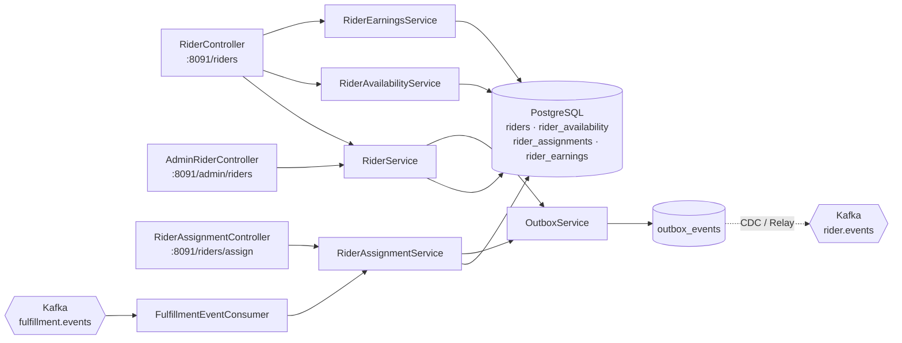
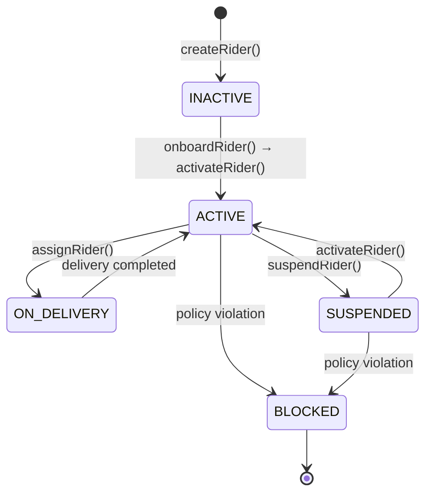
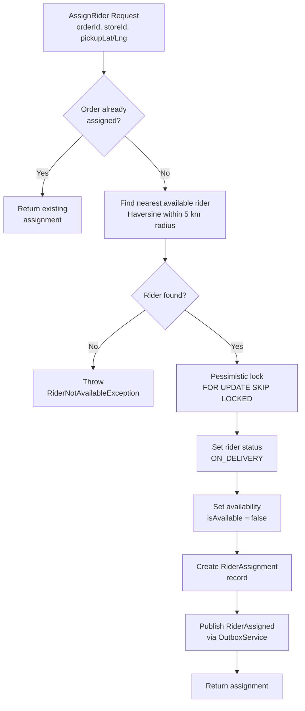
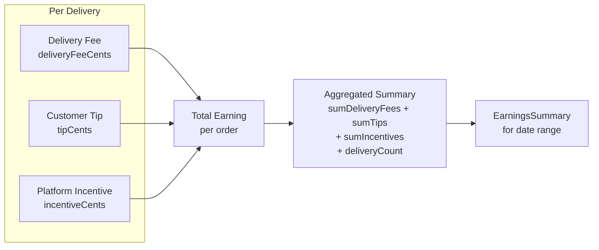
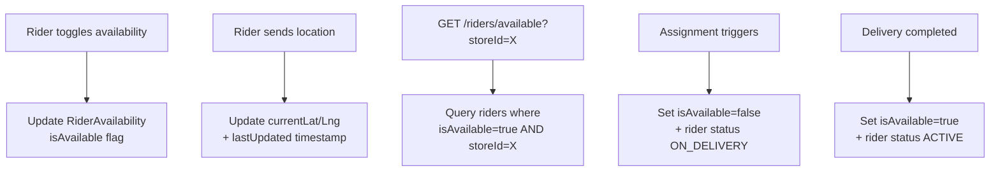
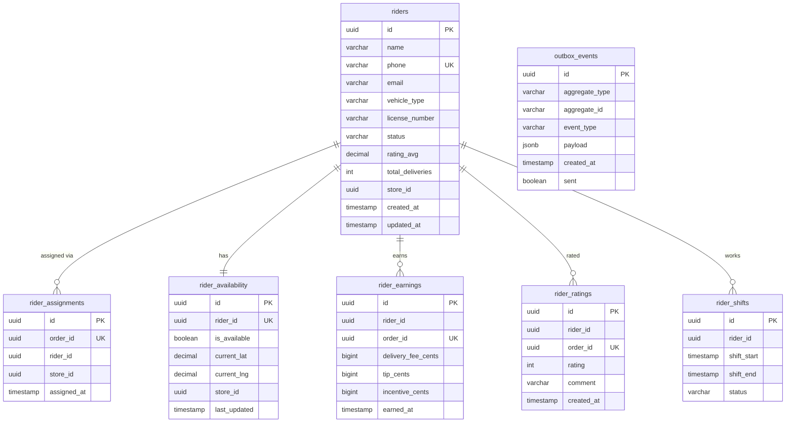

# Rider Fleet Service

> **Java · Spring Boot · Rider Lifecycle, Assignment & Earnings**

Manages the complete rider lifecycle — onboarding, activation, suspension — along with intelligent proximity-based assignment, real-time availability/location tracking, and granular earnings accounting. Events are published via the transactional outbox pattern and the service consumes fulfillment events to trigger automatic rider assignment.

## Architecture



## Rider Lifecycle State Machine



## Assignment Flow



## Earnings Calculation



## Availability Management



## API Reference

### RiderController — `/riders`

| Method | Path | Auth | Description |
|--------|------|------|-------------|
| `POST` | `/{id}/availability` | RIDER, ADMIN | Toggle rider availability on/off |
| `POST` | `/{id}/location` | RIDER, ADMIN | Update rider GPS coordinates |
| `GET` | `/available?storeId={id}` | INTERNAL, ADMIN | List available riders for a store |
| `GET` | `/{id}` | RIDER, ADMIN | Get rider details |
| `GET` | `/{id}/earnings` | RIDER, ADMIN | Get earnings summary (query params: `from`, `to`) |

### RiderAssignmentController — `/riders`

| Method | Path | Auth | Description |
|--------|------|------|-------------|
| `POST` | `/assign` | INTERNAL | Assign nearest available rider to order |

**Request:**
```json
{
  "orderId": "uuid",
  "storeId": "uuid",
  "pickupLat": 12.9716,
  "pickupLng": 77.5946
}
```

**Response:**
```json
{
  "id": "uuid",
  "orderId": "uuid",
  "riderId": "uuid",
  "storeId": "uuid",
  "assignedAt": "2025-01-15T10:30:00Z"
}
```

### AdminRiderController — `/admin/riders`

| Method | Path | Auth | Description |
|--------|------|------|-------------|
| `POST` | `/` | ADMIN | Create a new rider |
| `GET` | `/` | ADMIN | List all riders |
| `GET` | `/{id}` | ADMIN | Get rider by ID |
| `POST` | `/{id}/activate` | ADMIN | Activate a rider |
| `POST` | `/{id}/suspend` | ADMIN | Suspend a rider |
| `POST` | `/{id}/onboard` | ADMIN | Onboard a rider |

**Create Rider Request:**
```json
{
  "name": "Ravi Kumar",
  "phone": "+919876543210",
  "email": "ravi@example.com",
  "vehicleType": "MOTORCYCLE",
  "licenseNumber": "KA01AB1234",
  "storeId": "uuid"
}
```

## Database Schema



## Kafka Integration

| Direction | Topic | Group | Description |
|-----------|-------|-------|-------------|
| **Consume** | `fulfillment.events` | `rider-fleet-service` | Listens for `OrderPacked` → triggers `assignRider()` |
| **Produce** | `rider.events` (via outbox) | — | `RiderCreated`, `RiderActivated`, `RiderSuspended`, `RiderOnboarded`, `RiderAssigned` |

**Error handling:** Dead-letter topic (`*.DLT`) with 3 retries, 1-second backoff.

## Configuration

| Variable | Default | Description |
|----------|---------|-------------|
| `SERVER_PORT` | `8091` | HTTP listen port |
| `SPRING_DATASOURCE_URL` | — | PostgreSQL JDBC URL |
| `SPRING_KAFKA_BOOTSTRAP_SERVERS` | — | Kafka broker addresses |
| `RIDER_ASSIGNMENT_RADIUS_KM` | `5` | Max distance (km) for nearest-rider search |
| `JWT_PUBLIC_KEY` | — | RSA public key for token verification (GCP Secret Manager) |
| `OTEL_EXPORTER_OTLP_ENDPOINT` | `otel-collector.monitoring:4318` | OpenTelemetry collector |

### Caching

Caffeine cache: 1 000 entries max, 60-second TTL.

### Scheduled Jobs

| Job | Schedule | Lock | Description |
|-----|----------|------|-------------|
| `OutboxCleanupJob` | Every 6 hours | ShedLock | Deletes sent outbox events older than 7 days |

## Build & Run

```bash
# Local
./gradlew :services:rider-fleet-service:bootRun

# Docker
docker build -t rider-fleet-service .
docker run -p 8091:8091 rider-fleet-service
```

## Dependencies

- Java 21, Spring Boot 3, Spring Kafka
- PostgreSQL + Flyway migrations
- Resilience4j (circuit breakers)
- Caffeine (caching), ShedLock (distributed locking)
- JJWT 0.12.5 (JWT authentication)
- Micrometer + OTLP (tracing & metrics)
- GCP Secret Manager, Cloud SQL socket factory
