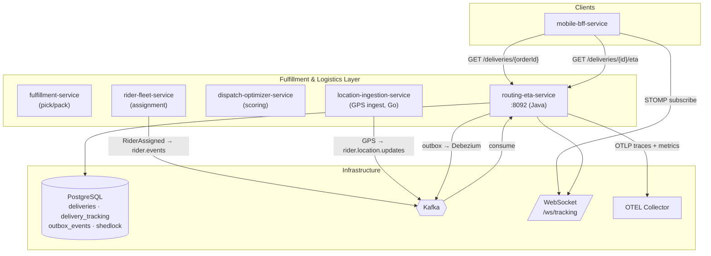
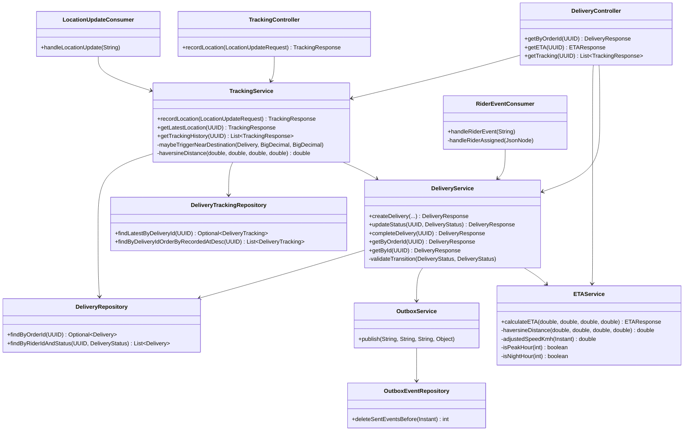
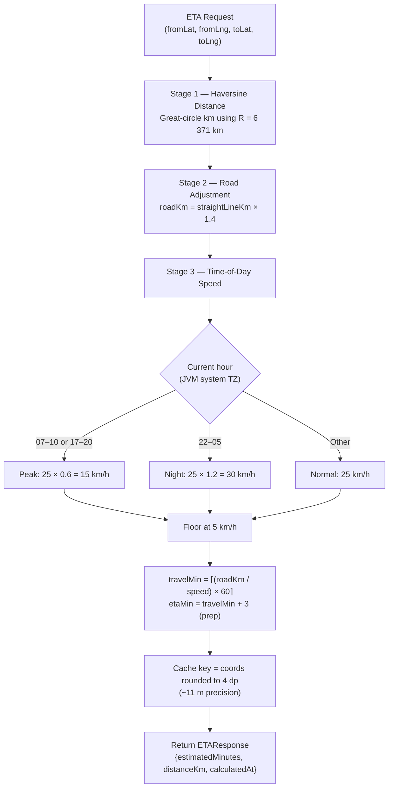
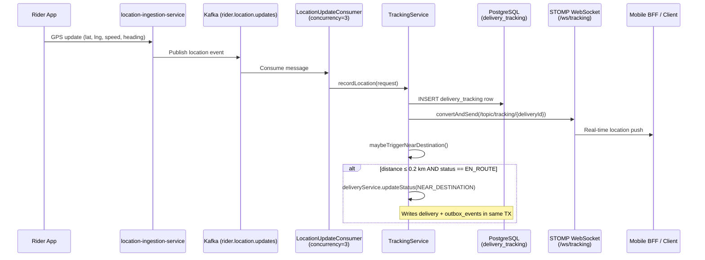
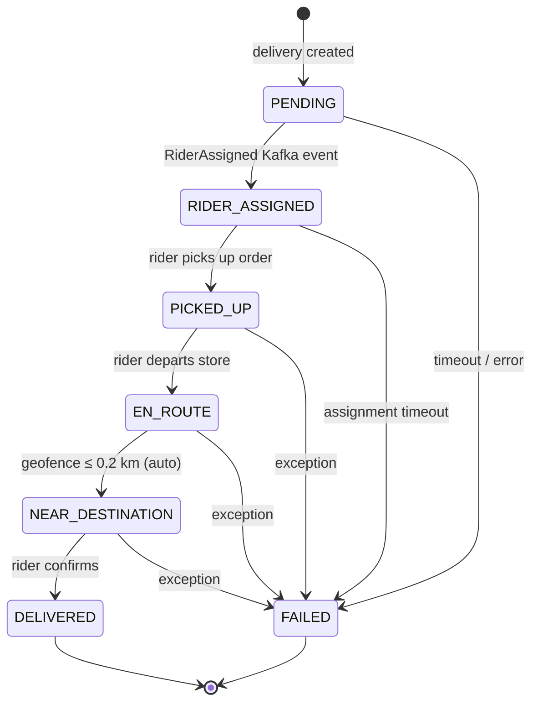
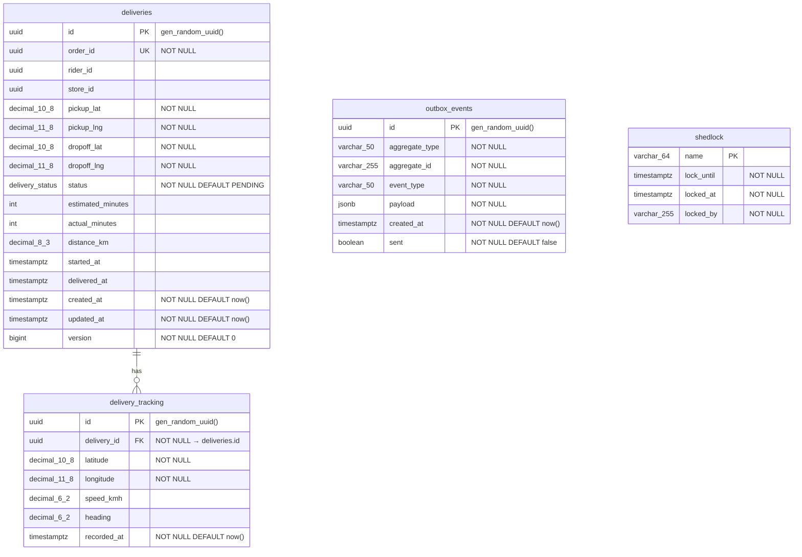

# Routing & ETA Service

> **Java 21 · Spring Boot 3 · PostgreSQL · Kafka · WebSocket**
>
> Single owner of delivery lifecycle state, ETA computation, and real-time rider location broadcast.

---

## Table of Contents

1. [Service Role and Boundaries](#service-role-and-boundaries)
2. [High-Level Design (HLD)](#high-level-design)
3. [Low-Level Design (LLD)](#low-level-design)
4. [Route / ETA Flow](#route--eta-flow)
5. [Live Tracking & WebSocket Flow](#live-tracking--websocket-flow)
6. [Delivery Lifecycle State Machine](#delivery-lifecycle-state-machine)
7. [Database Schema](#database-schema)
8. [API Reference](#api-reference)
9. [Kafka Integration](#kafka-integration)
10. [Runtime & Configuration](#runtime--configuration)
11. [Dependencies](#dependencies)
12. [Observability](#observability)
13. [Testing](#testing)
14. [Failure Modes & Mitigations](#failure-modes--mitigations)
15. [Rollout & Rollback](#rollout--rollback)
16. [Known Limitations & Future Work](#known-limitations--future-work)
17. [Q-Commerce ETA Pattern Comparison](#q-commerce-eta-pattern-comparison)

---

## Service Role and Boundaries

`routing-eta-service` is the **authoritative owner** of the `deliveries`, `delivery_tracking`, and `outbox_events` tables.  It is responsible for:

| Responsibility | How |
|----------------|-----|
| **Delivery creation** | Consumes `RiderAssigned` events from `rider.events` Kafka topic; creates the delivery record with an initial ETA (`RiderEventConsumer` → `DeliveryService.createDelivery`). |
| **ETA computation** | Three-stage Haversine model with road-distance multiplier and time-of-day speed adjustment (`ETAService.calculateETA`). Results cached via Caffeine (10 s TTL, 100 k entries). |
| **Delivery state management** | Enforces a strict state machine (`DeliveryStatus` enum) with validated transitions and JPA optimistic locking (`@Version`). |
| **Real-time GPS tracking** | Consumes `rider.location.updates` (concurrency = 3), persists `delivery_tracking` rows in a range-partitioned table, and broadcasts each point over STOMP/SockJS WebSocket. |
| **Geofence-triggered transition** | When rider ≤ 0.2 km from dropoff and delivery is `EN_ROUTE`, auto-transitions to `NEAR_DESTINATION`. |
| **Outbox event production** | All state mutations write an `outbox_events` row inside the same transaction (via `OutboxService` with `Propagation.MANDATORY`), relayed to Kafka by Debezium. |

**What this service does _not_ own:**

- Rider assignment decisions — owned by `rider-fleet-service` / `dispatch-optimizer-service`.
- GPS ingestion from the rider app — owned by `location-ingestion-service` (Go); this service only consumes the resulting Kafka topic.
- Fulfillment pick/pack workflow — owned by `fulfillment-service`.

> **Ownership note:** Per the iter-3 fulfillment-logistics review, `fulfillment-service` historically also maintained a `deliveries` table. The agreed resolution is that `routing-eta-service` is the **single owner** of delivery records; `fulfillment-service` should transition to reading delivery state via REST.
> *(Source: `docs/reviews/iter3/services/fulfillment-logistics.md`)*

---

## High-Level Design

System-context view showing how `routing-eta-service` fits into the fulfillment and logistics layer.



---

## Low-Level Design

### Component Diagram

Internal structure of the service showing controllers, services, consumers, repositories, and infrastructure connectors.



### Package Layout

```
com.instacommerce.routing
├── RoutingEtaServiceApplication.java      # @SpringBootApplication, @EnableCaching, @EnableConfigurationProperties
├── config/
│   ├── KafkaConfig.java                   # DLT error handler (FixedBackOff 1 s × 3 retries)
│   ├── RoutingProperties.java             # @ConfigurationProperties(prefix = "routing")
│   ├── SchedulingConfig.java              # @EnableScheduling + ShedLock (default lock ≤ 10 m)
│   ├── SecurityConfig.java                # JWT filter chain, CORS, stateless sessions
│   └── WebSocketConfig.java               # STOMP + SockJS at /ws/tracking
├── consumer/
│   ├── RiderEventConsumer.java            # rider.events → RiderAssigned handling
│   └── LocationUpdateConsumer.java        # rider.location.updates → recordLocation (concurrency=3)
├── controller/
│   ├── DeliveryController.java            # /deliveries REST endpoints
│   └── TrackingController.java            # /tracking REST endpoint
├── domain/model/
│   ├── Delivery.java                      # JPA entity, @Version optimistic lock
│   ├── DeliveryStatus.java                # Enum: PENDING → … → DELIVERED | FAILED
│   ├── DeliveryTracking.java              # JPA entity (partitioned table)
│   └── OutboxEvent.java                   # JPA entity, JSONB payload
├── dto/
│   ├── request/
│   │   ├── CreateDeliveryRequest.java     # Record: orderId, storeId, coords
│   │   └── LocationUpdateRequest.java     # Record: deliveryId, lat, lng, speed, heading (validated)
│   └── response/
│       ├── DeliveryResponse.java          # Record: full delivery projection
│       ├── ETAResponse.java               # Record: estimatedMinutes, distanceKm, calculatedAt
│       ├── ErrorDetail.java               # Record: field, message
│       ├── ErrorResponse.java             # Record: code, message, traceId, timestamp, details
│       └── TrackingResponse.java          # Record: lat, lng, speed, heading, recordedAt
├── exception/
│   ├── ApiException.java                  # Base: HttpStatus + code
│   ├── DeliveryNotFoundException.java     # 404
│   ├── GlobalExceptionHandler.java        # @RestControllerAdvice with trace-id propagation
│   ├── InvalidDeliveryStateException.java # 422
│   └── TraceIdProvider.java               # Resolves traceId from MDC / X-B3 / W3C traceparent / X-Request-Id
├── repository/
│   ├── DeliveryRepository.java
│   ├── DeliveryTrackingRepository.java
│   └── OutboxEventRepository.java
├── security/
│   ├── DefaultJwtService.java             # RSA public-key verification + role extraction
│   ├── JwtAuthenticationFilter.java       # OncePerRequestFilter; skips /actuator, /ws, /error
│   ├── JwtKeyLoader.java                  # PEM/Base64 key parsing at startup
│   ├── JwtService.java                    # Interface
│   ├── RestAccessDeniedHandler.java       # 403 JSON body
│   └── RestAuthenticationEntryPoint.java  # 401 JSON body
└── service/
    ├── DeliveryService.java               # Core domain logic + outbox writes
    ├── ETAService.java                    # Haversine + time-of-day ETA, @Cacheable
    ├── OutboxService.java                 # Transactional outbox writer (Propagation.MANDATORY)
    └── TrackingService.java               # GPS persistence, geofence, WebSocket broadcast
```

---

## Route / ETA Flow

### Three-Stage ETA Computation

The ETA model is a deterministic, configuration-driven pipeline. All constants are externalized via `RoutingProperties.Eta`.



**Formula (from `ETAService.java`):**

```
straightLineKm  = haversine(fromLat, fromLng, toLat, toLng)
roadDistanceKm   = straightLineKm × ETA_ROAD_DISTANCE_MULTIPLIER       (default 1.4)
adjustedSpeed    = ETA_AVG_SPEED_KMH × timeOfDayMultiplier              (default 25 km/h)
                   clamp min = 5.0 km/h
travelMinutes    = (roadDistanceKm / adjustedSpeed) × 60
estimatedMinutes = ⌈travelMinutes⌉ + ETA_PREP_TIME_MINUTES             (default 3)
```

**Caching:** Caffeine, `maximumSize=100000,expireAfterWrite=10s`. Cache key truncates each coordinate to 4 decimal places (≈ 11 m resolution) via `BigDecimal.setScale(4, HALF_UP)`.

### ETA Endpoint Logic (`GET /deliveries/{id}/eta`)

The controller attempts to use the rider's **latest known GPS position** as the `from` coordinate.  If no tracking data exists yet, it falls back to the delivery's `pickupLat`/`pickupLng`.

```java
// DeliveryController.java lines 39-51
TrackingResponse latest = trackingService.findLatestLocation(id).orElse(null);
double fromLat = latest != null ? latest.latitude().doubleValue() : delivery.pickupLat().doubleValue();
double fromLng = latest != null ? latest.longitude().doubleValue() : delivery.pickupLng().doubleValue();
```

---

## Live Tracking & WebSocket Flow

### End-to-End GPS → Client Sequence



### WebSocket Protocol

| Detail | Value |
|--------|-------|
| **Transport** | STOMP 1.2 over SockJS |
| **Endpoint** | `/ws/tracking` |
| **Subscribe topic** | `/topic/tracking/{deliveryId}` |
| **Broker** | In-memory simple broker (prefix `/topic`) |
| **App dest prefix** | `/app` |
| **Origin policy** | `setAllowedOriginPatterns("*")` ⚠️ See [Known Limitations](#known-limitations--future-work) |

**Payload per broadcast** (`TrackingResponse` record):

```json
{
  "latitude": 12.9750,
  "longitude": 77.5980,
  "speedKmh": 22.5,
  "heading": 145.0,
  "recordedAt": "2025-01-15T10:30:05Z"
}
```

---

## Delivery Lifecycle State Machine

Transitions are enforced in `DeliveryService.validateTransition()`.  Every transition writes an outbox event atomically.



**Transition rules** (from `DeliveryService.validateTransition`):

| From | Allowed targets |
|------|----------------|
| `PENDING` | `RIDER_ASSIGNED`, `FAILED` |
| `RIDER_ASSIGNED` | `PICKED_UP`, `FAILED` |
| `PICKED_UP` | `EN_ROUTE`, `FAILED` |
| `EN_ROUTE` | `NEAR_DESTINATION`, `FAILED` |
| `NEAR_DESTINATION` | `DELIVERED`, `FAILED` |
| `DELIVERED` | _(terminal)_ |
| `FAILED` | _(terminal)_ |

**Completion logic** (`completeDelivery`): sets `deliveredAt = Instant.now()` and computes `actualMinutes = round((deliveredAt − startedAt) / 60)`.

**Concurrency:** The `Delivery` entity uses `@Version` (JPA optimistic locking). Concurrent updates will raise `OptimisticLockException`.

---

## Database Schema

Managed by Flyway (`V1` through `V5`).



**Indexes:**

| Table | Index | Columns |
|-------|-------|---------|
| `deliveries` | `idx_deliveries_status` | `(status)` |
| `deliveries` | `idx_deliveries_rider` | `(rider_id, status)` |
| `deliveries` | `idx_deliveries_order` | `(order_id)` |
| `delivery_tracking` | `idx_tracking_delivery_time` | `(delivery_id, recorded_at DESC)` |
| `outbox_events` | `idx_outbox_unsent` | `(sent) WHERE sent = false` |

**Partitioning:** `delivery_tracking` is `PARTITION BY RANGE (recorded_at)`. `V5` dynamically creates 6 monthly partitions starting from the current month, plus a `delivery_tracking_default` catch-all partition created in `V2`.

---

## API Reference

### DeliveryController — `/deliveries`

| Method | Path | Auth | Description |
|--------|------|------|-------------|
| `GET` | `/{orderId}` | JWT | Delivery by order ID (unique constraint lookup) |
| `GET` | `/{id}/eta` | JWT | Live ETA from rider's latest GPS or pickup coords |
| `GET` | `/{id}/tracking` | JWT | Full tracking history (ordered `recorded_at DESC`) |

### TrackingController — `/tracking`

| Method | Path | Auth | Description |
|--------|------|------|-------------|
| `POST` | `/location` | JWT | Record a rider GPS point (triggers WebSocket broadcast + geofence check) |

**`LocationUpdateRequest` validation** (Bean Validation annotations on record):

| Field | Constraint |
|-------|-----------|
| `deliveryId` | `@NotNull` |
| `latitude` | `@NotNull`, `[-90, 90]` |
| `longitude` | `@NotNull`, `[-180, 180]` |
| `speedKmh` | `[0, 200]` (optional) |
| `heading` | `[0, 360]` (optional) |

### WebSocket — `/ws/tracking`

| Protocol | Endpoint | Subscribe Topic |
|----------|----------|-----------------|
| STOMP 1.2 + SockJS | `/ws/tracking` | `/topic/tracking/{deliveryId}` |

### Error Response Shape

All error responses include a trace ID for correlation:

```json
{
  "code": "DELIVERY_NOT_FOUND",
  "message": "Delivery not found: <uuid>",
  "traceId": "a1b2c3d4e5f6...",
  "timestamp": "2025-01-15T10:30:00Z",
  "details": []
}
```

`TraceIdProvider` resolves trace IDs from (in order): MDC `traceId`, `X-B3-TraceId`, `X-Trace-Id`, `traceparent` (W3C), `X-Request-Id`, or generates a random UUID.

---

## Kafka Integration

| Direction | Topic | Consumer Group | Concurrency | Details |
|-----------|-------|---------------|-------------|---------|
| **Consume** | `rider.events` | `routing-eta-service` | 1 | Filters for `eventType == "RiderAssigned"`. Extracts `orderId`, `riderId`, `storeId`, and pickup/dropoff coords. Calls `DeliveryService.createDelivery`. Idempotent: skips if `findByOrderId` already exists. |
| **Consume** | `rider.location.updates` | `routing-eta-service` | 3 | Parses `deliveryId`, `latitude`, `longitude`, optional `speedKmh`/`heading`. Calls `TrackingService.recordLocation`. |
| **Produce** | via `outbox_events` table → Debezium | — | — | Events: `DELIVERY_CREATED`, `DELIVERY_STATUS_UPDATED`, `DELIVERY_COMPLETED`. Payload is the full `DeliveryResponse` JSON. |

### Error Handling

Configured in `KafkaConfig.java`:

- **Error handler:** `DefaultErrorHandler` with `DeadLetterPublishingRecoverer`
- **Backoff:** `FixedBackOff(1000ms, 3)` — 3 retry attempts with 1 s delay
- **DLT naming:** `{original_topic}.DLT` (same partition as source record)
- **Log level:** `WARN` on exhausted retries

---

## Runtime & Configuration

### Environment Variables

All values are sourced from `application.yml` with env-var overrides.

| Variable | Default | Description |
|----------|---------|-------------|
| `SERVER_PORT` | `8092` | HTTP listen port |
| `ROUTING_DB_URL` | `jdbc:postgresql://localhost:5432/routing` | PostgreSQL JDBC URL |
| `ROUTING_DB_USER` | `postgres` | DB username |
| `ROUTING_DB_PASSWORD` | — | DB password (or via `sm://db-password-routing`) |
| `KAFKA_BOOTSTRAP_SERVERS` | `localhost:9092` | Kafka broker list |
| `ETA_AVG_SPEED_KMH` | `25` | Base rider speed (km/h) |
| `ETA_PREP_TIME_MINUTES` | `3` | Added prep time per delivery |
| `ETA_ROAD_DISTANCE_MULTIPLIER` | `1.4` | Haversine → road distance factor |
| `ETA_PEAK_SPEED_MULTIPLIER` | `0.6` | Rush-hour speed reduction (07–10, 17–20) |
| `ETA_NIGHT_SPEED_MULTIPLIER` | `1.2` | Night speed boost (22–05) |
| `ROUTING_JWT_ISSUER` | `instacommerce-identity` | Expected JWT issuer claim |
| `ROUTING_JWT_PUBLIC_KEY` | — | RSA public key PEM (or via `sm://jwt-rsa-public-key`) |
| `GOOGLE_MAPS_API_KEY` | `CHANGE_ME` | Google Maps API key (or via `sm://google-maps-api-key`) |
| `TRACING_PROBABILITY` | `1.0` | OTEL trace sampling probability |
| `OTEL_EXPORTER_OTLP_TRACES_ENDPOINT` | `http://otel-collector.monitoring:4318/v1/traces` | OTLP traces |
| `OTEL_EXPORTER_OTLP_METRICS_ENDPOINT` | `http://otel-collector.monitoring:4318/v1/metrics` | OTLP metrics |
| `ENVIRONMENT` | `dev` | Tag applied to all metrics |

### HikariCP Connection Pool

| Setting | Value |
|---------|-------|
| `maximum-pool-size` | 20 |
| `minimum-idle` | 5 |
| `connection-timeout` | 5 000 ms |
| `max-lifetime` | 1 800 000 ms (30 min) |

### GCP Secret Manager

Secrets are loaded via `spring.config.import: optional:sm://`.  Three secrets are referenced: `sm://db-password-routing`, `sm://jwt-rsa-public-key`, `sm://google-maps-api-key`.  When running locally, the corresponding `ROUTING_DB_PASSWORD`, `ROUTING_JWT_PUBLIC_KEY`, and `GOOGLE_MAPS_API_KEY` env vars are used as fallbacks.

### Caching

Caffeine cache configured via Spring Boot `spring.cache.caffeine.spec`: `maximumSize=100000,expireAfterWrite=10s`.  Applied to `ETAService.calculateETA` via `@Cacheable(value = "eta")`.

### Graceful Shutdown

`server.shutdown: graceful` with `lifecycle.timeout-per-shutdown-phase: 30s`.  Spring Kafka consumers drain in-flight messages during the shutdown window.

---

## Dependencies

From `build.gradle.kts` (all versions managed by Spring Boot BOM unless pinned):

| Dependency | Version | Purpose |
|------------|---------|---------|
| Spring Boot Starter Web | 3.x | REST controllers |
| Spring Boot Starter Data JPA | 3.x | Hibernate + PostgreSQL |
| Spring Boot Starter Security | 3.x | JWT auth filter chain |
| Spring Boot Starter Validation | 3.x | Bean Validation (jakarta) |
| Spring Boot Starter Actuator | 3.x | Health, readiness, Prometheus |
| Spring Boot Starter Kafka | 3.x | Consumer for `rider.events`, `rider.location.updates` |
| Spring Boot Starter WebSocket | 3.x | STOMP/SockJS live tracking |
| Spring Boot Starter Cache | 3.x | Caffeine integration |
| Resilience4j Spring Boot 3 | 2.2.0 | Circuit breakers |
| Caffeine | 3.1.8 | ETA calculation cache |
| ShedLock Spring + JDBC | 5.10.0 | Distributed scheduling locks |
| JJWT (api + impl + jackson) | 0.12.5 | JWT parsing and validation |
| Flyway Core + PostgreSQL | managed | Schema migrations |
| Micrometer Tracing Bridge OTEL | managed | Distributed tracing (OTLP) |
| Micrometer Registry OTLP | managed | Metrics export (OTLP) |
| Logstash Logback Encoder | 7.4 | Structured JSON logging |
| GCP Spring Cloud SecretManager | managed | `sm://` secret references |
| Cloud SQL Socket Factory | 1.15.0 | Cloud SQL Proxy for GCP |
| PostgreSQL JDBC Driver | managed | Runtime only |
| `project(":contracts")` | — | Shared proto/event definitions |

**Test dependencies:** Spring Boot Test, Spring Security Test, Testcontainers PostgreSQL 1.19.3, JUnit Jupiter.

---

## Observability

### Health Endpoints

| Endpoint | Purpose | Auth |
|----------|---------|------|
| `/actuator/health/liveness` | Kubernetes liveness probe | Unauthenticated |
| `/actuator/health/readiness` | Kubernetes readiness (includes DB check) | Unauthenticated |
| `/actuator/prometheus` | Prometheus metrics scrape | Unauthenticated |
| `/actuator/info` | Build info | Unauthenticated |

Readiness group includes `readinessState` + `db`.  Liveness group includes `livenessState` only.  All actuator paths are excluded from JWT auth (`SecurityConfig.java` + `JwtAuthenticationFilter.shouldNotFilter`).

### Key Metrics

*(Metric names from iter-3 review; `docs/reviews/iter3/diagrams/lld/fulfillment-dispatch-eta.md`)*

| Metric | Type | Purpose |
|--------|------|---------|
| `delivery.eta.calculation.duration_seconds` | histogram | ETA compute latency |
| `delivery.tracking.update.count` | counter | GPS tracking writes |
| `delivery.active_count` | gauge | Active deliveries by store/status |
| `delivery.eta.proactive_notification` | counter | ETA-change push notification volume |

### Tracing

All spans exported via OTLP to `otel-collector.monitoring:4318`.  Trace sampling is configurable (`TRACING_PROBABILITY`, default `1.0`).  `TraceIdProvider` propagates trace IDs from W3C `traceparent`, Zipkin B3 (`X-B3-TraceId`), or `X-Request-Id` headers into error responses.

### Structured Logging

Logstash Logback Encoder produces JSON-structured log lines with embedded `traceId`, `spanId`, and MDC context for correlation in ELK/Loki.

### SLO Target

| SLO ID | Target | Error Budget (30 d) |
|--------|--------|---------------------|
| SLO-11 | p99 latency ≤ 500 ms | 7.2 h |

*(Source: `docs/reviews/iter3/platform/observability-sre.md`)*

---

## Testing

### Current State

The service declares test dependencies for JUnit Platform, Spring Boot Test, Spring Security Test, and Testcontainers PostgreSQL 1.19.3. No test source files exist under `src/test/` yet — this is a gap.

### Running Tests

```bash
# All tests
./gradlew :services:routing-eta-service:test

# Single test class
./gradlew :services:routing-eta-service:test --tests "com.instacommerce.routing.service.ETAServiceTest"

# Build without tests
./gradlew :services:routing-eta-service:build -x test
```

### Build & Run

```bash
# Local (with docker-compose infrastructure running)
./gradlew :services:routing-eta-service:bootRun

# Docker build
./gradlew :services:routing-eta-service:bootJar
docker build -t routing-eta-service services/routing-eta-service/
docker run -p 8092:8092 routing-eta-service
```

**Dockerfile details:** Packages the pre-built Spring Boot jar from `build/libs/` into an `eclipse-temurin:21-jre-alpine` runtime image. Runs as non-root user `app` (UID 1001). JVM flags: `-XX:MaxRAMPercentage=75.0 -XX:+UseZGC`. Container `HEALTHCHECK` calls `/actuator/health/liveness` every 30 s. Default `SERVER_PORT` inside the container is `8080` (overridden by env var in Kubernetes).

---

## Failure Modes & Mitigations

| Failure | Detection | Blast Radius | Recovery |
|---------|-----------|-------------|----------|
| **routing-eta-service pod crash** | Kubernetes liveness probe (`/actuator/health/liveness`, 10 s initial delay) | All ETA + tracking | Auto pod restart; Kafka consumer resumes from last committed offset. |
| **Kafka consumer lag spike** | `kafka_consumer_records_lag_max > 10 s` | Live-tracked deliveries see stale positions | Scale consumer concurrency (currently 3; iter-3 recommends up to 10). |
| **DLT message accumulation** | `dlt.message.count > 0` counter | Individual failed messages | PagerDuty alert; investigate DLT topic `{topic}.DLT`. |
| **DB connection pool exhaustion** | HikariCP `pending` metric; readiness probe fails | All writes | Increase `maximum-pool-size` (currently 20); check for long-running transactions. |
| **Optimistic lock contention** | `OptimisticLockException` on `Delivery.version` | Single delivery update | Automatic retry at caller; check for concurrent state updates from multiple consumers. |
| **JWT public key not configured** | `IllegalStateException` at startup (`JwtKeyLoader`) | Service cannot start | Verify `sm://jwt-rsa-public-key` or `ROUTING_JWT_PUBLIC_KEY` is set. |
| **Rider goes offline (no GPS for 90 s)** | _(Recommended: ShedLock job, not yet implemented)_ | Single delivery | Mark delivery `FAILED`, publish `DeliveryFailed` via outbox, trigger re-assignment. |
| **WebSocket broker overload** | Memory pressure from in-memory simple broker | Real-time tracking for all clients | Consider external broker (RabbitMQ STOMP) for production scale. |
| **Outbox relay lag (Debezium)** | `outbox_events` table growing with `sent = false` | Downstream services miss events | Monitor outbox backlog; restart Debezium connector. |

---

## Rollout & Rollback

### Deployment

- **Helm rolling update:** max surge 1, max unavailable 0 (zero-downtime).
- **Readiness gate:** `/actuator/health/readiness` must return 200 before receiving traffic.
- **Flyway migrations:** Run automatically on startup (`spring.flyway.enabled: true`). All migrations are forward-only additive (safe for rolling deployments).
- **Kafka consumer group:** During rolling restart, partitions rebalance among surviving pods. Spring Kafka's graceful shutdown drains in-flight messages within the 30 s shutdown window.

### Rollback

```bash
# Helm rollback to previous revision
helm rollback routing-eta-service <revision>
```

**Safe rollback conditions:**
- No destructive Flyway migrations were added (current migrations are all additive `CREATE TABLE` / `CREATE INDEX`).
- Kafka consumer group offsets are committed per-batch, so a rollback does not lose already-processed messages.

### Feature Flags for Graduated Rollout

*(From `docs/reviews/iter3/diagrams/lld/fulfillment-dispatch-eta.md`)*

| Flag | Default | Effect when disabled |
|------|---------|---------------------|
| `routing_eta.recalculate_on_gps_ping.enabled` | `false` | ETA is only computed at request time, not on each GPS ping. Safe fallback if ETA recalculation causes CPU spikes. |

### Rollback Decision Triggers

| Incident | Severity | Trigger | Action |
|----------|----------|---------|--------|
| ETA recalc CPU spike | P1 | CPU > 80% for 5 min | Disable `routing_eta.recalculate_on_gps_ping.enabled` |
| Database deadlock | P0 | > 10 deadlocks/min | `helm rollback routing-eta-service` |
| Kafka lag > 1000 msgs | P1 | Sustained for 10 min | Scale consumer replicas |

---

## Known Limitations & Future Work

### Current Limitations

1. **No ETA recalculation on GPS ping.** ETA is computed at request time and cached for 10 s. GPS pings update tracking and trigger geofence checks, but do not refresh the stored `estimatedMinutes`. The iter-3 review recommends a closed-loop recalculation pattern consuming `rider.location.critical` (see `docs/reviews/iter3/diagrams/lld/fulfillment-dispatch-eta.md` §3.4).

2. **Heuristic ETA model.** The Haversine + flat multiplier approach does not account for actual road networks, traffic conditions, or historical delivery times. The `GOOGLE_MAPS_API_KEY` is configured in `application.yml` but not yet used by `ETAService`.

3. **WebSocket origin policy is permissive.** `WebSocketConfig.setAllowedOriginPatterns("*")` — must be restricted before exposing beyond trusted internal clients.

4. **In-memory STOMP broker.** The simple broker does not survive pod restarts and does not scale across multiple pods. For horizontal scaling, an external STOMP broker (e.g., RabbitMQ) should replace it.

5. **No test coverage.** Testcontainers and JUnit Platform are declared in `build.gradle.kts` but no test source files exist yet. ETAService (pure logic), state machine transitions, and Kafka consumer error paths are highest-priority test targets.

6. **No dead reckoning for stale GPS.** When a rider enters a tunnel or loses connectivity, the service serves the last-known position with no extrapolation. The iter-3 review recommends dead reckoning using last-known speed vector when location age > 15 s.

7. **Time-zone dependency.** `ETAService.adjustedSpeedKmh` uses `ZoneId.systemDefault()` to determine peak/night hours. In a multi-region deployment, this should be replaced with the delivery's geographic timezone.

8. **`OutboxEventRepository.deleteSentEventsBefore`** is defined but no scheduled job calls it. A ShedLock-guarded cleanup job should be added to prevent unbounded table growth.

### Recommended Next Steps (from iter-3 reviews)

- Implement GPS-triggered ETA recalculation with `ETAIncreased` push notification (delta ≥ 2 min).
- Add `rider.geofence.events` consumer for auto-transition on `ENTERED_STORE`.
- Implement 90 s stale-GPS detection job (ShedLock) to mark deliveries `FAILED` and trigger re-assignment.
- Integrate `GOOGLE_MAPS_API_KEY` for Directions API based routing (road-network ETA).
- Replace in-memory STOMP broker with RabbitMQ for WebSocket horizontal scaling.

---

## Q-Commerce ETA Pattern Comparison

How the current implementation compares to patterns documented in the India q-commerce operator benchmark.

*(Source: `docs/reviews/iter3/benchmarks/india-operator-patterns.md`)*

| Dimension | InstaCommerce (current) | Benchmark operators (Zepto, Blinkit, Swiggy Instamart) |
|-----------|------------------------|-------------------------------------------------------|
| **ETA model** | Haversine + flat road multiplier + time-of-day speed bands. Deterministic, config-driven. | Operators use road-network routing APIs (Google/Mapbox) combined with ML models trained on historical trip times, real-time traffic, and weather. |
| **ETA recomputation** | Request-time only (cached 10 s). GPS pings do not refresh ETA. | Continuous: every GPS ping recalculates ETA; customer-facing push if delta ≥ 2 min. |
| **Pre-assignment** | Not implemented. Delivery created on `RiderAssigned` (post-assignment). | Blinkit and Zepto pre-assign (or shadow-assign) riders **before** pack completion, removing assignment latency from the critical delivery path. |
| **Geofence** | Single-radius check (0.2 km from dropoff → `NEAR_DESTINATION`). | Multi-zone geofencing: store-entry triggers `PICKED_UP` auto-transition; customer-proximity triggers notification. |
| **Demand forecasting** | None. | Swiggy publishes 15-min demand forecasts per dark store for rider pre-positioning. |

The current model is a sound foundation for initial operations. The primary gap is the lack of a closed-loop ETA recalculation on GPS pings — the single highest-impact improvement identified in the iter-3 review.
