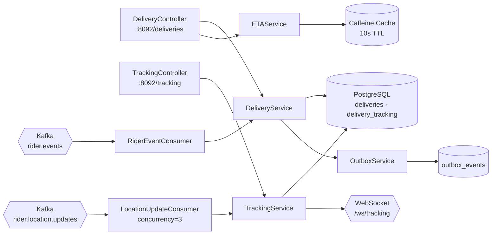
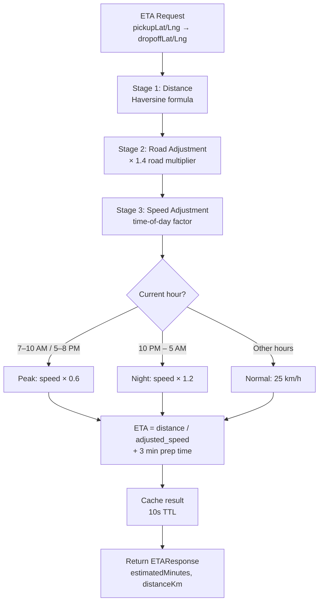
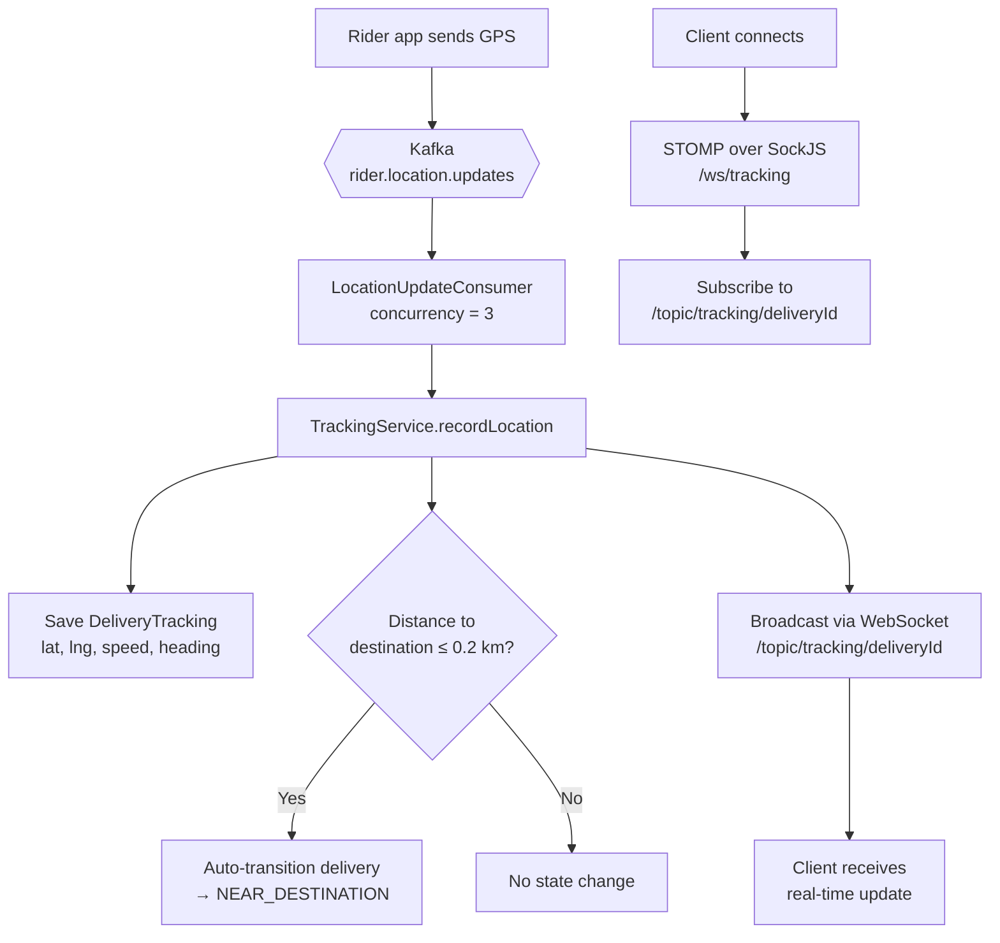
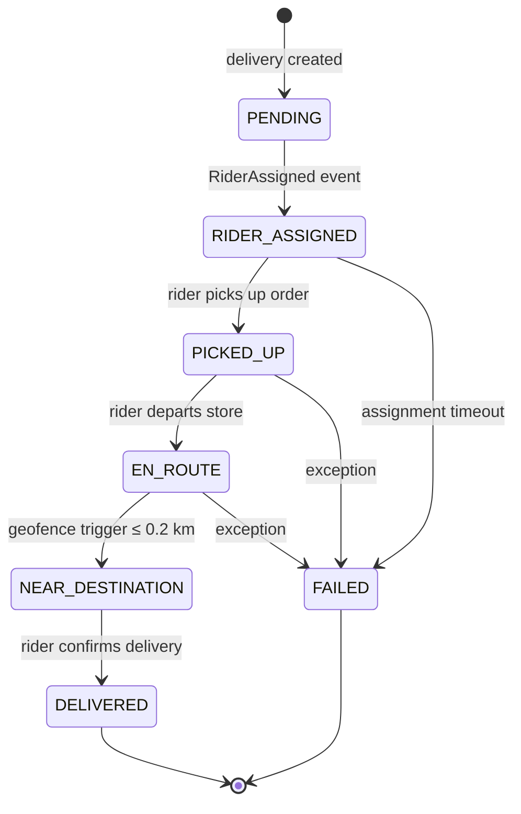
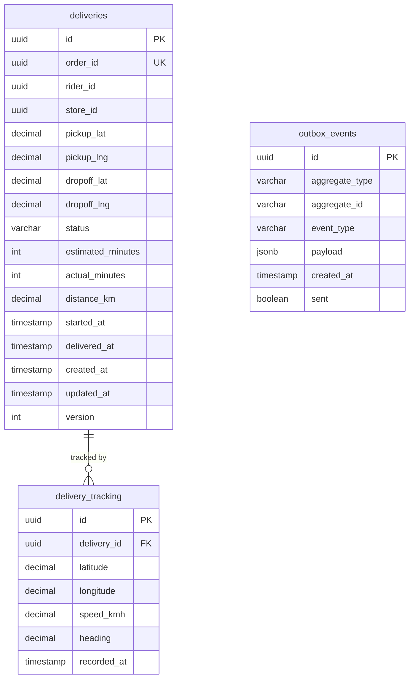

# Routing & ETA Service

> **Java · Spring Boot · Delivery ETA Computation & Live Tracking**

Computes delivery ETAs using Haversine distance with time-of-day speed adjustments, manages the full delivery lifecycle, and provides real-time rider location tracking over WebSocket. Consumes `rider.events` to create deliveries on rider assignment and `rider.location.updates` for continuous GPS ingestion.

## Architecture



## Three-Stage ETA Prediction



## Live Tracking Flow



## Delivery Lifecycle



## API Reference

### DeliveryController — `/deliveries`

| Method | Path | Auth | Description |
|--------|------|------|-------------|
| `GET` | `/{orderId}` | Authenticated | Get delivery by order ID |
| `GET` | `/{id}/eta` | Authenticated | Calculate current ETA for delivery |
| `GET` | `/{id}/tracking` | Authenticated | Get full tracking history |

**ETA Response:**
```json
{
  "estimatedMinutes": 12,
  "distanceKm": 3.45,
  "calculatedAt": "2025-01-15T10:30:00Z"
}
```

**Delivery Response:**
```json
{
  "id": "uuid",
  "orderId": "uuid",
  "riderId": "uuid",
  "storeId": "uuid",
  "pickupLat": 12.9716,
  "pickupLng": 77.5946,
  "dropoffLat": 12.9816,
  "dropoffLng": 77.6046,
  "status": "EN_ROUTE",
  "estimatedMinutes": 12,
  "actualMinutes": null,
  "distanceKm": 3.45,
  "startedAt": "2025-01-15T10:20:00Z",
  "deliveredAt": null,
  "createdAt": "2025-01-15T10:15:00Z",
  "updatedAt": "2025-01-15T10:30:00Z"
}
```

### TrackingController — `/tracking`

| Method | Path | Auth | Description |
|--------|------|------|-------------|
| `POST` | `/location` | Authenticated | Record rider location update |

**Request:**
```json
{
  "deliveryId": "uuid",
  "latitude": 12.9750,
  "longitude": 77.5980,
  "speedKmh": 22.5,
  "heading": 145.0
}
```

**Validation:** latitude ∈ [−90, 90], longitude ∈ [−180, 180], speedKmh ∈ [0, 200], heading ∈ [0, 360].

### WebSocket — `/ws/tracking`

| Protocol | Endpoint | Subscribe Topic |
|----------|----------|-----------------|
| STOMP + SockJS | `/ws/tracking` | `/topic/tracking/{deliveryId}` |

Real-time location broadcasts are pushed whenever a new GPS point is recorded.

## Database Schema



**Indexes:** `deliveries(status)`, `deliveries(rider_id, status)`, `deliveries(order_id)`, `delivery_tracking(delivery_id, recorded_at DESC)`.

**Partitioning:** `delivery_tracking` is range-partitioned by `recorded_at` (monthly, 6-month rolling window).

## Kafka Integration

| Direction | Topic | Group | Details |
|-----------|-------|-------|---------|
| **Consume** | `rider.events` | `routing-eta-service` | Handles `RiderAssigned` → creates delivery with ETA |
| **Consume** | `rider.location.updates` | `routing-eta-service` | GPS points → `recordLocation()` (concurrency=3) |
| **Produce** | via outbox table | — | Delivery state change events |

**Error handling:** Dead-letter topic (`*.DLT`) with 3 retries, 1-second backoff.

## Configuration

| Variable | Default | Description |
|----------|---------|-------------|
| `SERVER_PORT` | `8092` | HTTP listen port |
| `SPRING_DATASOURCE_URL` | — | PostgreSQL JDBC URL |
| `SPRING_KAFKA_BOOTSTRAP_SERVERS` | — | Kafka broker addresses |
| `ROUTING_ETA_AVERAGE_SPEED_KMH` | `25` | Base rider speed |
| `ROUTING_ETA_PREPARATION_TIME_MINUTES` | `3` | Added prep time per delivery |
| `ROUTING_ETA_ROAD_DISTANCE_MULTIPLIER` | `1.4` | Haversine → road distance factor |
| `ROUTING_ETA_PEAK_SPEED_MULTIPLIER` | `0.6` | Speed reduction during rush hours |
| `ROUTING_ETA_NIGHT_SPEED_MULTIPLIER` | `1.2` | Speed boost during night hours |
| `JWT_PUBLIC_KEY` | — | RSA public key (GCP Secret Manager) |
| `OTEL_EXPORTER_OTLP_ENDPOINT` | `otel-collector.monitoring:4318` | OpenTelemetry collector |

### Caching

Caffeine cache: 100 000 entries max, 10-second TTL (ETA calculations).

### CORS

Allowed origins: `http://localhost:3000`, `https://*.instacommerce.dev`.

## Build & Run

```bash
# Local
./gradlew :services:routing-eta-service:bootRun

# Docker
docker build -t routing-eta-service .
docker run -p 8092:8092 routing-eta-service
```

## Dependencies

- Java 21, Spring Boot 3, Spring Kafka, Spring WebSocket
- PostgreSQL + Flyway migrations (partitioned tracking table)
- Resilience4j 2.2.0 (circuit breakers)
- Caffeine 3.1.8 (ETA caching)
- ShedLock 5.10.0 (distributed scheduling)
- JJWT 0.12.5 (JWT authentication)
- Micrometer + OTLP (tracing & metrics)
- GCP Secret Manager, Cloud SQL socket factory
