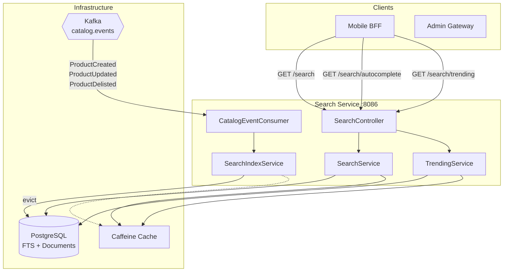
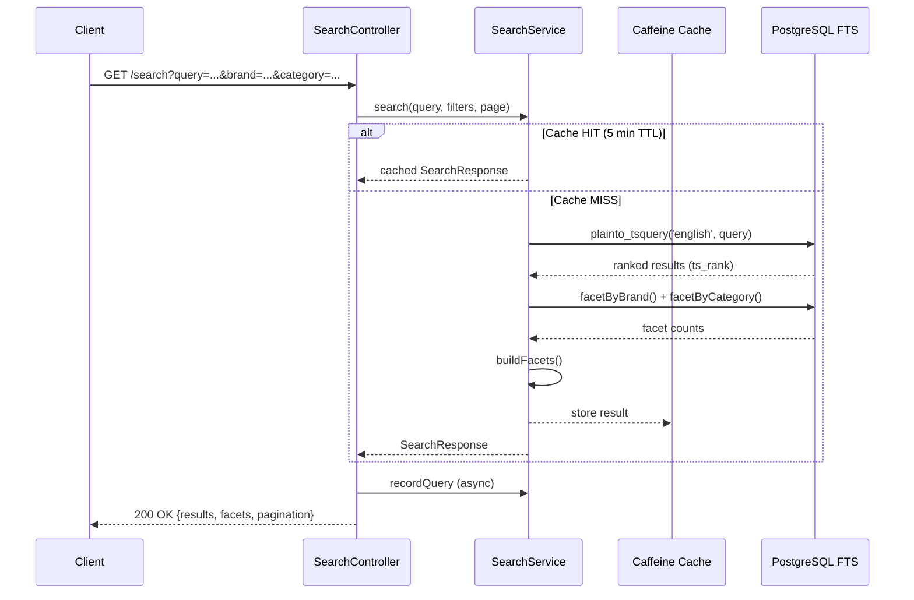
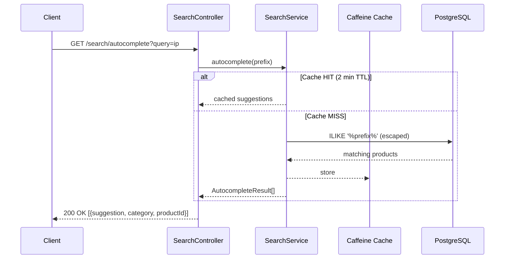
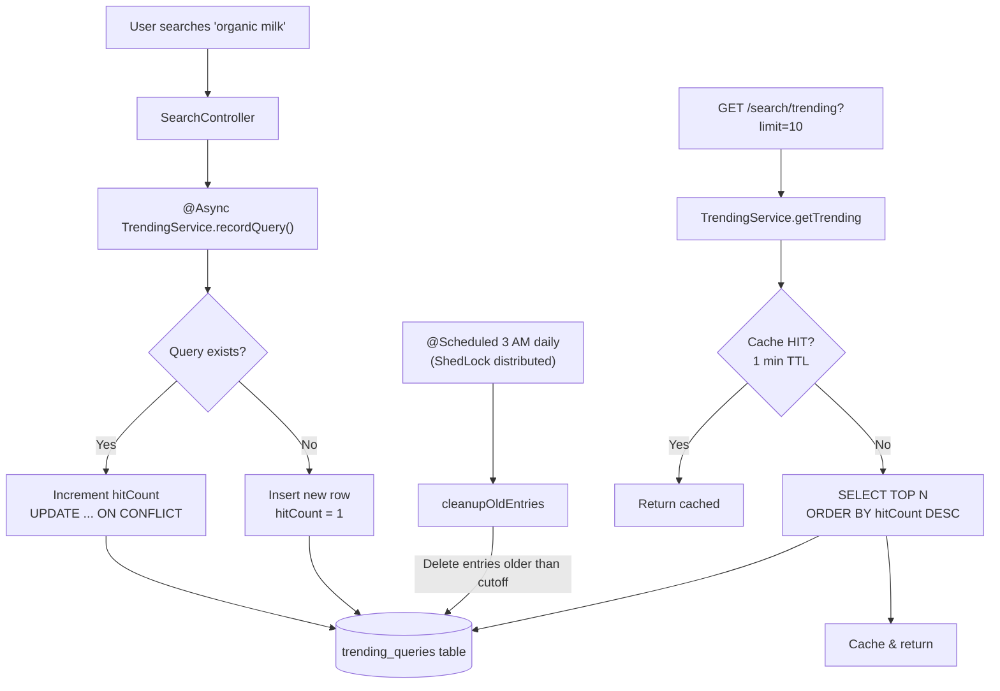
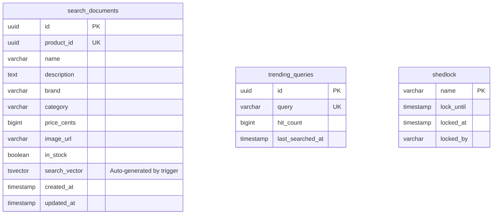

# 🔍 Search Service

> **Full-text product search, autocomplete, and trending queries — powered by PostgreSQL FTS and Kafka-driven index synchronization.**

| Property | Value |
|----------|-------|
| **Port** | `8086` |
| **Database** | PostgreSQL (full-text search) |
| **Messaging** | Kafka (`catalog.events`) |
| **Cache** | Caffeine (in-memory) |
| **Auth** | JWT (RS256) |

---

## Table of Contents

- [Architecture](#architecture)
- [Service Components](#service-components)
- [Search Flow](#search-flow)
- [Index Sync Pipeline](#index-sync-pipeline)
- [Trending Algorithm](#trending-algorithm)
- [API Reference](#api-reference)
- [Database Schema](#database-schema)
- [Configuration](#configuration)
- [Running Locally](#running-locally)

---

## Architecture



---

## Service Components

| Component | Package | Responsibility |
|-----------|---------|---------------|
| **SearchController** | `controller` | REST endpoints for search, autocomplete, and trending |
| **SearchService** | `service` | Full-text search using `plainto_tsquery`, facet aggregation, caching |
| **SearchIndexService** | `service` | Upsert/delete documents in the search index; evicts caches on mutation |
| **TrendingService** | `service` | Async query recording, scheduled cleanup (daily 3 AM via ShedLock) |
| **CatalogEventConsumer** | `kafka` | Kafka listener for `catalog.events`; routes to SearchIndexService |

---

## Search Flow



### Autocomplete Flow



---

## Index Sync Pipeline

```mermaid
flowchart LR
    subgraph Catalog Service
        CS[Catalog Service]
    end

    subgraph Kafka
        KT[catalog.events]
        DLT[catalog.events.DLT]
    end

    subgraph Search Service
        CEC[CatalogEventConsumer]
        SIS[SearchIndexService]
        DB[(PostgreSQL)]
        CACHE[Caffeine Cache]
    end

    CS -->|publish| KT
    KT -->|consume<br/>group: search-service| CEC

    CEC -->|ProductCreated / ProductUpdated| SIS
    CEC -->|ProductDelisted| SIS

    SIS -->|upsertDocument| DB
    SIS -->|deleteDocument| DB
    SIS -.->|@CacheEvict<br/>searchResults, autocomplete| CACHE

    CEC -->|on failure<br/>3 retries, 1s backoff| DLT
```

### Event Mapping

| Kafka Event | Action | Method |
|-------------|--------|--------|
| `ProductCreated` | Insert search document | `upsertDocument()` |
| `ProductUpdated` | Update search document | `upsertDocument()` |
| `ProductDelisted` | Remove from index | `deleteDocument()` |

---

## Trending Algorithm



---

## API Reference

### Public Endpoints

| Method | Endpoint | Description | Auth |
|--------|----------|-------------|------|
| `GET` | `/search` | Full-text product search | Public |
| `GET` | `/search/autocomplete` | Prefix-based product suggestions | Public |
| `GET` | `/search/trending` | Top N trending search queries | Public |

### `GET /search`

| Parameter | Type | Required | Description |
|-----------|------|----------|-------------|
| `query` | string | ✅ | Search terms |
| `brand` | string | ❌ | Filter by brand |
| `category` | string | ❌ | Filter by category |
| `minPrice` | long | ❌ | Minimum price in cents |
| `maxPrice` | long | ❌ | Maximum price in cents |
| `page` | int | ❌ | Page number (default: 0) |
| `size` | int | ❌ | Page size (default: 20) |

**Response:**
```json
{
  "results": [
    {
      "productId": "uuid",
      "name": "Organic Milk",
      "brand": "FarmFresh",
      "category": "Dairy",
      "priceCents": 499,
      "imageUrl": "https://...",
      "inStock": true,
      "score": 0.95
    }
  ],
  "totalResults": 142,
  "page": 0,
  "totalPages": 8,
  "facets": {
    "brand": [{"value": "FarmFresh", "count": 12}],
    "category": [{"value": "Dairy", "count": 28}]
  }
}
```

### `GET /search/autocomplete`

| Parameter | Type | Required | Description |
|-----------|------|----------|-------------|
| `query` | string | ✅ | Prefix to autocomplete |

**Response:**
```json
[
  { "suggestion": "Organic Milk", "category": "Dairy", "productId": "uuid" }
]
```

### `GET /search/trending`

| Parameter | Type | Required | Description |
|-----------|------|----------|-------------|
| `limit` | int | ❌ | Number of results (default: 10) |

**Response:**
```json
["organic milk", "fresh bread", "avocado"]
```

---

## Database Schema



### PostgreSQL Full-Text Search

The `search_vector` column is maintained by a database trigger and uses the `english` dictionary. Search queries use:

- **`plainto_tsquery('english', query)`** — tokenizes user input
- **`ts_rank(search_vector, tsquery)`** — relevance scoring
- **`GIN` index** on `search_vector` for fast lookups

---

## Configuration

### Environment Variables

| Variable | Default | Description |
|----------|---------|-------------|
| `SERVER_PORT` | `8086` | HTTP port |
| `SEARCH_DB_URL` | `jdbc:postgresql://localhost:5432/search` | PostgreSQL connection URL |
| `SEARCH_DB_USER` | `search` | Database username |
| `SEARCH_DB_PASSWORD` | — | Database password |
| `KAFKA_BOOTSTRAP_SERVERS` | `localhost:9092` | Kafka broker addresses |
| `SEARCH_JWT_ISSUER` | `instacommerce-identity` | Expected JWT issuer |
| `SEARCH_JWT_PUBLIC_KEY` | — | RSA public key (PEM) for JWT validation |
| `TRACING_PROBABILITY` | `1.0` | OpenTelemetry sampling rate |
| `OTEL_EXPORTER_OTLP_ENDPOINT` | `http://otel-collector.monitoring:4318` | OTLP collector endpoint |
| `LOG_LEVEL` | `INFO` | Application log level |

### Cache Configuration

| Cache Name | Max Size | TTL | Purpose |
|------------|----------|-----|---------|
| `searchResults` | 10,000 | 5 min | Full-text search results |
| `autocomplete` | 5,000 | 2 min | Autocomplete suggestions |
| `trending` | 100 | 1 min | Trending queries |

### Security

- **Public endpoints:** `/search/**`, `/actuator/**`
- **Admin endpoints:** `/admin/**` → requires `ROLE_ADMIN`
- **CORS origins:** `http://localhost:3000`, `https://*.instacommerce.dev`
- **Session:** Stateless (no cookies)

---

## Running Locally

### Prerequisites

- **Java 21+**
- **PostgreSQL 15+** (with full-text search support)
- **Kafka** (for catalog event consumption)

### 1. Start dependencies

```bash
docker compose up -d postgres kafka
```

### 2. Run the service

```bash
# From repository root
./gradlew :services:search-service:bootRun
```

### 3. Verify

```bash
# Health check
curl http://localhost:8086/actuator/health

# Search
curl "http://localhost:8086/search?query=milk"

# Autocomplete
curl "http://localhost:8086/search/autocomplete?query=mi"

# Trending
curl "http://localhost:8086/search/trending?limit=5"
```

### Connection Pool (HikariCP)

| Setting | Value |
|---------|-------|
| Maximum pool size | 50 |
| Minimum idle | 20 |
| Connection timeout | 3s |
| Statement timeout | 5s |

### Build & Test

```bash
# Build
./gradlew :services:search-service:build

# Run tests
./gradlew :services:search-service:test
```

---

## Observability

| Aspect | Technology |
|--------|-----------|
| **Tracing** | OpenTelemetry → OTLP exporter |
| **Metrics** | Micrometer → Prometheus (`/actuator/prometheus`) |
| **Health** | Spring Actuator (`/actuator/health`) |
| **Logging** | Logstash JSON format |
| **Graceful Shutdown** | 30s timeout per lifecycle phase |
