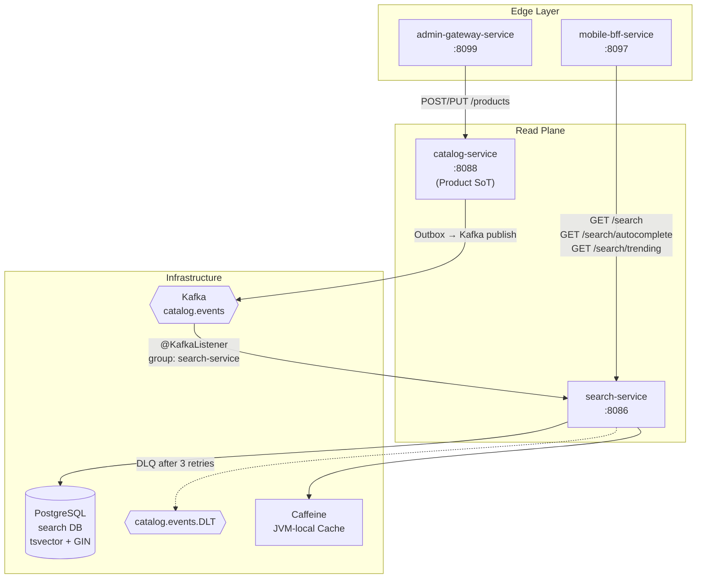
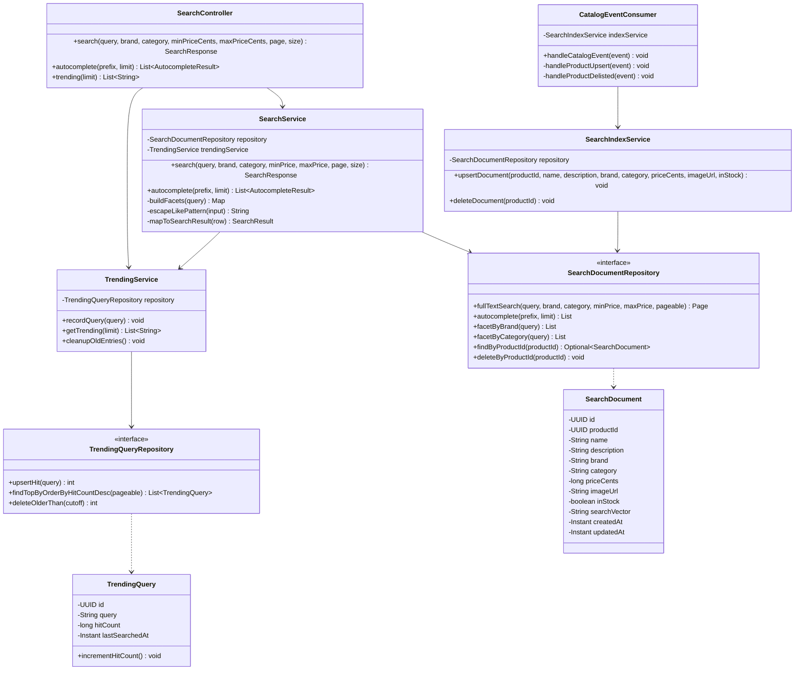
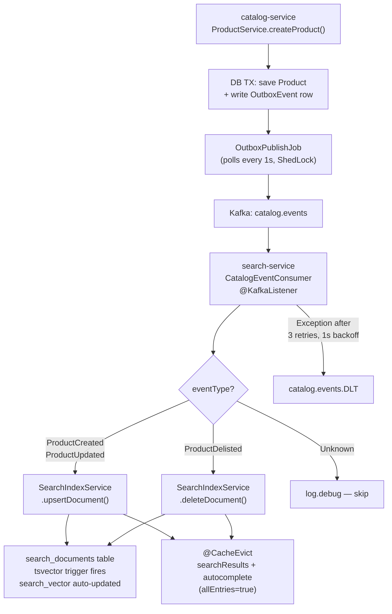
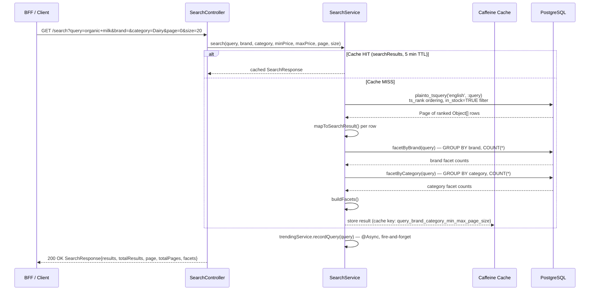
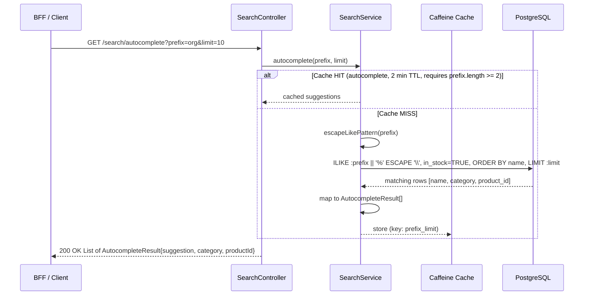
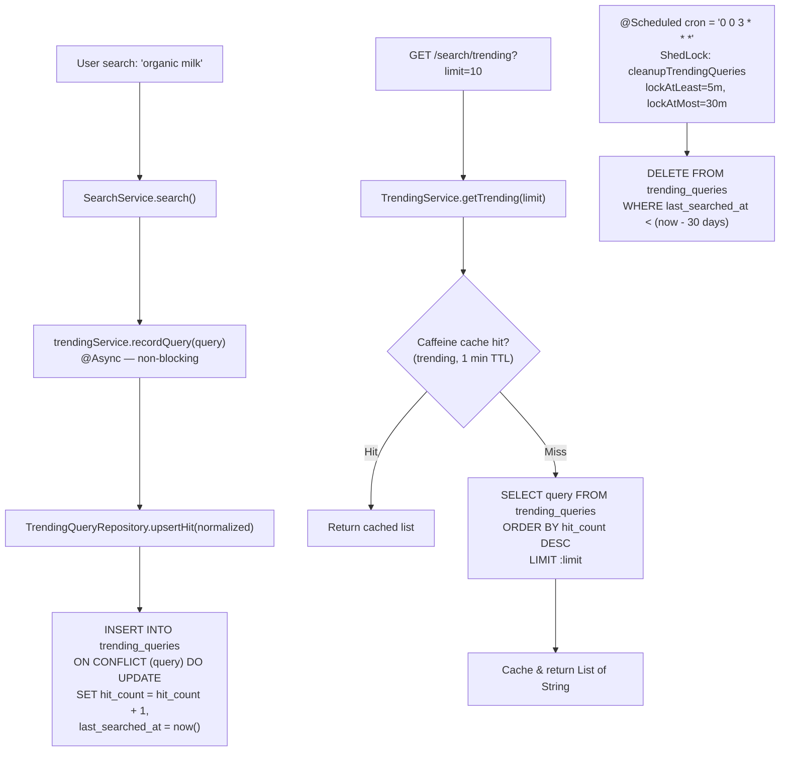
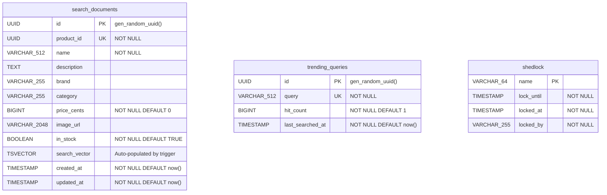

# Search Service

> **Full-text product search, autocomplete, and trending queries — a read-projection over the catalog domain, powered by PostgreSQL tsvector FTS, Kafka-driven index sync, and Caffeine caching.**

| Property | Value |
|----------|-------|
| **Module** | `:services:search-service` |
| **Port (local)** | `8086` (`application.yml`) · `8080` (Dockerfile) |
| **Runtime** | Spring Boot · Java 21 · eclipse-temurin:25-jre-alpine |
| **Database** | PostgreSQL 15+ (tsvector FTS, Flyway-managed) |
| **Messaging** | Kafka consumer (`catalog.events`, group `search-service`) |
| **Cache** | Caffeine (JVM-local, 3 named caches) |
| **Auth** | JWT RS256 (issuer: `instacommerce-identity`) |
| **Secrets** | GCP Secret Manager (`sm://`) with env-var fallback |

---

## Table of Contents

- [Service Role and Boundaries](#service-role-and-boundaries)
- [High-Level Design](#high-level-design)
- [Low-Level Design](#low-level-design)
- [Indexing Flow](#indexing-flow)
- [Search Query Flow](#search-query-flow)
- [Autocomplete Flow](#autocomplete-flow)
- [Trending Queries Flow](#trending-queries-flow)
- [API Reference](#api-reference)
- [Database Schema](#database-schema)
- [Runtime and Configuration](#runtime-and-configuration)
- [Dependencies](#dependencies)
- [Observability](#observability)
- [Testing](#testing)
- [Failure Modes and Degradation](#failure-modes-and-degradation)
- [Rollout and Rollback](#rollout-and-rollback)
- [Known Limitations](#known-limitations)
- [Q-Commerce Search Patterns — Comparison Note](#q-commerce-search-patterns--comparison-note)

---

## Service Role and Boundaries

search-service is the **dedicated read-projection for product search** in the InstaCommerce platform. It consumes `catalog.events` from Kafka, maintains a local `search_documents` table with PostgreSQL tsvector indexing, and exposes search, autocomplete, and trending endpoints to downstream consumers (primarily `mobile-bff-service`).

**Owns:**
- `search_documents` table — a denormalized projection of catalog product data with auto-maintained `tsvector` column.
- `trending_queries` table — an append/upsert log of user search terms with hit-count aggregation.
- `shedlock` table — distributed-lock infrastructure for scheduled jobs.

**Does not own:**
- Product master data (owned by `catalog-service`).
- Stock/inventory truth (owned by `inventory-service`).
- Effective pricing and promotions (owned by `pricing-service`).
- Store/zone resolution (owned by `warehouse-service`).

**Upstream event contract:** The service depends on `catalog-service` publishing `ProductCreated`, `ProductUpdated`, and `ProductDelisted` events to `catalog.events`. The `CatalogEventConsumer` extracts `productId`, `name`, `description`, `brand`, `category`, `priceCents`, `imageUrl`, and `inStock` from the event payload. See [Known Limitations](#known-limitations) for current upstream pipeline status.

---

## High-Level Design



The service sits on the **read path** between the BFF and the infrastructure layer. It is a pure consumer of catalog events — it never writes back to catalog-service or Kafka (except DLQ forwards on consumer failure). All search state is derived and rebuildable from the catalog domain.

---

## Low-Level Design

### Component Diagram



### Package Layout

```
com.instacommerce.search
├── SearchServiceApplication          # @SpringBootApplication, @EnableAsync, @EnableConfigurationProperties
├── controller/
│   └── SearchController              # REST: /search, /search/autocomplete, /search/trending
├── service/
│   ├── SearchService                 # Full-text search, autocomplete, facets, @Cacheable
│   ├── SearchIndexService            # Upsert/delete documents, @CacheEvict, @Transactional
│   └── TrendingService               # @Async record, @Scheduled cleanup (ShedLock), @Cacheable
├── kafka/
│   └── CatalogEventConsumer          # @KafkaListener(topics="catalog.events")
├── repository/
│   ├── SearchDocumentRepository      # Native SQL: fullTextSearch, autocomplete, facetByBrand/Category
│   └── TrendingQueryRepository       # Native SQL: upsertHit (ON CONFLICT DO UPDATE)
├── domain/model/
│   ├── SearchDocument                # @Entity → search_documents
│   └── TrendingQuery                 # @Entity → trending_queries
├── dto/
│   ├── SearchResponse                # record(results, totalResults, page, totalPages, facets)
│   ├── SearchResult                  # record(productId, name, brand, category, priceCents, imageUrl, inStock, score)
│   ├── AutocompleteResult            # record(suggestion, category, productId)
│   ├── FacetValue                    # record(value, count)
│   ├── ErrorResponse                 # record(code, message, traceId, timestamp, details)
│   └── ErrorDetail                   # record(field, message)
├── config/
│   ├── CacheConfig                   # 3 Caffeine caches with per-cache size/TTL
│   ├── KafkaConfig                   # ConsumerFactory, DLQ via DeadLetterPublishingRecoverer
│   ├── SecurityConfig                # JWT filter chain, CORS, stateless sessions
│   ├── ShedLockConfig                # @EnableScheduling, @EnableSchedulerLock, JdbcTemplate provider
│   └── SearchProperties              # @ConfigurationProperties(prefix="search") — JWT config
├── security/
│   ├── JwtService                    # Interface: validateAccessToken, extractAuthorities
│   ├── DefaultJwtService             # RS256 validation via jjwt, issuer check
│   ├── JwtAuthenticationFilter       # OncePerRequestFilter, Bearer token extraction
│   ├── JwtKeyLoader                  # PEM/Base64 RSA public key parsing
│   ├── RestAuthenticationEntryPoint  # 401 JSON response
│   └── RestAccessDeniedHandler       # 403 JSON response
└── exception/
    ├── GlobalExceptionHandler        # @RestControllerAdvice — validation, access denied, fallback
    ├── ApiException                  # Custom exception with HttpStatus + code
    └── TraceIdProvider               # Resolves traceId from MDC/headers/traceparent
```

---

## Indexing Flow

The search index is populated asynchronously via Kafka events from catalog-service. The catalog outbox pattern ensures at-least-once delivery: catalog writes product + outbox row in a single DB transaction, a poller publishes to Kafka, and search-service consumes and upserts.



### Event-to-field mapping

The `CatalogEventConsumer.handleProductUpsert()` extracts the following fields from the event `Map<String, Object>`:

| Event Field | Target Column | Type |
|-------------|--------------|------|
| `productId` | `product_id` | UUID (string → parsed) |
| `name` | `name` | String |
| `description` | `description` | String |
| `brand` | `brand` | String |
| `category` | `category` | String |
| `priceCents` | `price_cents` | Number → long |
| `imageUrl` | `image_url` | String |
| `inStock` | `in_stock` | Boolean (null → false) |

### Upsert semantics

`SearchIndexService.upsertDocument()` is `@Transactional`. It queries by `productId` first: if found, it updates all mutable fields; if absent, it creates a new `SearchDocument`. The PostgreSQL trigger `trg_search_documents_vector` fires `BEFORE INSERT OR UPDATE`, recomputing the weighted tsvector:

- **Weight A:** `name`
- **Weight B:** `brand`, `category`
- **Weight C:** `description`

Both `upsertDocument()` and `deleteDocument()` are annotated with `@CacheEvict(value = {"searchResults", "autocomplete"}, allEntries = true)`, flushing all cached entries on any index mutation.

---

## Search Query Flow



### Full-text search query (native SQL)

```sql
SELECT sd.*, ts_rank(sd.search_vector, plainto_tsquery('english', :query)) AS rank
FROM search_documents sd
WHERE sd.search_vector @@ plainto_tsquery('english', :query)
  AND sd.in_stock = TRUE
  AND (:brand IS NULL OR sd.brand = :brand)
  AND (:category IS NULL OR sd.category = :category)
  AND (:minPrice IS NULL OR sd.price_cents >= :minPrice)
  AND (:maxPrice IS NULL OR sd.price_cents <= :maxPrice)
ORDER BY rank DESC
```

Results are paginated via Spring Data `PageRequest`. The `rank` column (index 11 in the result array) is mapped to `SearchResult.score`. Facets are computed via two additional queries (`facetByBrand`, `facetByCategory`) that repeat the tsvector match with `GROUP BY` aggregation.

---

## Autocomplete Flow



The autocomplete query uses a `text_pattern_ops` B-tree index on `search_documents.name` (added in V4 migration). Input is sanitized via `escapeLikePattern()` which escapes `\`, `%`, and `_` characters. Caching is conditional on `prefix.length() >= 2` to avoid caching single-character prefix results.

---

## Trending Queries Flow



- **Recording:** `@Async` on `recordQuery()` means the caller (SearchService) does not wait. The query is normalized to lowercase-trimmed before upsert.
- **Cleanup:** Runs at 03:00 daily, protected by ShedLock (`cleanupTrendingQueries`) to ensure only one instance executes across replicas. Evicts entries with `lastSearchedAt` older than 30 days.
- **Serving:** `getTrending()` returns the top-N queries by `hitCount DESC`, cached for 1 minute.

---

## API Reference

### Endpoints

| Method | Path | Auth | Description |
|--------|------|------|-------------|
| `GET` | `/search` | Public | Full-text search with filters and facets |
| `GET` | `/search/autocomplete` | Public | Prefix-based product name suggestions |
| `GET` | `/search/trending` | Public | Top-N trending search queries |
| `*` | `/admin/**` | `ROLE_ADMIN` (JWT) | Reserved for admin operations |
| `GET` | `/actuator/health` | Public | Health check (liveness + readiness) |
| `GET` | `/actuator/prometheus` | Public | Prometheus metrics scrape |

### `GET /search`

| Parameter | Type | Required | Validation | Description |
|-----------|------|----------|------------|-------------|
| `query` | string | ✅ | 1–256 chars | Search terms |
| `brand` | string | ❌ | | Exact brand filter |
| `category` | string | ❌ | | Exact category filter |
| `minPriceCents` | long | ❌ | ≥ 0 | Minimum price in cents |
| `maxPriceCents` | long | ❌ | ≥ 0 | Maximum price in cents |
| `page` | int | ❌ | ≥ 0 (default: 0) | Page number |
| `size` | int | ❌ | 1–100 (default: 20) | Page size |

**Response — `SearchResponse`:**
```json
{
  "results": [
    {
      "productId": "550e8400-e29b-41d4-a716-446655440000",
      "name": "Organic Milk",
      "brand": "FarmFresh",
      "category": "Dairy",
      "priceCents": 499,
      "imageUrl": "https://cdn.instacommerce.dev/img/milk.jpg",
      "inStock": true,
      "score": 0.95
    }
  ],
  "totalResults": 142,
  "page": 0,
  "totalPages": 8,
  "facets": {
    "brand": [{"value": "FarmFresh", "count": 12}],
    "category": [{"value": "Dairy", "count": 28}]
  }
}
```

### `GET /search/autocomplete`

| Parameter | Type | Required | Validation | Description |
|-----------|------|----------|------------|-------------|
| `prefix` | string | ✅ | 1–128 chars | Prefix to autocomplete |
| `limit` | int | ❌ | 1–50 (default: 10) | Max suggestions |

**Response — `List<AutocompleteResult>`:**
```json
[
  { "suggestion": "Organic Milk", "category": "Dairy", "productId": "550e8400-..." }
]
```

### `GET /search/trending`

| Parameter | Type | Required | Validation | Description |
|-----------|------|----------|------------|-------------|
| `limit` | int | ❌ | 1–50 (default: 10) | Number of results |

**Response — `List<String>`:**
```json
["organic milk", "fresh bread", "avocado"]
```

### Error Response Format

All errors return a consistent `ErrorResponse` body with trace correlation:

```json
{
  "code": "VALIDATION_ERROR",
  "message": "Invalid input",
  "traceId": "abc123def456",
  "timestamp": "2026-03-07T12:00:00Z",
  "details": [{ "field": "query", "message": "Query must be between 1 and 256 characters" }]
}
```

Error codes: `VALIDATION_ERROR`, `TOKEN_INVALID`, `AUTHENTICATION_REQUIRED`, `ACCESS_DENIED`, `INTERNAL_ERROR`.

---

## Database Schema

### Flyway Migrations

| Version | File | Purpose |
|---------|------|---------|
| V1 | `V1__create_search_documents.sql` | Create `search_documents` table, GIN index on `search_vector`, B-tree indexes on `category`/`brand`/`price_cents`/`in_stock`, tsvector trigger |
| V2 | `V2__create_trending_queries.sql` | Create `trending_queries` table, indexes on `hit_count DESC` and `last_searched_at DESC` |
| V3 | `V3__create_shedlock.sql` | Create `shedlock` table for distributed lock coordination |
| V4 | `V4__add_autocomplete_index.sql` | Add `text_pattern_ops` index on `search_documents.name` for prefix autocomplete |

### Entity-Relationship Diagram



### Indexes

| Table | Index | Type | Purpose |
|-------|-------|------|---------|
| `search_documents` | `idx_search_documents_search_vector` | GIN | Full-text search on `search_vector` |
| `search_documents` | `idx_search_documents_category` | B-tree | Category filter |
| `search_documents` | `idx_search_documents_brand` | B-tree | Brand filter |
| `search_documents` | `idx_search_documents_price` | B-tree | Price range filter |
| `search_documents` | `idx_search_documents_in_stock` | B-tree | Stock filter |
| `search_documents` | `idx_search_documents_name_pattern` | B-tree (`text_pattern_ops`) | Autocomplete prefix match |
| `trending_queries` | `idx_trending_queries_hit_count` | B-tree DESC | Top-N trending lookup |
| `trending_queries` | `idx_trending_queries_last_searched` | B-tree DESC | Cleanup by recency |

### tsvector Trigger

The `trg_search_documents_vector` trigger fires `BEFORE INSERT OR UPDATE` on `search_documents`. It computes a weighted tsvector using the `english` dictionary:

```sql
NEW.search_vector :=
    setweight(to_tsvector('english', COALESCE(NEW.name, '')), 'A') ||
    setweight(to_tsvector('english', COALESCE(NEW.brand, '')), 'B') ||
    setweight(to_tsvector('english', COALESCE(NEW.category, '')), 'B') ||
    setweight(to_tsvector('english', COALESCE(NEW.description, '')), 'C');
```

The trigger also sets `updated_at := now()` on every write.

---

## Runtime and Configuration

### Environment Variables

| Variable | Default | Source | Description |
|----------|---------|--------|-------------|
| `SERVER_PORT` | `8086` | `application.yml` | HTTP listen port (Dockerfile overrides to `8080`) |
| `SEARCH_DB_URL` | `jdbc:postgresql://localhost:5432/search` | `application.yml` | JDBC connection URL |
| `SEARCH_DB_USER` | `postgres` | `application.yml` | Database username |
| `SEARCH_DB_PASSWORD` | — | `sm://db-password-search` | Database password (Secret Manager → env fallback) |
| `KAFKA_BOOTSTRAP_SERVERS` | `localhost:9092` | `application.yml` | Kafka broker addresses |
| `SEARCH_JWT_ISSUER` | `instacommerce-identity` | `application.yml` | Expected JWT `iss` claim |
| `SEARCH_JWT_PUBLIC_KEY` | — | `sm://jwt-rsa-public-key` | RSA public key (PEM or raw Base64) |
| `TRACING_PROBABILITY` | `1.0` | `application.yml` | OTEL trace sampling probability (0.0–1.0) |
| `OTEL_EXPORTER_OTLP_TRACES_ENDPOINT` | `http://otel-collector.monitoring:4318/v1/traces` | `application.yml` | OTLP traces endpoint |
| `OTEL_EXPORTER_OTLP_METRICS_ENDPOINT` | `http://otel-collector.monitoring:4318/v1/metrics` | `application.yml` | OTLP metrics endpoint |
| `ENVIRONMENT` | `dev` | `application.yml` | Environment tag for metrics |
| `LOG_LEVEL` | `INFO` | `application.yml` | Log level for `com.instacommerce.search` |

### Cache Configuration

Defined programmatically in `CacheConfig.java` (not via `application.yml` `spring.cache.caffeine.spec`):

| Cache Name | Max Size | TTL | Eviction Trigger | Cache Key Pattern |
|------------|----------|-----|-------------------|-------------------|
| `searchResults` | 10,000 | 5 min | `@CacheEvict(allEntries=true)` on index mutation | `query_brand_category_minPrice_maxPrice_page_size` |
| `autocomplete` | 5,000 | 2 min | `@CacheEvict(allEntries=true)` on index mutation | `prefix_limit` (only cached if `prefix.length >= 2`) |
| `trending` | 100 | 1 min | `@CacheEvict(allEntries=true)` on daily cleanup | `limit` |

### HikariCP Connection Pool

From `application.yml` `spring.datasource.hikari`:

| Setting | Value | Notes |
|---------|-------|-------|
| `maximum-pool-size` | 50 | |
| `minimum-idle` | 20 | |
| `connection-timeout` | 3,000 ms | |
| `max-lifetime` | 1,800,000 ms (30 min) | |
| `leak-detection-threshold` | 60,000 ms (1 min) | |
| `statement_timeout` | 5,000 ms | Via `data-source-properties.options` |

### Kafka Consumer

| Setting | Value |
|---------|-------|
| `group-id` | `search-service` |
| `auto-offset-reset` | `earliest` |
| Key deserializer | `StringDeserializer` |
| Value deserializer | `JsonDeserializer` (trusted: `com.instacommerce.*`) |
| Error handler | `DefaultErrorHandler` + `DeadLetterPublishingRecoverer` |
| Retry policy | 3 retries, 1,000 ms fixed backoff |
| DLQ topic | `catalog.events.DLT` |

### Security

| Path Pattern | Access |
|-------------|--------|
| `/search/**` | `permitAll` |
| `/actuator/**`, `/error` | `permitAll` |
| `/admin/**` | `hasRole("ADMIN")` — requires valid JWT with `roles` claim |
| All other | `authenticated` |

- **Session policy:** `STATELESS` (no HTTP session, no cookies).
- **CORS:** Configurable via `search.cors.allowed-origins` (default: `http://localhost:3000,https://*.instacommerce.dev`). Allows methods `GET, POST, PUT, DELETE, PATCH, OPTIONS` and headers `Authorization, Content-Type, X-Request-Id, X-Idempotency-Key`. Max age 3600s.
- **JWT validation:** RS256 via jjwt. Public key loaded at startup by `JwtKeyLoader` from PEM or raw Base64 format. Issuer must match `search.jwt.issuer`.

### Docker

```
FROM eclipse-temurin:25-jdk       (build stage)
FROM eclipse-temurin:25-jre-alpine (runtime)
```

- Non-root user: `appuser` (UID 1001)
- JVM flags: `-XX:MaxRAMPercentage=75.0 -XX:+UseZGC`
- Healthcheck: `wget -qO- http://localhost:8080/actuator/health/liveness` every 30s
- Exposed port: `8080` (overrides the `8086` default in `application.yml`)

---

## Dependencies

### Runtime Dependencies (from `build.gradle.kts`)

| Dependency | Purpose |
|------------|---------|
| `spring-boot-starter-web` | REST endpoints, embedded Tomcat |
| `spring-boot-starter-data-jpa` | JPA/Hibernate for entity persistence |
| `spring-boot-starter-security` | JWT authentication, authorization filter chain |
| `spring-boot-starter-validation` | Bean validation (`@Size`, `@Min`, `@Max`) |
| `spring-boot-starter-actuator` | Health, metrics, Prometheus endpoint |
| `spring-boot-starter-cache` | `@Cacheable` / `@CacheEvict` abstraction |
| `spring-boot-starter-kafka` | Kafka consumer (`@KafkaListener`) |
| `caffeine:3.1.8` | JVM-local cache implementation |
| `micrometer-tracing-bridge-otel` | OTEL distributed tracing bridge |
| `micrometer-registry-otlp` | OTLP metrics export |
| `logstash-logback-encoder:7.4` | Structured JSON logging |
| `spring-cloud-gcp-starter-secretmanager` | GCP Secret Manager integration (`sm://`) |
| `postgres-socket-factory:1.15.0` | Cloud SQL socket factory for GCP |
| `flyway-core` + `flyway-database-postgresql` | Schema migration |
| `shedlock-spring:5.10.2` + `shedlock-provider-jdbc-template` | Distributed scheduled job locking |
| `jjwt-api:0.12.5` (+impl, +jackson at runtime) | JWT parsing and validation |
| `postgresql` (runtime) | JDBC driver |

### Test Dependencies

| Dependency | Purpose |
|------------|---------|
| `spring-boot-starter-test` | JUnit 5, Mockito, Spring test context |
| `spring-security-test` | Security context mocking |
| `testcontainers:postgresql:1.19.3` | Dockerized PostgreSQL for integration tests |
| `testcontainers:junit-jupiter:1.19.3` | Testcontainers JUnit 5 extension |

### Upstream Service Dependencies

| Service | Interaction | Data |
|---------|-------------|------|
| `catalog-service` | Kafka consumer (`catalog.events`) | Product data for indexing |
| `identity-service` | JWT public key (config, not runtime call) | Auth token validation |

### Infrastructure Dependencies

| Component | Required For |
|-----------|-------------|
| PostgreSQL 15+ | FTS, tsvector, GIN indexes |
| Kafka | `catalog.events` consumption, DLQ publishing |
| GCP Secret Manager | Production secret injection (optional locally) |
| OTEL Collector | Trace and metric export (optional locally) |

---

## Observability

### Endpoints

| Endpoint | Purpose |
|----------|---------|
| `/actuator/health` | Composite health (show-details: always) |
| `/actuator/health/liveness` | Liveness probe (livenessState) |
| `/actuator/health/readiness` | Readiness probe (readinessState + DB) |
| `/actuator/prometheus` | Prometheus metrics scrape |
| `/actuator/metrics` | Micrometer metrics browser |
| `/actuator/info` | Application info |

### Health Groups (from `application.yml`)

| Group | Includes |
|-------|----------|
| `readiness` | `readinessState`, `db` |
| `liveness` | `livenessState` |

### Tracing

- **Bridge:** `micrometer-tracing-bridge-otel` — generates W3C `traceparent` spans.
- **Sampling:** Configurable via `TRACING_PROBABILITY` (default `1.0` = 100%).
- **Export:** OTLP HTTP to `OTEL_EXPORTER_OTLP_TRACES_ENDPOINT`.
- **Trace ID resolution:** `TraceIdProvider` extracts traceId from MDC, then `X-B3-TraceId`, `X-Trace-Id`, `traceparent`, or `X-Request-Id` headers (in that order). Falls back to a random UUID. All error responses include the `X-Trace-Id` response header.

### Metrics

- **Export:** OTLP HTTP to `OTEL_EXPORTER_OTLP_METRICS_ENDPOINT`, also exposed at `/actuator/prometheus`.
- **Tags:** All metrics tagged with `service=search-service` and `environment=${ENVIRONMENT}`.
- **Key metrics to monitor** (per `docs/reviews/iter3/diagrams/lld/browse-search-discovery.md`):

| Metric | Purpose | Alert Threshold |
|--------|---------|-----------------|
| `search.query.latency` | Search p50/p99 | p99 > 200 ms for 5 min |
| `search.autocomplete.latency` | Autocomplete p99 | p99 > 80 ms |
| `search.query.no_results_rate` | Relevance quality signal | > 15% of queries |
| `search.index.lag_seconds` | Index freshness SLO | p95 > 60s for 5 min |
| `search.cache.hit_ratio` | Cache effectiveness | < 60% sustained |
| `search.consumer.dlq.count` | Malformed events reaching DLQ | > 0 |

### Logging

- **Format:** Logstash JSON via `logstash-logback-encoder`.
- **Log levels:** `com.instacommerce.search` → `${LOG_LEVEL:INFO}`, `org.springframework.kafka` → `WARN`.
- **Shutdown:** Graceful with 30s timeout per lifecycle phase (`spring.lifecycle.timeout-per-shutdown-phase`).

---

## Testing

### Test Harness

Tests use JUnit 5 via Gradle (`useJUnitPlatform()`). Test dependencies include Testcontainers for PostgreSQL and Spring Security test support. The `build.gradle.kts` declares:

- `org.testcontainers:postgresql:1.19.3` — for integration tests against a real PostgreSQL instance with FTS.
- `org.testcontainers:junit-jupiter:1.19.3` — JUnit 5 lifecycle integration.
- `spring-security-test` — for mocking security contexts in controller tests.

### Running Tests

```bash
# All tests
./gradlew :services:search-service:test

# Specific test class
./gradlew :services:search-service:test --tests "com.instacommerce.search.service.SearchServiceTest"

# Build (includes test)
./gradlew :services:search-service:build
```

### Running Locally

```bash
# 1. Start infrastructure
docker compose up -d postgres kafka

# 2. Run the service
./gradlew :services:search-service:bootRun

# 3. Verify
curl http://localhost:8086/actuator/health
curl "http://localhost:8086/search?query=milk"
curl "http://localhost:8086/search/autocomplete?prefix=mi&limit=5"
curl "http://localhost:8086/search/trending?limit=5"
```

---

## Failure Modes and Degradation

| Failure | Severity | User Impact | Behavior |
|---------|----------|-------------|----------|
| **PostgreSQL down** | P0 | Search, autocomplete, trending all return 500 | Readiness probe fails (`db` health indicator). Pod removed from load balancer. No cache-only fallback — all queries hit DB. |
| **Kafka broker down** | P1 | Search index stops updating; stale results served | Existing `search_documents` data continues to serve. Outbox rows accumulate in catalog-service DB (no data loss). Recovery automatic when Kafka returns. |
| **Kafka consumer crash-loop** | P1 | Index updates stuck on a poisoned partition | After 3 retries (1s backoff each), the message is forwarded to `catalog.events.DLT`. Consumer advances past the bad message. Monitor `search.consumer.dlq.count`. |
| **Upstream event payload mismatch** | P0 | Consumer throws `NullPointerException` or `ClassCastException` | The exception propagates, triggers retry + DLQ. See [Known Limitations](#known-limitations) for the current catalog-service payload gap. |
| **Cache stampede (allEntries eviction)** | P2 | Burst DB load after product updates | Every `upsertDocument()` / `deleteDocument()` flushes all 10k `searchResults` + 5k `autocomplete` entries. Under rapid updates (e.g., flash sale stock toggles), all pods re-query PostgreSQL concurrently. |
| **Cross-pod cache inconsistency** | P2 | Users on different pods see different results | Caffeine is JVM-local. A Kafka event evicts caches only on the consuming pod. Other N-1 pods serve stale data for up to 5 min (searchResults TTL). |
| **Statement timeout** | P3 | Individual query returns 500 | `statement_timeout=5000ms`. Queries exceeding 5s are cancelled by PostgreSQL. The `GlobalExceptionHandler` returns an `INTERNAL_ERROR` response. |
| **JWT public key misconfigured** | P0 | Service fails to start | `JwtKeyLoader` throws `IllegalStateException("JWT public key is not configured")` at bean creation. Application context fails to initialize. |
| **GCP Secret Manager unavailable** | P2 | Service fails to start if no env fallback | `spring.config.import: optional:sm://` — the `optional:` prefix means startup proceeds if Secret Manager is unavailable, falling back to environment variables. |

---

## Rollout and Rollback

### Deployment

- **GitOps:** Helm chart in `deploy/helm/` with `search-service` key in `values-dev.yaml`. ArgoCD syncs from `argocd/`.
- **Docker image:** Multi-stage build (`Dockerfile`), tagged per CI pipeline, pushed to container registry.
- **Health gates:** Kubernetes uses `/actuator/health/liveness` and `/actuator/health/readiness` probes. Readiness includes DB connectivity check.
- **Graceful shutdown:** 30s timeout. In-flight requests complete; Kafka consumer commits offsets before shutdown.

### Rollout Strategy (per review docs)

1. **Canary:** Deploy 1 pod with new image, retain N-1 pods on previous version.
2. **Observe:** Monitor `search.query.latency`, `search.consumer.dlq.count`, error rates for 15–30 min.
3. **Promote:** Roll remaining pods if metrics are healthy.

### Rollback Triggers

| Condition | Action |
|-----------|--------|
| Search error rate > 1% | Rollback to previous image tag |
| Search p99 latency > 500 ms sustained | Rollback to previous image tag |
| DLQ count spike (> 10 in 5 min) | Investigate event format; rollback consumer if regression |
| Readiness probe failures on > 50% pods | Rollback; check DB connectivity and Flyway migration compatibility |

### Migration Safety

Flyway runs automatically at startup (`spring.flyway.enabled=true`). All migrations are forward-only (no `V*__drop` or destructive DDL). JPA is set to `ddl-auto: validate` — it will not modify the schema, only verify entity-to-table alignment. A bad migration will fail startup cleanly before serving traffic.

---

## Known Limitations

These are grounded in checked-in code and documented in `docs/reviews/iter3/diagrams/lld/browse-search-discovery.md` and `docs/reviews/iter3/services/read-decision-plane.md`.

| # | Severity | Limitation | Evidence |
|---|----------|------------|----------|
| 1 | **P0** | **Upstream pipeline broken.** `catalog-service` outbox publisher is a logging stub (`LoggingOutboxEventPublisher`). Events are written to the outbox table and marked `sent=true` but never reach Kafka. The `search_documents` table is not populated via the event pipeline in practice. | `docs/reviews/iter3/services/read-decision-plane.md` §1.1; `docs/reviews/iter3/diagrams/lld/browse-search-discovery.md` §2.2 |
| 2 | **P0** | **Event payload mismatch.** `CatalogEventConsumer` expects 8 fields (`productId`, `name`, `description`, `brand`, `category`, `priceCents`, `imageUrl`, `inStock`), but `ProductChangedEvent` in catalog-service only publishes `productId`, `sku`, `name`, `slug`, `categoryId`, `active`. Seven fields are missing — consumer would NPE even if Kafka were wired. | `CatalogEventConsumer.handleProductUpsert()` vs catalog-service `ProductChangedEvent.java` |
| 3 | **P1** | **No store-scoped availability.** `in_stock` is a single global boolean derived from the catalog event. There is no `product_store_availability` sidecar table and no `inventory.events` consumer. All users see the same stock status regardless of delivery zone. | `SearchDocumentRepository.fullTextSearch()` `WHERE sd.in_stock = TRUE` (no store JOIN) |
| 4 | **P2** | **Cache stampede on `allEntries=true`.** Every index mutation flushes all `searchResults` (10k) and `autocomplete` (5k) cache entries. Under rapid updates, this causes a sustained cache miss storm across all pods. | `SearchIndexService.java` `@CacheEvict(allEntries = true)` |
| 5 | **P2** | **Cross-pod cache inconsistency.** Caffeine is JVM-local. Only the pod that processes a Kafka event evicts its cache. Other pods serve stale data for up to 5 min. | `CacheConfig.java` — no Redis or distributed invalidation |
| 6 | **P2** | **No bulk reindex endpoint.** There is no mechanism to rebuild the search index from scratch (cold-start or drift repair). | No `/admin/reindex` endpoint or `ReindexJob` in source |
| 7 | **P2** | **Statement timeout is 5s.** This is high for a read-oriented search service. The review docs recommend reducing to 2s. | `application.yml` `statement_timeout=5000` |
| 8 | **P3** | **Ranking is pure text relevance.** No trending, conversion, availability, recency, or personalization signals in the ranking formula. | `SearchDocumentRepository.fullTextSearch()` `ORDER BY rank DESC` (ts_rank only) |
| 9 | **P3** | **Facets cost 3x query.** `facetByBrand()` and `facetByCategory()` each re-execute the full tsvector match. At scale this triples query cost. | `SearchService.buildFacets()` — two additional native queries |
| 10 | **P3** | **No test files checked in.** Test dependencies (Testcontainers, spring-security-test) are declared in `build.gradle.kts` but no test sources exist under `src/test/`. | `src/test/` is absent |
| 11 | — | **Autocomplete has no fuzzy/typo tolerance.** Uses `ILIKE prefix%` only. No phonetic matching, no edit-distance tolerance. | `SearchDocumentRepository.autocomplete()` |

---

## Q-Commerce Search Patterns — Comparison Note

The following observations are grounded in the architecture review at `docs/reviews/iter3/diagrams/lld/browse-search-discovery.md` and the q-commerce benchmarks in `docs/reviews/iter3/benchmarks/`.

**Store-scoped availability is the critical differentiator in q-commerce search.** Unlike traditional e-commerce where a product is either globally available or not, q-commerce operates with per-dark-store inventory. A search result that shows an item as in-stock when the user's nearest store is out creates a broken funnel: the user adds to cart, reaches checkout, and hits an OOS error. The review docs identify this as P1 and propose a `product_store_availability` sidecar table fed by `inventory.events` (see §3.3 of the LLD). This is not yet implemented.

**Latency budgets are tighter than traditional e-commerce.** The target latencies documented in the review are p99 < 200 ms for keyword search, p99 < 80 ms for autocomplete, and p99 < 50 ms for trending. The current PostgreSQL tsvector approach is viable for SKU counts up to ~50k. The review docs note that a transition to a dedicated search engine (OpenSearch) should be planned when SKU count exceeds that threshold (§5.3, §5.4).

**Ranking signals beyond text relevance are table stakes.** Leading q-commerce platforms incorporate availability, trending, conversion rate, and freshness into ranking. The current implementation uses `ts_rank` only. The review outlines a phased ranking improvement: Phase 1 adds a trending-query signal, Phase 2 adds availability boost, Phase 3 (ML-driven personalization) is deferred to the ML platform track (§5.2).

---

*This README is grounded in checked-in source code under `services/search-service/` and review documents under `docs/reviews/iter3/`. Last verified against the current state of the codebase.*
