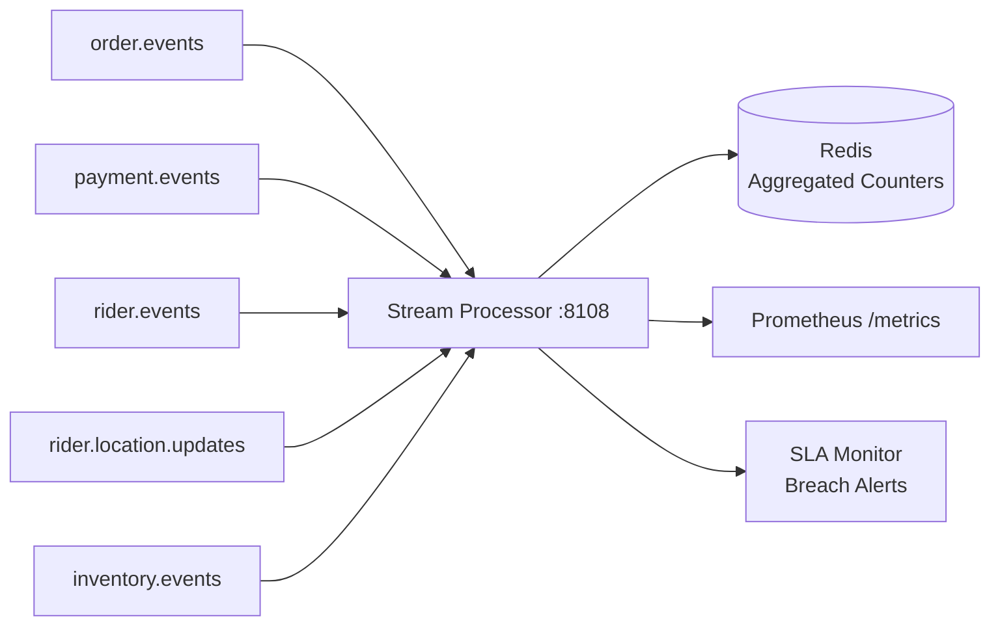
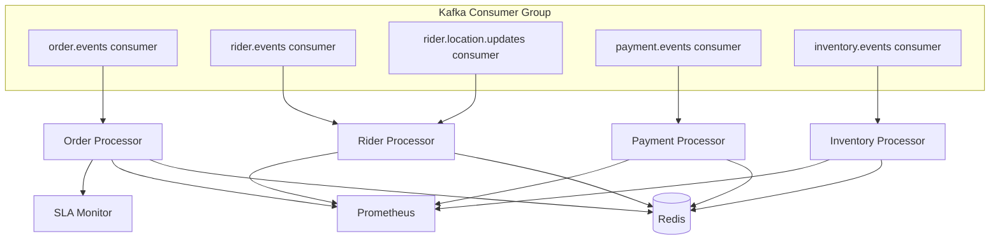
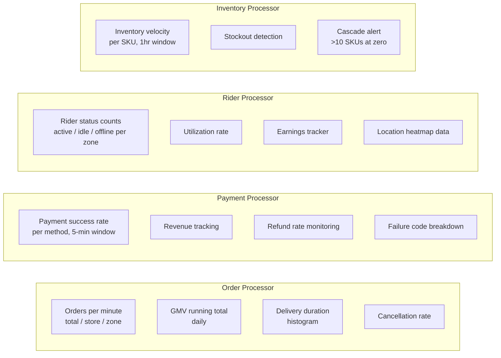
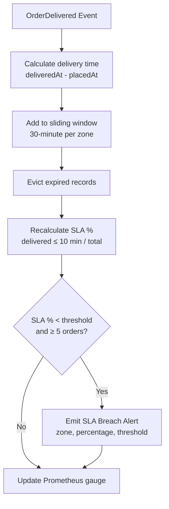
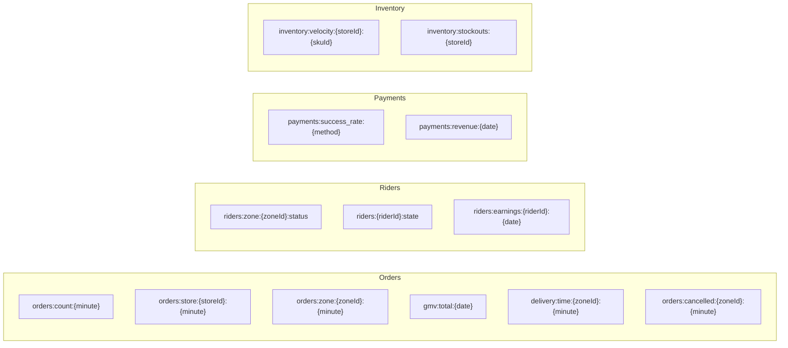

# Stream Processor Service

> **Go · Real-Time Kafka Stream Processing for Business Metrics**

Consumes events from multiple Kafka topics (orders, payments, riders, inventory) and computes real-time business metrics using sliding windows. Outputs aggregated counters and gauges to Redis for dashboard consumption and Prometheus for alerting. Includes a dedicated SLA monitor that detects delivery compliance breaches per zone.

## Architecture



## Multi-Topic Consumption



## Aggregation Pipeline



## SLA Monitoring



## Redis Output Keys



## Project Structure

```
stream-processor-service/
├── main.go                          # Kafka consumers, HTTP server, Redis init
├── processor/
│   ├── order_processor.go           # Order metrics: GMV, delivery time, cancellations
│   ├── payment_processor.go         # Payment success rate, revenue, refund monitoring
│   ├── rider_processor.go           # Rider status, utilization, earnings, location
│   ├── inventory_processor.go       # Stock velocity, stockout cascade detection
│   └── sla_monitor.go              # 30-min sliding window SLA compliance per zone
├── Dockerfile
└── go.mod
```

## Configuration

| Variable | Default | Description |
|---|---|---|
| `HTTP_PORT` | `8108` | HTTP listen port |
| `KAFKA_BROKERS` | `localhost:9092` | Comma-separated Kafka broker list |
| `CONSUMER_GROUP_ID` | `stream-processor` | Kafka consumer group ID |
| `REDIS_ADDR` | `localhost:6379` | Redis address |
| `REDIS_PASSWORD` | — | Redis password |

## Key Metrics

### Order Metrics
| Metric | Type | Description |
|---|---|---|
| `orders_total` | Counter | Orders by event_type, store_id, zone_id |
| `gmv_total_cents` | Counter | Gross Merchandise Value running total |
| `delivery_duration_minutes` | Histogram | Delivery time distribution by zone/store |
| `sla_compliance_ratio` | Gauge | SLA compliance percentage per zone |
| `order_cancellations_total` | Counter | Cancellations by store/zone |

### Payment Metrics
| Metric | Type | Description |
|---|---|---|
| `payments_total` | Counter | Payment events by type and method |
| `payments_revenue_total_cents` | Counter | Revenue running total |
| `payment_success_rate` | Gauge | Success rate per payment method |
| `payment_failures_by_code_total` | Counter | Failures by error code |
| `refunds_total` | Counter | Refunds by method |

### Rider Metrics
| Metric | Type | Description |
|---|---|---|
| `riders_by_status` | Gauge | Rider count by status and zone |
| `rider_deliveries_total` | Counter | Deliveries by rider/zone |
| `rider_earnings_total_cents` | Counter | Earnings by rider |
| `rider_location_updates_total` | Counter | Location pings received |

### Inventory Metrics
| Metric | Type | Description |
|---|---|---|
| `inventory_stock_updates_total` | Counter | Stock updates by type/store |
| `inventory_stockouts_total` | Counter | Stockout events per store |
| `inventory_cascade_alerts_total` | Counter | Cascade alerts (>10 SKUs at zero) |
| `inventory_velocity` | Gauge | Stock velocity per store/SKU |

### SLA Monitor Metrics
| Metric | Type | Description |
|---|---|---|
| `sla_window_percent` | Gauge | Current SLA % per zone (30-min window) |
| `sla_alerts_total` | Counter | SLA breach alerts emitted per zone |
| `sla_window_orders` | Gauge | Orders in current SLA window per zone |

## API Reference

### `GET /health`

Returns `{"status":"ok"}`.

### `GET /metrics`

Prometheus metrics endpoint.

## Build & Run

```bash
# Local
go build -o stream-processor .
KAFKA_BROKERS="localhost:9092" REDIS_ADDR="localhost:6379" ./stream-processor

# Docker
docker build -t stream-processor-service .
docker run -e KAFKA_BROKERS="..." -e REDIS_ADDR="..." -p 8108:8108 stream-processor-service
```

## Dependencies

- Go 1.22+
- `github.com/segmentio/kafka-go` (Kafka consumer)
- `github.com/redis/go-redis/v9` (Redis client)
- `github.com/prometheus/client_golang` (metrics with `promauto`)
