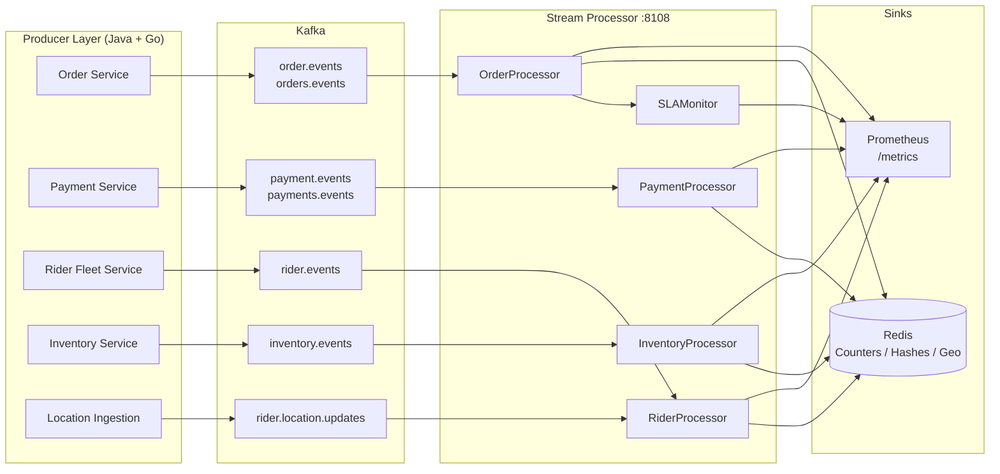
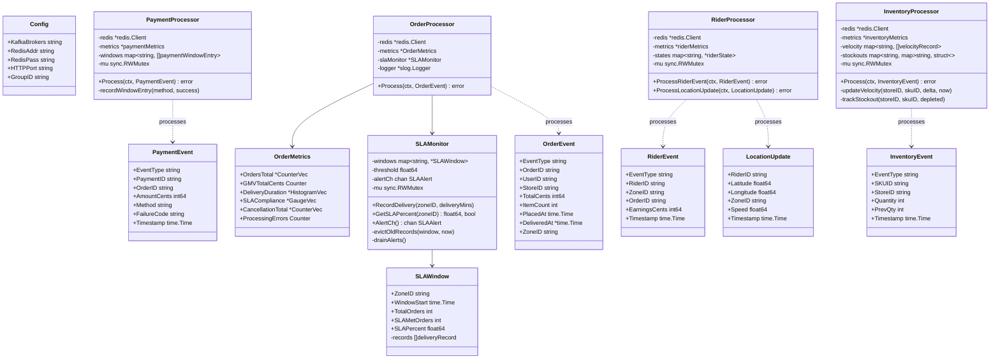
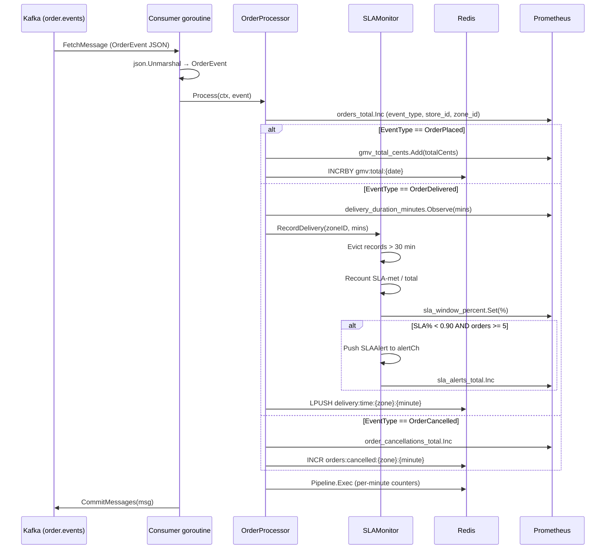
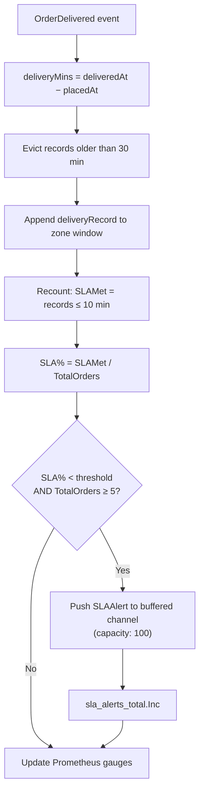

# Stream Processor Service

> **Go · Real-Time Kafka Stream Processing for Operational Business Metrics**

Stateless Go service that consumes domain events from seven Kafka topics across
four business domains (orders, payments, riders, inventory), computes real-time
sliding-window aggregations, and dual-writes the results to **Redis** (for
dashboard/API consumption) and **Prometheus** (for alerting and SLA monitoring).
A dedicated SLA monitor detects delivery compliance breaches per zone using a
30-minute sliding window with configurable thresholds.

This service sits on the **consumer layer** of InstaCommerce's three-layer event
plane (see `docs/architecture/DATA-FLOW.md`). It operates on "Path A" alongside
the Beam/Dataflow analytical pipelines ("Path B") — the stream processor
provides sub-second operational metrics, while Beam pipelines land windowed
analytics into BigQuery for warehouse-grade analysis.

---

## Table of Contents

- [Service Role and Boundaries](#service-role-and-boundaries)
- [High-Level Design](#high-level-design)
- [Low-Level Design](#low-level-design)
- [Streaming and Enrichment Flows](#streaming-and-enrichment-flows)
- [SLA Monitoring](#sla-monitoring)
- [Redis Output Schema](#redis-output-schema)
- [Runtime and Configuration](#runtime-and-configuration)
- [Dependencies](#dependencies)
- [Observability](#observability)
- [Testing](#testing)
- [Failure Modes](#failure-modes)
- [Rollout and Rollback Notes](#rollout-and-rollback-notes)
- [Known Limitations](#known-limitations)
- [Q-Commerce Stream Processing: Comparison Note](#q-commerce-stream-processing-comparison-note)
- [Project Structure](#project-structure)
- [Build and Run](#build-and-run)

---

## Service Role and Boundaries

**Owns**: Real-time operational metric computation from domain events. Counters,
gauges, histograms, and sliding-window aggregations for orders, payments, riders,
and inventory — consumed by ops dashboards and Prometheus alerting.

**Does NOT own**: Authoritative financial totals (owned by BigQuery via
`cdc-consumer-service`), event production (owned by Java domain services via the
outbox pattern and `outbox-relay-service`), or analytical windowed aggregations
(owned by Beam/Dataflow pipelines under `data-platform/`).

**Inputs**: Kafka topics produced by `outbox-relay-service` (domain events) and
`location-ingestion-service` (GPS pings).

**Outputs**: Redis keys (TTL-bounded counters, hashes, geo sets) and Prometheus
metrics exposed on `:8108/metrics`.

**Consumer group**: `stream-processor` (configurable via `CONSUMER_GROUP_ID`).

---

## High-Level Design



### Kafka Consumer Topology

Seven `kafka.Reader` goroutines share one consumer group. Each reader handles
one topic and dispatches to the corresponding processor. Dual-topic subscription
exists for `order.events` / `orders.events` and `payment.events` /
`payments.events` to bridge a legacy/canonical topic naming inconsistency
(see [Known Limitations](#known-limitations)).

| Topic | Processor | Notes |
|---|---|---|
| `order.events` | `OrderProcessor` | Legacy topic name |
| `orders.events` | `OrderProcessor` | Canonical topic name |
| `payment.events` | `PaymentProcessor` | Legacy topic name |
| `payments.events` | `PaymentProcessor` | Canonical topic name |
| `rider.events` | `RiderProcessor` | Rider status events |
| `rider.location.updates` | `RiderProcessor` | GPS location pings from `location-ingestion-service` |
| `inventory.events` | `InventoryProcessor` | Stock-level change events |

---

## Low-Level Design



### Key Design Decisions

- **No database**: All state is ephemeral — in-memory sliding windows and Redis
  TTL-bounded keys. This makes the service stateless from an infrastructure
  perspective (no PVCs, no migrations).
- **Redis pipelines**: Every processor batches Redis writes into a single
  `Pipeline.Exec()` call per event, minimising round trips.
- **promauto registration**: All Prometheus metrics are registered via `promauto`
  at init time, avoiding manual `MustRegister` boilerplate.
- **Structured logging**: `log/slog` with JSON handler, processor-scoped loggers
  via `.With("processor", "<name>")`.

---

## Streaming and Enrichment Flows

### Order Event Flow



### Payment Event Flow

`PaymentProcessor` maintains an **in-memory 5-minute sliding window** per
payment method to compute `payment_success_rate`. On each
`PaymentSuccess`/`PaymentFailed` event:

1. Evict entries older than 5 minutes from the window slice.
2. Append the new entry.
3. Recompute `successCount / len(entries)` and update the Prometheus gauge.
4. Pipeline Redis writes: revenue counters, success/failure counters, refund
   counters (keyed per minute with 2h TTL).

Event types handled: `PaymentInitiated`, `PaymentSuccess`, `PaymentFailed`,
`RefundInitiated`, `RefundCompleted`.

### Rider Event Flow

`RiderProcessor` maintains an **in-memory rider state map** (`riderId →
{status, zoneID, updatedAt}`) to compute `riders_by_status` gauge transitions:

1. Decrement the gauge for the rider's previous status/zone.
2. Map event type to status: `RiderOnline`/`RiderIdle`/`RiderDelivered` → `idle`,
   `RiderAssigned` → `active`, `RiderOffline` → `offline`.
3. Increment the gauge for the new status/zone.
4. Pipeline Redis writes: `HSET rider:status:{id}`, zone counts, earnings on
   `RiderDelivered`.

Location updates (`rider.location.updates`) write `HSET rider:location:{id}`
and `GEOADD riders:geo:{zoneID}` to Redis, enabling real-time map rendering and
geo-radius queries.

### Inventory Event Flow

`InventoryProcessor` maintains two in-memory structures:

- **Velocity window**: 1-hour sliding window of `(timestamp, delta)` per
  `store:sku`, updated on every event. The `inventory_velocity_per_hour` gauge
  reflects the net unit change over the window.
- **Stockout tracker**: `store → set of SKU IDs at zero quantity`. When a
  `StockDepleted` event fires, the SKU is added; on `StockReplenished`, removed.
  If a store exceeds **10 SKUs at zero**, a cascade alert is emitted
  (`inventory_cascade_alerts_total`).

---

## SLA Monitoring

The `SLAMonitor` is a standalone component wired into `OrderProcessor`. It
tracks per-zone delivery compliance using a 30-minute sliding window.



**Constants** (from `sla_monitor.go`):

| Parameter | Value | Source |
|---|---|---|
| `slaTargetMinutes` | `10.0` | Hardcoded constant |
| `windowDuration` | `30 * time.Minute` | Hardcoded constant |
| Default `threshold` | `0.90` | Passed to `NewSLAMonitor()` in `main.go` |
| Minimum orders for alert | `5` | Hardcoded in `RecordDelivery()` |
| Alert channel buffer | `100` | `make(chan SLAAlert, 100)` |

The `drainAlerts()` goroutine logs breaches; alerts that overflow the buffered
channel are dropped with a warning log.

---

## Redis Output Schema

### Order Keys

| Key Pattern | Type | TTL | Written By |
|---|---|---|---|
| `orders:count:{minute}` | String (INCR) | 2h | `OrderProcessor` |
| `orders:store:{storeId}:{minute}` | String (INCR) | 2h | `OrderProcessor` |
| `orders:zone:{zoneId}:{minute}` | String (INCR) | 2h | `OrderProcessor` |
| `gmv:total:{date}` | String (INCRBY) | 48h | `OrderProcessor` |
| `delivery:time:{zoneId}:{minute}` | List (LPUSH) | 2h | `OrderProcessor` |
| `orders:cancelled:{zoneId}:{minute}` | String (INCR) | 2h | `OrderProcessor` |

### Payment Keys

| Key Pattern | Type | TTL | Written By |
|---|---|---|---|
| `revenue:total:{date}` | String (INCRBY) | 48h | `PaymentProcessor` |
| `payments:success:{method}:{minute}` | String (INCR) | 2h | `PaymentProcessor` |
| `payments:failed:{method}:{minute}` | String (INCR) | 2h | `PaymentProcessor` |
| `refunds:initiated:{minute}` | String (INCR) | 2h | `PaymentProcessor` |
| `refunds:completed:{minute}` | String (INCR) | 2h | `PaymentProcessor` |

### Rider Keys

| Key Pattern | Type | TTL | Written By |
|---|---|---|---|
| `rider:status:{riderId}` | Hash (HSET) | 24h | `RiderProcessor` |
| `riders:zone:{zoneId}:{status}` | String (INCR) | 2h | `RiderProcessor` |
| `rider:earnings:{riderId}:{date}` | String (INCRBY) | 48h | `RiderProcessor` |
| `rider:location:{riderId}` | Hash (HSET) | 10min | `RiderProcessor` |
| `riders:geo:{zoneId}` | Sorted Set (GEOADD) | None | `RiderProcessor` |

### Inventory Keys

| Key Pattern | Type | TTL | Written By |
|---|---|---|---|
| `stockout:{storeId}:{skuId}` | String (SET) | 2h | `InventoryProcessor` |
| `inventory:{storeId}:{skuId}` | String (SET) | None | `InventoryProcessor` |

---

## Runtime and Configuration

| Variable | Default | Description |
|---|---|---|
| `HTTP_PORT` | `8108` | HTTP listen port for `/health` and `/metrics` |
| `KAFKA_BROKERS` | `localhost:9092` | Comma-separated Kafka broker addresses |
| `CONSUMER_GROUP_ID` | `stream-processor` | Kafka consumer group ID |
| `REDIS_ADDR` | `localhost:6379` | Redis server address |
| `REDIS_PASSWORD` | *(empty)* | Redis authentication password |

### Kafka Reader Settings (hardcoded in `main.go`)

| Setting | Value | Implication |
|---|---|---|
| `MinBytes` | 1 KB | Reader blocks until at least 1 KB is available |
| `MaxBytes` | 10 MB | Maximum fetch size per poll |
| `CommitInterval` | 1 second | Offsets are flushed to broker every 1s (async) |
| `StartOffset` | `kafka.LastOffset` | On cold start or group reset, starts from latest — see [Known Limitations](#known-limitations) |

### HTTP Endpoints

| Endpoint | Method | Response |
|---|---|---|
| `/health` | GET | `{"status":"ok"}` — basic liveness check |
| `/metrics` | GET | Prometheus exposition format via `promhttp.Handler()` |

### Graceful Shutdown

On `SIGINT`/`SIGTERM`: context is cancelled → consumers drain and exit →
HTTP server shuts down with a **15-second timeout** → `sync.WaitGroup` awaits
all goroutines → process exits.

---

## Dependencies

| Dependency | Version | Purpose |
|---|---|---|
| Go | 1.24+ | Runtime (per `go.mod`; Dockerfile uses `golang:1.26-alpine`) |
| `github.com/segmentio/kafka-go` | v0.4.50 | Kafka consumer (reader per topic) |
| `github.com/redis/go-redis/v9` | v9.18.0 | Redis client with pipeline support |
| `github.com/prometheus/client_golang` | v1.23.2 | Prometheus metrics via `promauto` |

### Infrastructure Dependencies

| System | Required | Notes |
|---|---|---|
| Kafka | Yes | Seven topics must exist; produced by `outbox-relay-service` and `location-ingestion-service` |
| Redis | Yes | Single instance; DB 0 |
| Prometheus | No (recommended) | Scrapes `/metrics` endpoint |

---

## Observability

### Prometheus Metrics

#### Order Metrics

| Metric | Type | Labels | Description |
|---|---|---|---|
| `orders_total` | Counter | `event_type`, `store_id`, `zone_id` | Orders processed by type |
| `gmv_total_cents` | Counter | — | GMV running total (cents) |
| `delivery_duration_minutes` | Histogram | `zone_id`, `store_id` | Delivery time distribution; buckets: 5, 7, 8, 9, 10, 12, 15, 20, 30, 45, 60 min |
| `sla_compliance_ratio` | Gauge | `zone_id` | SLA compliance ratio per zone |
| `order_cancellations_total` | Counter | `store_id`, `zone_id` | Cancellations |
| `order_processing_errors_total` | Counter | — | Redis pipeline errors in order processing |

#### Payment Metrics

| Metric | Type | Labels | Description |
|---|---|---|---|
| `payments_total` | Counter | `event_type`, `method` | Payment events by type and method |
| `payment_revenue_total_cents` | Counter | — | Successful payment revenue (cents) |
| `payment_success_rate` | Gauge | `method` | Success rate per method (5-min sliding window) |
| `payment_failures_by_code` | Counter | `failure_code`, `method` | Failures by error code |
| `refunds_total` | Counter | `event_type` | Refund events (initiated/completed) |
| `payment_processing_errors_total` | Counter | — | Redis pipeline errors in payment processing |

#### Rider Metrics

| Metric | Type | Labels | Description |
|---|---|---|---|
| `riders_by_status` | Gauge | `status`, `zone_id` | Rider count by status and zone |
| `rider_deliveries_total` | Counter | `rider_id`, `zone_id` | Deliveries per rider |
| `rider_earnings_total_cents` | Counter | `rider_id`, `zone_id` | Earnings per rider (cents) |
| `rider_location_updates_total` | Counter | — | Total GPS pings processed |
| `rider_processing_errors_total` | Counter | — | Redis pipeline errors in rider processing |

#### Inventory Metrics

| Metric | Type | Labels | Description |
|---|---|---|---|
| `inventory_stock_updates_total` | Counter | `event_type`, `store_id` | Stock update events by type |
| `inventory_stockouts_total` | Counter | `store_id` | Stockout events per store |
| `inventory_cascade_alerts_total` | Counter | `store_id` | Cascade alerts (>10 SKUs at zero in one store) |
| `inventory_velocity_per_hour` | Gauge | `sku_id`, `store_id` | Net unit change per SKU per store (1h window) |
| `inventory_processing_errors_total` | Counter | — | Redis pipeline errors in inventory processing |

#### SLA Metrics

| Metric | Type | Labels | Description |
|---|---|---|---|
| `sla_window_percent` | Gauge | `zone_id` | Current SLA % per zone (30-min window) |
| `sla_alerts_total` | Counter | `zone_id` | SLA breach alerts emitted |
| `sla_window_orders` | Gauge | `zone_id` | Orders in current SLA window per zone |

### Logging

Structured JSON logs via `log/slog`. Key log fields:

- `processor`: `order` | `payment` | `rider` | `inventory`
- `component`: `sla_monitor`
- `topic`, `offset`, `error`: on consumer-level errors

### Recommended Alert Rules

| Alert | Condition | Severity |
|---|---|---|
| Order processing errors | `rate(order_processing_errors_total[5m]) > 0.1` | Warning |
| Payment success rate drop | `payment_success_rate{method="upi"} < 0.8` | Critical |
| SLA breach | `sla_window_percent{zone_id=~".+"} < 0.9` | Critical |
| Stockout cascade | `rate(inventory_cascade_alerts_total[10m]) > 0` | Warning |
| Consumer lag | Kafka consumer group lag > 10,000 (via external exporter) | Warning |

---

## Testing

```bash
# Build
cd services/stream-processor-service
go build ./...

# Run all tests
go test -race ./...

# Run a specific test
go test -race ./... -run '^TestName$'
```

No test files currently exist in the checked-in code. The service can be
validated locally by running against the `docker-compose.yml` infrastructure
(PostgreSQL, Redis, Kafka) and producing test events to the relevant topics.

---

## Failure Modes

| Failure | Behavior | Impact | Mitigation |
|---|---|---|---|
| **Kafka broker unavailable** | `FetchMessage` returns error; consumer retries after 1s sleep | Metrics stale until recovery | Consumer auto-reconnects; monitor consumer group lag |
| **Redis unavailable** | `Pipeline.Exec()` returns error; `*_processing_errors_total` incremented | Event processed but metrics not written to Redis; Prometheus counters still updated | Prometheus metrics remain accurate; Redis catches up on recovery |
| **Malformed event JSON** | `json.Unmarshal` fails; error logged; message **not committed** | Message redelivered until next success in same partition advances offset past it | Monitor `*_processing_errors_total`; see [Known Limitations](#known-limitations) |
| **Handler error (Redis pipeline)** | Error logged; `continue` without `CommitMessages` | Offset advances as side effect of next successful commit in same partition | Failed message's metrics are silently lost |
| **SLA alert channel full** | Alert dropped; warning logged | Missed breach alerts during high-volume breach periods | Channel buffer is 100; increase if needed |
| **Pod restart** | All in-memory state lost (sliding windows, rider states, stockout map) | SLA/payment/inventory windows reset to empty; rider gauge counts rebuild from event stream | Metrics temporarily inaccurate until windows repopulate |
| **Consumer group reset** | `StartOffset: LastOffset` causes skip to latest | All unprocessed historical events are silently dropped | Document as known semantic; avoid careless group resets |

---

## Rollout and Rollback Notes

### Deployment

- The service is a single Go binary in a **distroless** container (`gcr.io/distroless/static:nonroot`), running as non-root.
- CI path filter: `services/stream-processor-service/**` in `.github/workflows/ci.yml`.
- Helm deploy key: `stream-processor-service` (no Go-to-Helm name mapping needed).
- HPA scaling recommendation from `docs/architecture/HLD.md`: min 2, max 20 replicas, scaling on Kafka consumer lag < 10,000.

### Rollout Considerations

- **Stateless**: No database migrations. Rolling deploys are safe — old and new
  pods can co-exist in the same consumer group; Kafka rebalances partitions.
- **In-memory window reset**: During rolling deploy, restarting pods lose their
  sliding window state. SLA, payment success rate, and inventory velocity gauges
  will temporarily report based on incomplete windows. Plan deploys during
  low-traffic periods if SLA accuracy is critical.
- **Topic subscription changes**: Adding or removing a topic subscription
  requires a deploy. Ensure the topic exists in Kafka before deploying a version
  that subscribes to it.

### Rollback

- Standard rollback via Helm revision or ArgoCD sync to previous image tag.
- No persistent state to revert — rollback is clean.
- After rollback, sliding windows restart from empty; metrics stabilise within
  the window duration (30 min for SLA, 5 min for payment rate, 1 hr for
  inventory velocity).

---

## Known Limitations

These are documented gaps identified in the
`docs/reviews/iter3/services/event-data-plane.md` principal engineering review:

| # | Gap | Severity | Description |
|---|---|---|---|
| 1 | **Not idempotent** | 🔴 Critical | All Redis writes use `INCR`/`INCRBY` which are not idempotent. Redelivered messages (from outbox relay duplicates or consumer restarts) double-count metrics. Approximate counters (OPM, GMV) have bounded error proportional to redelivery rate. Financial counters (`payment_revenue_total_cents`) may be incorrect. Recommended fix: `event_id`-based dedup via Redis `SETNX` + Lua script, or move exact financial counters to BigQuery. |
| 2 | **Dual topic subscription** | 🟡 High | Subscribes to both `order.events`/`orders.events` and `payment.events`/`payments.events` as a workaround for legacy vs. canonical topic naming inconsistency. If both topics carry the same events, counters are doubled. Recommended fix: converge producers to canonical topic names and remove legacy subscriptions. |
| 3 | **`StartOffset: LastOffset`** | 🟡 High | On cold start or consumer group reset, the reader seeks to the latest Kafka offset, silently skipping all unprocessed backlog. Combined with async `CommitInterval: 1s`, a crash between `CommitMessages` and the background flush loses the committed offset — restart skips those messages. Acceptable for approximate real-time metrics but must not be relied upon for exact accounting. |
| 4 | **No DLQ** | 🟡 Medium | Failed messages are logged and skipped. The failed message's offset is committed as a side effect of the next successful message in the same partition. No dead-letter queue, no replay capability. The only signal is `*_processing_errors_total` counters. |
| 5 | **Ephemeral window state** | 🟡 Medium | Sliding windows (SLA 30-min, payment 5-min, inventory 1-hr) and rider state maps are in-memory Go maps/slices. All state is lost on pod restart. Recommended fix: persist window state to Redis and reload on startup. |
| 6 | **High-cardinality label risk** | 🟡 Medium | `rider_deliveries_total` and `rider_earnings_total_cents` are labeled by `rider_id`, which is unbounded. At scale (>10k riders), this creates Prometheus cardinality pressure. Consider aggregating to zone-level or using a recording rule. |

---

## Q-Commerce Stream Processing: Comparison Note

Leading q-commerce operators (Zepto, Blinkit/Zomato, Swiggy Instamart) in the
Indian market typically use **Flink or Kafka Streams** for real-time metric
computation, with exactly-once semantics via Flink checkpointing or Kafka
Streams state stores backed by RocksDB/changelog topics.

This service takes a deliberately simpler approach: **stateless Go consumers
with in-memory windows and Redis sinks**. This trades exactly-once guarantees
and state durability for operational simplicity (no Flink cluster to manage, no
RocksDB state stores, sub-second startup). The tradeoff is appropriate for
**approximate operational metrics** but not suitable for financial reconciliation
or billing-grade counters — those are correctly delegated to BigQuery via the
`cdc-consumer-service` path in this architecture (see `docs/architecture/DATA-FLOW.md`,
"Path B").

---

## Project Structure

```
stream-processor-service/
├── main.go                          # Entry point: config, Redis/Kafka init, consumer goroutines,
│                                    # HTTP server (/health, /metrics), graceful shutdown
├── processor/
│   ├── order_processor.go           # OrderProcessor: GMV, delivery duration, cancellations, SLA feed
│   ├── payment_processor.go         # PaymentProcessor: success rate (5-min window), revenue, refunds
│   ├── rider_processor.go           # RiderProcessor: status gauge, earnings, location geo-indexing
│   ├── inventory_processor.go       # InventoryProcessor: velocity (1-hr window), stockout cascade
│   └── sla_monitor.go              # SLAMonitor: 30-min sliding window, 90% threshold, alert channel
├── Dockerfile                       # Multi-stage: golang:1.26-alpine builder → distroless nonroot
└── go.mod                           # Go 1.24; kafka-go, go-redis/v9, prometheus/client_golang
```

---

## Build and Run

```bash
# Local build
cd services/stream-processor-service
go build -o stream-processor .

# Run locally (requires Kafka + Redis from docker-compose up -d)
KAFKA_BROKERS="localhost:9092" REDIS_ADDR="localhost:6379" ./stream-processor

# Docker build
docker build -t stream-processor-service .
docker run -e KAFKA_BROKERS="localhost:9092" -e REDIS_ADDR="host.docker.internal:6379" \
  -p 8108:8108 stream-processor-service

# Validate in CI
go test -race ./... && go build ./...
```
