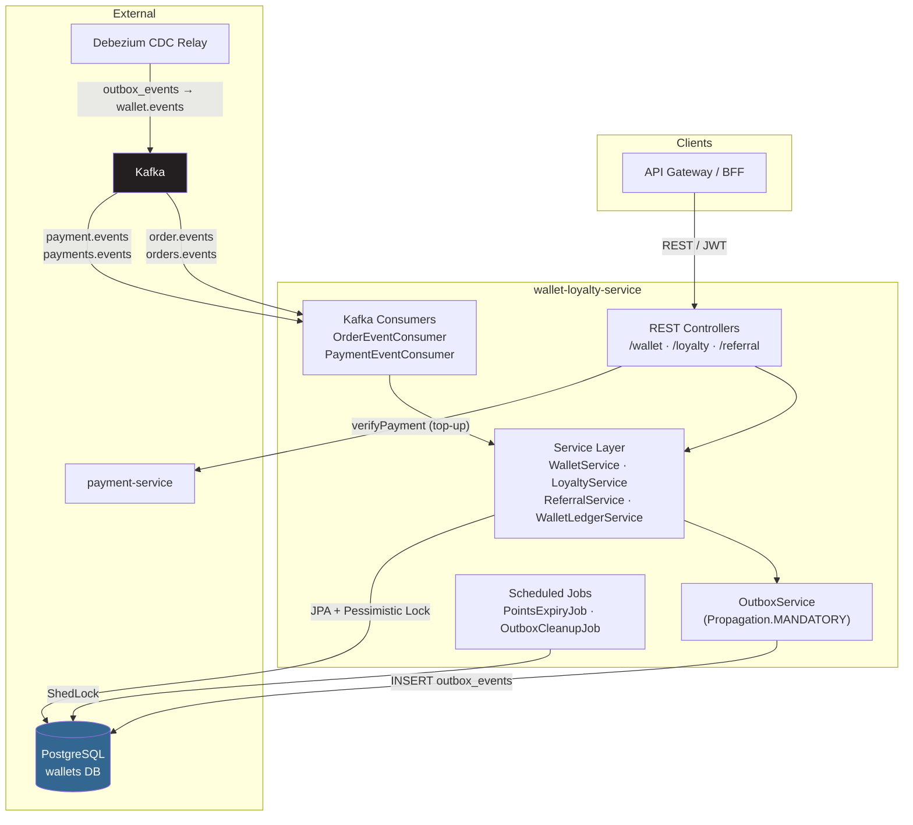
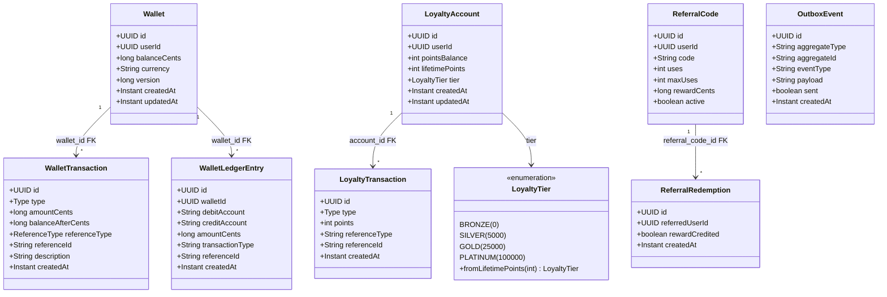
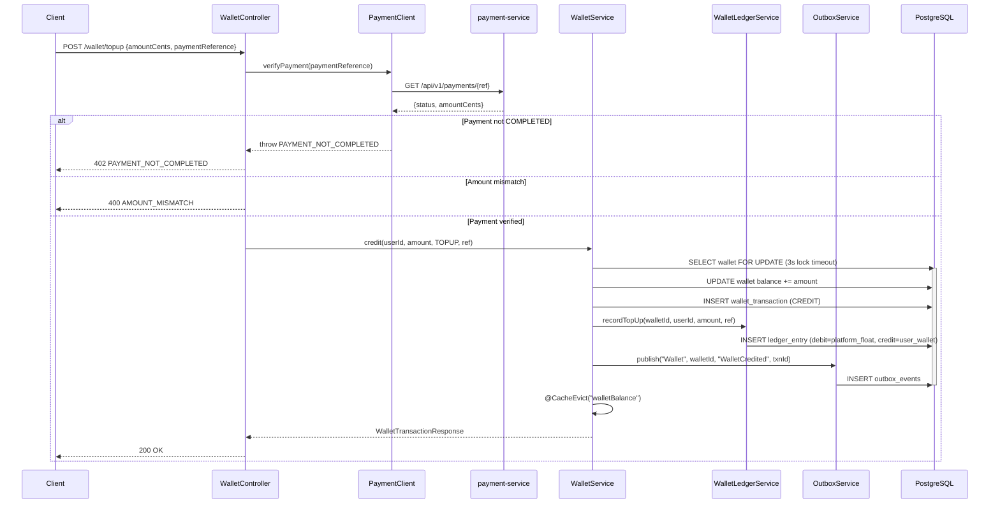
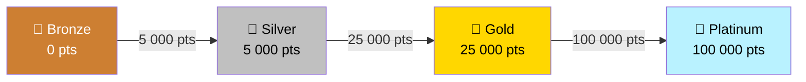
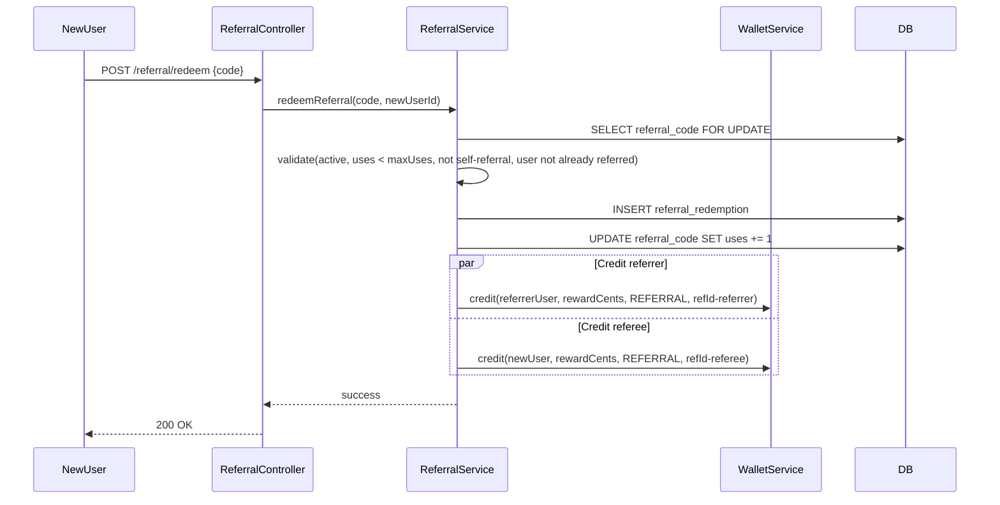

# Wallet & Loyalty Service

> **Module path:** `services/wallet-loyalty-service` · **Port:** 8093 · **Stack:** Spring Boot 3 / Java 21 · **DB:** PostgreSQL (`wallets`)

Digital wallet, loyalty-points engine, and referral programme for InstaCommerce.
Every monetary mutation is recorded via a **double-entry ledger** so wallet balances are provably correct and auditable.

## Table of Contents

- [Service Role and Boundaries](#service-role-and-boundaries)
- [High-Level Design](#high-level-design)
- [Low-Level Design](#low-level-design)
  - [Component Map](#component-map)
  - [Domain Model (UML)](#domain-model-uml)
  - [Database Schema](#database-schema)
  - [Concurrency and Locking](#concurrency-and-locking)
  - [Double-Entry Ledger](#double-entry-ledger)
  - [Idempotency Model](#idempotency-model)
- [Wallet Flow](#wallet-flow)
  - [Top-Up (Credit)](#top-up-credit)
  - [Debit](#debit)
- [Loyalty Flow](#loyalty-flow)
  - [Points Lifecycle](#points-lifecycle)
  - [Tier System](#tier-system)
- [Referral Flow](#referral-flow)
- [Event Flows](#event-flows)
  - [Inbound (Kafka Consumers)](#inbound-kafka-consumers)
  - [Outbound (Outbox → CDC)](#outbound-outbox--cdc)
- [API Reference](#api-reference)
- [Scheduled Jobs](#scheduled-jobs)
- [Runtime and Configuration](#runtime-and-configuration)
- [Dependencies](#dependencies)
- [Observability](#observability)
- [Testing](#testing)
- [Failure Modes](#failure-modes)
- [Rollout and Rollback Notes](#rollout-and-rollback-notes)
- [Known Limitations](#known-limitations)
- [Industry Pattern Comparison](#industry-pattern-comparison)

---

## Service Role and Boundaries

`wallet-loyalty-service` is the **sole authority** for three capabilities:

| Capability | Owns | Does NOT own |
|---|---|---|
| **Digital wallet** | Balance state, credit/debit, double-entry ledger, transaction history | Payment gateway integration (delegates to `payment-service` for top-up verification) |
| **Loyalty programme** | Points earn/redeem, tier management, expiry | Earn-rate business rules beyond the configured `points-per-rupee` multiplier |
| **Referral programme** | Code generation, redemption validation, dual-party reward crediting | Device/IP fraud detection (planned integration with `fraud-detection-service`) |

**Upstream triggers:** `order-service` (OrderDelivered → earn points + cashback), `payment-service` (PaymentRefunded → wallet credit).
**Downstream consumers:** `data-platform` / analytics read `wallet.events` via Debezium CDC relay from the outbox table.
**Sync dependencies:** `payment-service` — called during top-up to verify payment completion before crediting the wallet (fail-closed). `order-service` — called by `PaymentEventConsumer` to resolve `userId` from `orderId` on refund events (fail-closed; refund credit is retried until order-service is reachable).

---

## High-Level Design



---

## Low-Level Design

### Component Map

| Layer | Class | Responsibility |
|---|---|---|
| **Controller** | `WalletController` | Balance lookup, top-up (with payment verification), debit, paginated transaction history |
| | `LoyaltyController` | Points balance + tier query, points redemption |
| | `ReferralController` | Get/generate referral code, redeem referral code |
| **Service** | `WalletService` | Wallet CRUD, credit/debit under pessimistic lock, Caffeine cache eviction, outbox publish |
| | `LoyaltyService` | Earn/redeem points, tier upgrade checks via `LoyaltyTier.fromLifetimePoints()`, outbox publish |
| | `ReferralService` | 8-char code generation (`SecureRandom`, charset `ABCDEFGHJKLMNPQRSTUVWXYZ23456789`), redemption with dual wallet credits |
| | `WalletLedgerService` | Double-entry bookkeeping: `recordTopUp`, `recordPurchase`, `recordRefund`, `recordPromotion`, `verifyBalance` reconciliation check. All methods use `Propagation.MANDATORY`. |
| | `OutboxService` | Writes `OutboxEvent` rows inside the caller's transaction (`Propagation.MANDATORY`). Debezium relays these to Kafka. |
| **Kafka** | `OrderEventConsumer` | Listens `order.events` + `orders.events` → earns loyalty points + credits 2% cashback on `OrderDelivered` |
| | `PaymentEventConsumer` | Listens `payment.events` + `payments.events` → credits refund amount on `PaymentRefunded` |
| **Jobs** | `PointsExpiryJob` | Daily 02:00 — batch-expires stale `EARN` transactions older than `points-expiry-months` (default 12). Uses `PROPAGATION_REQUIRES_NEW` per account and pages accounts in batches of 500. |
| | `OutboxCleanupJob` | Every 6 h — deletes `sent = true` outbox rows older than 7 days |
| **Client** | `PaymentClient` | `RestClient`-based client for `payment-service`. Connect timeout 2 s, read timeout 3 s. Used only in top-up path. |
| | `RestOrderLookupClient` | `RestClient`-based client for `order-service` (`/admin/orders/{orderId}`). Connect timeout 3 s, read timeout 5 s. Uses `X-Internal-Service` / `X-Internal-Token` headers. Used by `PaymentEventConsumer` to resolve `userId` from refund events. |
| **Security** | `JwtAuthenticationFilter` | `OncePerRequestFilter` — validates RSA JWT via JJWT, extracts `sub` (userId) and `roles`. Skips `/actuator/**` and `/error`. |
| | `DefaultJwtService` | Parses JWT with `Jwts.parser().verifyWith(publicKey).requireIssuer(...)` |
| | `JwtKeyLoader` | Loads RSA public key from PEM/Base64 config |
| **Config** | `SecurityConfig` | Stateless sessions, CORS (configurable origins), all non-actuator paths require authentication |
| | `WalletProperties` | `@ConfigurationProperties(prefix = "wallet")` binding JWT, loyalty, and referral settings |
| | `CacheConfig` | `@EnableCaching` — Caffeine spec: `maximumSize=10000,expireAfterWrite=60s` |
| | `ShedLockConfig` | `@EnableSchedulerLock(defaultLockAtMostFor = "PT30M")` with JDBC lock provider using DB time |
| **Exception** | `GlobalExceptionHandler` | `@RestControllerAdvice` — maps `ApiException`, validation errors, `AccessDeniedException`, and fallback `Exception` to structured `ErrorResponse` with trace ID |

### Domain Model (UML)



### Database Schema

Eight Flyway migrations (`V1` through `V8`) manage the schema:

| Migration | Table(s) | Key constraints |
|---|---|---|
| `V1` | `wallets` | `CHECK (balance_cents >= 0)`, `UNIQUE (user_id)`, `version` for `@Version` |
| `V2` | `wallet_transactions` | `CHECK (amount_cents > 0)`, `UNIQUE (reference_type, reference_id)` for idempotency |
| `V3` | `loyalty_accounts`, `loyalty_transactions` | `UNIQUE (user_id)`, `CHECK type IN (EARN, REDEEM, EXPIRE)` |
| `V4` | `referral_codes`, `referral_redemptions` | `UNIQUE (code)`, `UNIQUE (referred_user_id)` — one redemption per user |
| `V5` | `outbox_events` | Partial index `WHERE sent = false` for relay performance |
| `V6` | `shedlock` | Standard ShedLock table |
| `V7` | `wallet_ledger_entries` | `CHECK (amount_cents > 0)`, `CHECK transaction_type IN (...)`, indexes on debit/credit accounts |
| `V8` | (index only) | `UNIQUE (reference_type, reference_id)` on `loyalty_transactions` for idempotency |

All balance columns use `BIGINT` (cents) to avoid floating-point rounding. Currency defaults to `INR`.

### Concurrency and Locking

**Wallet mutations** use pessimistic locking:

```java
// WalletRepository.java
@Lock(LockModeType.PESSIMISTIC_WRITE)
@QueryHints(@QueryHint(name = "jakarta.persistence.lock.timeout", value = "3000"))
@Query("SELECT w FROM Wallet w WHERE w.userId = :userId")
Optional<Wallet> findByUserIdForUpdate(@Param("userId") UUID userId);
```

Every `credit()` and `debit()` call acquires a `SELECT ... FOR UPDATE` row lock with a 3-second timeout before mutating the balance. The `Wallet` entity also carries a JPA `@Version` field for optimistic lock detection.

**Referral redemption** uses pessimistic locking on the `referral_codes` row via `findByCodeForUpdate`.

**Loyalty mutations** currently have **no row-level lock** — see [Known Limitations](#known-limitations) (C6-F2).

### Double-Entry Ledger

`WalletLedgerService` records every wallet mutation as a pair of debit/credit entries:

| Operation | Debit Account | Credit Account | Source |
|---|---|---|---|
| Top-up | `platform_float` | `user_wallet:{userId}` | `recordTopUp()` |
| Purchase (debit) | `user_wallet:{userId}` | `merchant_settlement` | `recordPurchase()` |
| Refund | `merchant_settlement` | `user_wallet:{userId}` | `recordRefund()` |
| Cashback / Referral | `marketing_budget` | `user_wallet:{userId}` | `recordPromotion()` |

All ledger methods use `Propagation.MANDATORY` — they must run inside the caller's transaction. `verifyBalance()` can reconcile `SUM(credits) - SUM(debits)` against `wallet.balanceCents` using the repository's `computeBalanceForAccount` JPQL query.

### Idempotency Model

| Scope | Unique Key | Mechanism |
|---|---|---|
| Wallet transactions | `UNIQUE(reference_type, reference_id)` (V2) | DB constraint → `DataIntegrityViolationException` → `DuplicateTransactionException` |
| Loyalty transactions | `UNIQUE(reference_type, reference_id)` (V8) | Same pattern |
| Referral redemptions | `UNIQUE(referred_user_id)` (V4) | One referral per user lifetime |
| Outbox events | `UUID id` per event | Debezium deduplicates via outbox record ID |

---

## Wallet Flow

### Top-Up (Credit)



### Debit

The debit path is similar but skips payment verification. It acquires the same pessimistic lock, checks `balance >= requested`, and throws `InsufficientBalanceException` (HTTP 422) if the check fails. Ledger entry is `recordPurchase` (user_wallet → merchant_settlement).

---

## Loyalty Flow

### Points Lifecycle


**Earn path** (`LoyaltyService.earnPoints`):
1. Compute `pointsEarned = (orderTotalCents × pointsPerRupee) / 100` (integer division, floor).
2. Increment `pointsBalance` and `lifetimePoints` on `LoyaltyAccount`.
3. Insert `LoyaltyTransaction` (type=EARN, referenceType=ORDER, referenceId=orderId).
4. Call `checkTierUpgrade()` — compares current tier ordinal against `LoyaltyTier.fromLifetimePoints(lifetimePoints)`.
5. Publish `PointsEarned` outbox event; if tier upgraded, also publish `TierUpgraded`.

**Redeem path** (`LoyaltyService.redeemPoints`):
Validates `pointsBalance >= requested`, decrements, inserts REDEEM transaction, publishes `PointsRedeemed` outbox event.

**Expiry** (`PointsExpiryJob`):
Pages through all `LoyaltyAccount` rows in batches of 500. For each account, finds EARN transactions older than `points-expiry-months` (default 12) that have no corresponding EXPIRE transaction (checked via `NOT EXISTS` subquery). Creates EXPIRE transactions and decrements `pointsBalance`. Each account is processed in a `REQUIRES_NEW` transaction.

### Tier System



Tier thresholds are defined in the `LoyaltyTier` enum. Tier is determined by `lifetimePoints` and is **monotonically non-decreasing** — the current code never downgrades tiers.

---

## Referral Flow



**Validation guards:** `active == true`, `uses < maxUses` (default 10), `referredUserId != code.userId` (no self-referral), `referred_user_id UNIQUE` constraint (one referral per user lifetime). Code generation uses `SecureRandom` with 10 collision-retry attempts over a 31-character alphabet (`ABCDEFGHJKLMNPQRSTUVWXYZ23456789`, no ambiguous chars `0/O/1/I`).

---

## Event Flows

### Inbound (Kafka Consumers)

| Consumer | Topics | Event | Action |
|---|---|---|---|
| `OrderEventConsumer` | `order.events`, `orders.events` | `OrderDelivered` | Calls `loyaltyService.earnPoints(userId, orderId, totalCents)` then credits 2% cashback via `walletService.credit()` |
| `PaymentEventConsumer` | `payment.events`, `payments.events` | `PaymentRefunded` | Resolves `userId` via `OrderLookupClient.findOrder(orderId)`, then calls `walletService.credit(userId, amountCents, REFUND, refundId)` |

Both consumers deserialise raw JSON via Jackson `ObjectMapper.readTree()`, extract `eventType`, and dispatch only on matching types. Unrecognised events are silently ignored. `PaymentEventConsumer` propagates parse and validation errors (no catch-all); `OrderEventConsumer` catches and logs.

**Kafka error handling (PaymentEventConsumer):** A `DefaultErrorHandler` with `DeadLetterPublishingRecoverer` provides production-safe retry and dead-letter routing (topic suffix `.DLT`). Transient failures (order-service 5xx, network timeouts) are attempted up to 3 times total (1 initial delivery + 2 retries) with 1 s fixed backoff. Non-retryable failures — malformed JSON (`JsonProcessingException`), missing/invalid fields (`IllegalArgumentException`), and order genuinely not found (`OrderNotFoundException` from order-service 404) — skip retry and are routed to the DLT immediately. This prevents both silent message loss after transient failures and infinite retry loops for permanent errors.

Consumer group: `wallet-loyalty-service`. Auto-offset-reset: `earliest`.

### Outbound (Outbox → CDC)

| Aggregate | Event Type | Payload | Trigger |
|---|---|---|---|
| `Wallet` | `WalletCredited` | Transaction UUID | Any credit (top-up, cashback, refund, referral) |
| `Wallet` | `WalletDebited` | Transaction UUID | Any debit |
| `Loyalty` | `PointsEarned` | Transaction UUID | `earnPoints()` |
| `Loyalty` | `PointsRedeemed` | Transaction UUID | `redeemPoints()` |
| `Loyalty` | `TierUpgraded` | New tier name (e.g. `"GOLD"`) | `checkTierUpgrade()` |

All outbox writes use `Propagation.MANDATORY` — they participate in the same transaction as the domain mutation, guaranteeing atomic write. Debezium CDC relay picks up new `outbox_events` rows and publishes them to `wallet.events`.

---

## API Reference

### Wallet Endpoints

| Method | Path | Auth | Description |
|---|---|---|---|
| `GET` | `/wallet/balance` | Authenticated | Current balance (Caffeine-cached, 60 s TTL). Auto-creates wallet if absent. |
| `POST` | `/wallet/topup` | Authenticated | Top-up after payment-service verification. Min amount: 100 cents. |
| `POST` | `/wallet/debit` | Authenticated | Debit wallet. Requires `referenceType` ∈ `{ORDER, REFUND, TOPUP, CASHBACK, REFERRAL, PROMOTION, ADMIN_ADJUSTMENT}`. |
| `GET` | `/wallet/transactions` | Authenticated | Paginated history (default page size 20, ordered by `created_at DESC`). |

**Request / Response examples:**

```jsonc
// POST /wallet/topup
{ "amountCents": 5000, "paymentReference": "pay_abc123" }

// POST /wallet/debit
{ "amountCents": 1200, "referenceType": "ORDER", "referenceId": "ord_xyz" }

// Response (credit or debit)
{
  "type": "CREDIT",
  "amountCents": 5000,
  "balanceAfterCents": 8500,
  "referenceType": "TOPUP",
  "referenceId": "topup-pay_abc123",
  "description": "Wallet top-up via payment pay_abc123",
  "createdAt": "2025-01-15T10:30:00Z"
}
```

### Loyalty Endpoints

| Method | Path | Auth | Description |
|---|---|---|---|
| `GET` | `/loyalty/points` | Authenticated | Points balance, tier, lifetime points. Auto-creates account if absent. |
| `POST` | `/loyalty/redeem` | Authenticated | Redeem points. Min: 1 point. |

```jsonc
// GET /loyalty/points response
{ "pointsBalance": 4200, "tier": "SILVER", "lifetimePoints": 12300 }

// POST /loyalty/redeem
{ "points": 500 }
```

### Referral Endpoints

| Method | Path | Auth | Description |
|---|---|---|---|
| `GET` | `/referral/code` | Authenticated | Get existing or generate new referral code |
| `POST` | `/referral/redeem` | Authenticated | Redeem a referral code (returns 200 with empty body) |

```jsonc
// GET /referral/code response
{ "code": "A7X9K2Q9", "uses": 3, "maxUses": 10, "rewardCents": 5000 }

// POST /referral/redeem
{ "code": "A7X9K2Q9" }
```

### Error Response

All errors follow a consistent envelope:

```json
{
  "code": "INSUFFICIENT_BALANCE",
  "message": "Wallet balance too low",
  "traceId": "abc123def456",
  "timestamp": "2025-01-15T10:30:00Z",
  "details": []
}
```

| HTTP | Code | Meaning |
|---|---|---|
| 400 | `VALIDATION_ERROR` | Jakarta Bean Validation failure (details array populated) |
| 400 | `AMOUNT_MISMATCH` | Top-up amount doesn't match payment amount |
| 401 | `TOKEN_INVALID` | JWT missing, expired, or signature invalid |
| 402 | `PAYMENT_NOT_COMPLETED` | Payment reference not in COMPLETED status |
| 403 | `ACCESS_DENIED` | Insufficient roles |
| 404 | `WALLET_NOT_FOUND` / `LOYALTY_ACCOUNT_NOT_FOUND` / `REFERRAL_NOT_FOUND` | Resource doesn't exist |
| 409 | `DUPLICATE_TRANSACTION` / `REFERRAL_ALREADY_USED` | Idempotency conflict |
| 422 | `INSUFFICIENT_BALANCE` / `INSUFFICIENT_POINTS` | Not enough funds or points |
| 422 | `REFERRAL_INACTIVE` / `REFERRAL_MAX_USES` / `REFERRAL_SELF_USE` | Referral validation failures |
| 503 | `PAYMENT_SERVICE_UNAVAILABLE` | payment-service unreachable during top-up |
| 500 | `INTERNAL_ERROR` | Unhandled exception (logged with stack trace) |

---

## Scheduled Jobs

| Job | Cron | ShedLock | Lock Duration | Behaviour |
|---|---|---|---|---|
| `PointsExpiryJob` | `0 0 2 * * *` (daily 02:00) | `points-expiry` | min 5 min, max 2 h | Pages all accounts (batch 500), expires EARN transactions older than `points-expiry-months`. Each account processed in `REQUIRES_NEW` transaction to limit blast radius. |
| `OutboxCleanupJob` | `0 0 */6 * * *` (every 6 h) | `outbox-cleanup` | min 5 min, max 30 min | Deletes `sent = true` outbox rows with `created_at` older than 7 days. |

---

## Runtime and Configuration

| Property | Default | Env Override | Description |
|---|---|---|---|
| `server.port` | `8093` | `SERVER_PORT` | HTTP listen port |
| `server.shutdown` | `graceful` | — | 30 s drain period (`spring.lifecycle.timeout-per-shutdown-phase`) |
| `spring.datasource.url` | `jdbc:postgresql://localhost:5432/wallets` | `WALLET_DB_URL` | PostgreSQL JDBC URL |
| `spring.datasource.password` | — | `sm://db-password-wallet` or `WALLET_DB_PASSWORD` | GCP Secret Manager integration |
| `spring.datasource.hikari.maximum-pool-size` | `20` | — | Connection pool ceiling |
| `spring.datasource.hikari.connection-timeout` | `5000` (ms) | — | Acquire timeout |
| `spring.kafka.bootstrap-servers` | `localhost:9092` | `KAFKA_BOOTSTRAP_SERVERS` | Kafka broker list |
| `spring.kafka.consumer.group-id` | `wallet-loyalty-service` | — | Consumer group for both order and payment topics |
| `spring.kafka.consumer.auto-offset-reset` | `earliest` | — | Ensures no missed events on new deployment |
| `spring.cache.caffeine.spec` | `maximumSize=10000,expireAfterWrite=60s` | — | Wallet balance cache |
| `spring.jpa.hibernate.ddl-auto` | `validate` | — | Flyway owns the schema; Hibernate only validates |
| `spring.jpa.open-in-view` | `false` | — | OSIV disabled to avoid accidental lazy loads in controllers |
| `wallet.jwt.issuer` | `instacommerce-identity` | `WALLET_JWT_ISSUER` | Expected JWT issuer claim |
| `wallet.jwt.public-key` | — | `sm://jwt-rsa-public-key` or `WALLET_JWT_PUBLIC_KEY` | RSA public key (PEM or Base64) |
| `wallet.loyalty.points-per-rupee` | `1` | — | Points earned per ₹1 spent (`orderTotalCents / 100 × pointsPerRupee`) |
| `wallet.loyalty.points-expiry-months` | `12` | — | Months before EARN points become eligible for expiry |
| `wallet.referral.reward-cents` | `5000` | — | Default reward per referral (₹50) |
| `payment-service.base-url` | `http://payment-service:8080` | `PAYMENT_SERVICE_URL` | Payment verification endpoint base |
| `management.tracing.sampling.probability` | `1.0` | `TRACING_PROBABILITY` | OTEL trace sampling rate |

---

## Dependencies

### Runtime

| Dependency | Version | Purpose |
|---|---|---|
| Java | 21 (Temurin JRE Alpine) | Runtime — Dockerfile uses `eclipse-temurin:21-jre-alpine` with ZGC |
| Spring Boot 3 | (managed by root `build.gradle.kts`) | Web, JPA, Security, Validation, Actuator, Cache |
| Spring Kafka | (managed) | Kafka consumer for order/payment events |
| PostgreSQL | 15+ | Primary datastore; `CHECK` constraints, partial indexes |
| Flyway | (managed) | Schema migration (8 versioned migrations) |
| Caffeine | (managed) | In-memory cache for wallet balance (10K entries, 60 s TTL) |
| ShedLock | 5.10.2 | Distributed lock for scheduled jobs (JDBC provider, DB time) |
| JJWT | 0.12.5 | RSA JWT validation (api + impl + jackson modules) |
| Micrometer + OTEL | (managed) | Tracing bridge (`micrometer-tracing-bridge-otel`) and OTLP metrics registry |
| Logstash Logback Encoder | 7.4 | Structured JSON logging |
| GCP Spring Cloud SecretManager | (managed) | `sm://` secret resolution for DB password, JWT key |
| GCP Cloud SQL Socket Factory | 1.15.0 | Cloud SQL Proxy-less connection |

### Test

| Dependency | Purpose |
|---|---|
| `spring-boot-starter-test` | JUnit 5 + MockMvc + Mockito |
| `spring-security-test` | Security context mocking |
| `spring-kafka-test` | Embedded Kafka for consumer tests |
| `testcontainers:postgresql:1.19.3` | Real PostgreSQL in integration tests |
| `testcontainers:junit-jupiter:1.19.3` | Testcontainers JUnit 5 lifecycle |

---

## Observability

### Health Probes

| Endpoint | Scope | Notes |
|---|---|---|
| `/actuator/health/liveness` | Liveness | `livenessState` — JVM alive check. Docker HEALTHCHECK polls this every 30 s. |
| `/actuator/health/readiness` | Readiness | `readinessState` + `db` — includes PostgreSQL connectivity |
| `/actuator/health` | Combined | `show-details: always` |

### Metrics

Exposed via `/actuator/prometheus` and pushed to OTLP endpoint:

- **JVM / Hikari / Spring MVC** — standard Micrometer auto-configuration.
- **Cache** — `cache.gets`, `cache.puts`, `cache.evictions` for `walletBalance` cache.
- **Kafka consumer** — `kafka.consumer.fetch.manager.*` lag and throughput metrics.
- **Custom tags:** `service=wallet-loyalty-service`, `environment=${ENVIRONMENT:dev}`.

### Tracing

- OTEL bridge via `micrometer-tracing-bridge-otel`. Default sampling: 100% (tune via `TRACING_PROBABILITY`).
- Traces exported to `${OTEL_EXPORTER_OTLP_TRACES_ENDPOINT}` (default: `http://otel-collector.monitoring:4318/v1/traces`).
- `TraceIdProvider` resolves trace ID from MDC → `X-B3-TraceId` → `X-Trace-Id` → `traceparent` → `X-Request-Id` headers, falling back to a random UUID. This ID is included in every error response.

### Logging

Structured JSON via `logstash-logback-encoder`. Key log events:
- `Credited/Debited {N} cents to/from wallet for user={} ref={}/{}` — every wallet mutation.
- `Earned {N} points for user={} order={}` — loyalty earn.
- `Tier upgrade for user={}: {} -> {}` — tier changes.
- `Referral redeemed: code={} referrer={} referee={}` — referral events.
- `Top-up FAILED/REJECTED for user={}` — payment verification failures.
- `Cleaned up {N} processed outbox events` — cleanup job results.
- `Points expiry complete: expired {N} points` — expiry job results.

---

## Testing

```bash
# Run all tests
./gradlew :services:wallet-loyalty-service:test

# Run a specific test class
./gradlew :services:wallet-loyalty-service:test --tests "com.instacommerce.wallet.service.WalletServiceTest"

# Build without tests
./gradlew :services:wallet-loyalty-service:build -x test
```

The test suite uses JUnit 5 (`useJUnitPlatform()`), `spring-boot-starter-test` (MockMvc, Mockito), `spring-security-test`, `spring-kafka-test` (embedded Kafka), and Testcontainers with PostgreSQL for integration-level coverage against a real database and Flyway migrations.

---

## Failure Modes

| Scenario | Behaviour | Mitigation |
|---|---|---|
| **payment-service down during top-up** | `PaymentClient` throws `RestClientException` → mapped to `503 PAYMENT_SERVICE_UNAVAILABLE`. Wallet is NOT credited. | Fail-closed by design. Client retries. Connect timeout 2 s, read timeout 3 s prevent thread starvation. |
| **PostgreSQL unreachable** | Readiness probe fails (`/actuator/health/readiness` includes `db` indicator). Kubernetes stops routing traffic. | HikariCP `connection-timeout: 5000 ms`. Pool `minimum-idle: 5`, `maximum-pool-size: 20`. |
| **Pessimistic lock timeout** | `findByUserIdForUpdate` has `lock.timeout = 3000 ms`. If lock contention exceeds this, JPA throws `PessimisticLockException`. | Caller gets 500. Safe — no partial state written. Client retries idempotently. |
| **Duplicate Kafka event (OrderDelivered replay)** | `wallet_transactions` and `loyalty_transactions` have unique indexes on `(reference_type, reference_id)`. Duplicate insert → `DataIntegrityViolationException` → `DuplicateTransactionException` (409). | Idempotent by DB constraint. |
| **Kafka consumer crash mid-processing** | Offset not committed. Message re-delivered on rebalance. Idempotency constraints prevent double-credit. | At-least-once delivery + idempotent writes. |
| **ShedLock contention** | Only one instance runs each scheduled job. Other instances skip. Lock durations (`lockAtMostFor`) prevent deadlocks if holder crashes. | `PointsExpiryJob` max lock 2 h; `OutboxCleanupJob` max lock 30 min. |
| **Outbox relay lag > 7 days** | `OutboxCleanupJob` deletes `sent = true` rows older than 7 days by `created_at`. If relay marks rows `sent` but relay-to-Kafka lag exceeds retention, events could be lost downstream. | See [Known Limitations](#known-limitations) (C6-F4). Monitor relay lag. |
| **Referral code collision** | `generateUniqueCode()` retries up to 10 times. If all 10 collide, throws `IllegalStateException`. | With 31^8 ≈ 852 billion combinations, collision is astronomically unlikely at realistic user counts. |

---

## Rollout and Rollback Notes

- **Schema migrations are forward-only.** All 8 Flyway migrations use additive DDL (CREATE TABLE, CREATE INDEX). None drop columns or tables. Rolling back the service binary to a prior version is safe as long as the new schema is a superset.
- **Graceful shutdown** is configured with a 30 s drain period (`server.shutdown: graceful`). In-flight REST requests complete; Kafka consumer offsets are committed for processed messages.
- **Kafka consumer group** (`wallet-loyalty-service`) — adding or removing pods triggers a Kafka rebalance. Events are reprocessed from the last committed offset; idempotency constraints prevent duplicate mutations.
- **Cache invalidation on deploy** — Caffeine is in-memory per pod. On deploy, caches start cold. `walletBalance` cache TTL is 60 s, so stale reads self-heal quickly.
- **Docker image** uses `eclipse-temurin:21-jre-alpine`, runs as non-root user `app` (UID 1001), and configures ZGC with `MaxRAMPercentage=75.0`.
- **Feature-flag integration** — none currently. Loyalty earn rate and referral reward amounts are `application.yml` config; changing them requires a redeploy or environment variable update.

---

## Known Limitations

| ID | Description | Severity | Reference |
|---|---|---|---|
| **C6-F2** | `LoyaltyService.earnPoints()` has no pessimistic lock on `LoyaltyAccount`. Concurrent `OrderDelivered` events for the same user can race, causing a lost-update on `pointsBalance`. The V8 idempotency index prevents duplicate transactions for the same order, but two different orders processed concurrently can still race. Target fix: add `findByUserIdForUpdate` to `LoyaltyAccountRepository`. | 🔴 Critical | `docs/reviews/iter3/services/customer-engagement.md` §2.2 |
| **C6-F4** | Outbox cleanup deletes by `created_at` rather than `sent_at` (no `sent_at` column exists). If the CDC relay lags beyond 7 days, rows may be deleted before relay, losing downstream events. Target fix: add `sent_at` column, clean by `sent_at`. | 🟠 High | `docs/reviews/iter3/services/customer-engagement.md` §2.2 |
| **C6-F7** | `WalletLedgerService.verifyBalance()` exists in code but is not called by any scheduled job. Ledger-vs-wallet drift is undetectable until manual audit. Target fix: add a `WalletIntegrityJob` (ShedLock, daily 04:00) that scans recently-active wallets and reports mismatches as a Prometheus metric. | 🟠 High | `docs/reviews/iter3/diagrams/lld/engagement-loyalty-fraud.md` §2.4 |
| **NO-DLQ** | `OrderEventConsumer` catches all exceptions and logs them, but does not publish to a dead-letter queue. `PaymentEventConsumer` routes to DLT via `KafkaErrorConfig` after retry exhaustion or for non-retryable errors (`JsonProcessingException`, `IllegalArgumentException`, `OrderNotFoundException`). | 🟡 Medium (OrderEventConsumer only) | `kafka/OrderEventConsumer.java` |
| **NO-REFERRAL-FRAUD** | Referral redemption checks code validity and self-referral but does not track device/IP. A single person can create multiple accounts and exploit their own referral code. | 🟡 Medium | `docs/reviews/iter3/diagrams/lld/engagement-loyalty-fraud.md` §2.6 |
| **TIER-NO-DOWNGRADE** | Tiers are monotonically non-decreasing. If lifetime points are adjusted downward (e.g., fraud clawback), the tier is not recalculated. | 🟡 Low | `service/LoyaltyService.java` `checkTierUpgrade()` |
| **REFERRAL-CODE-8** | Referral codes are 8 characters from a 31-char alphabet. Sufficient for current scale but not configurable. | ℹ️ Info | `service/ReferralService.java` |

---

## Industry Pattern Comparison

> Brief comparison to common q-commerce wallet/loyalty patterns, grounded in what this service does and does not implement.

| Pattern | Industry Standard | This Service | Gap |
|---|---|---|---|
| **Double-entry ledger** | Standard for fintech wallets (Paytm, PhonePe). Enables audit, reconciliation, regulatory compliance. | ✅ Implemented — `WalletLedgerService` with named accounts (`platform_float`, `user_wallet`, `merchant_settlement`, `marketing_budget`). | Reconciliation job (`verifyBalance()`) exists but is not wired to a scheduler or alerting. |
| **Pessimistic locking for balance mutations** | Standard in high-concurrency systems (Razorpay, Stripe). Prevents lost updates under contention. | ✅ Wallet mutations use `SELECT ... FOR UPDATE` with 3 s timeout. | Loyalty mutations lack equivalent protection (C6-F2). |
| **Transactional outbox + CDC** | Standard pattern for exactly-once event delivery in distributed systems (Debezium, Confluent). | ✅ `OutboxService` with `Propagation.MANDATORY` + Debezium relay. | Cleanup uses `created_at` instead of relay-confirmed `sent_at` (C6-F4). |
| **Points expiry** | Regulatory requirement in many jurisdictions. Common in Swiggy, Zomato, Dunzo loyalty programmes. | ✅ Configurable `points-expiry-months`, batch processing with `REQUIRES_NEW` isolation. | No per-user notification before expiry. |
| **Tiered loyalty** | Standard (Bronze → Silver → Gold → Platinum). Swiggy ONE, Zomato Pro use similar structures. | ✅ Four tiers with configurable thresholds. | Tiers are earn-only (no downgrade), no tier-specific benefits are modeled in this service. |
| **Referral with fraud controls** | Best practice includes device fingerprint + IP rate limiting (Rappi, Glovo, Zepto). | ⚠️ Basic validation only (self-referral, max uses, one-per-user). | No device/IP tracking, no fraud-service integration. |

---

## PaymentRefunded Consumer — Rollout & Dependencies

The `PaymentEventConsumer` consumes `PaymentRefunded` events published by `payment-service` when the `PAYMENT_WEBHOOK_REFUND_OUTBOX_ENABLED` flag is active.

**Deploy order:**
1. Deploy the updated `wallet-loyalty-service` with the corrected consumer and `ORDER_SERVICE_URL` / `INTERNAL_SERVICE_TOKEN` env vars.
2. Verify the consumer is healthy (`/actuator/health/readiness`) and connected to Kafka (`payment.events` group lag visible in Kafka UI).
3. Only then enable `PAYMENT_WEBHOOK_REFUND_OUTBOX_ENABLED: "true"` on `payment-service` in the target environment.

**Runtime dependency — order-service:**
- The consumer calls `order-service` `/admin/orders/{orderId}` to resolve `userId` for each refund event.
- If `order-service` is unreachable, the consumer throws and Kafka retries the message (back-off per consumer config). Refund credits are delayed but not lost.
- Prolonged order-service downtime will cause consumer lag to grow; monitor `kafka_consumer_lag` for group `wallet-loyalty-service`.

**Rollback:**
- Disable `PAYMENT_WEBHOOK_REFUND_OUTBOX_ENABLED` on `payment-service` to stop new events.
- Redeploy the previous `wallet-loyalty-service` image if needed.
- Unconsumed or partially-consumed events remain on the topic and are safe to leave unprocessed.

**Environment variables added in this wave:**

| Variable | Default | Purpose |
|---|---|---|
| `ORDER_SERVICE_URL` | `http://order-service:8080` | Base URL for order-service REST lookups |
| `INTERNAL_SERVICE_TOKEN` | `dev-internal-token-change-in-prod` | Shared token for `X-Internal-Token` header on internal service calls |

---

## Running Locally

```bash
# Start infrastructure (from repo root)
docker compose up -d postgres kafka

# Run the service
./gradlew :services:wallet-loyalty-service:bootRun

# Health check
curl -s http://localhost:8093/actuator/health | jq .

# Run tests
./gradlew :services:wallet-loyalty-service:test
```
