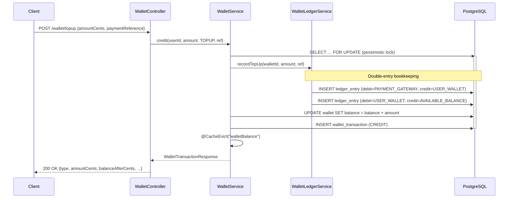
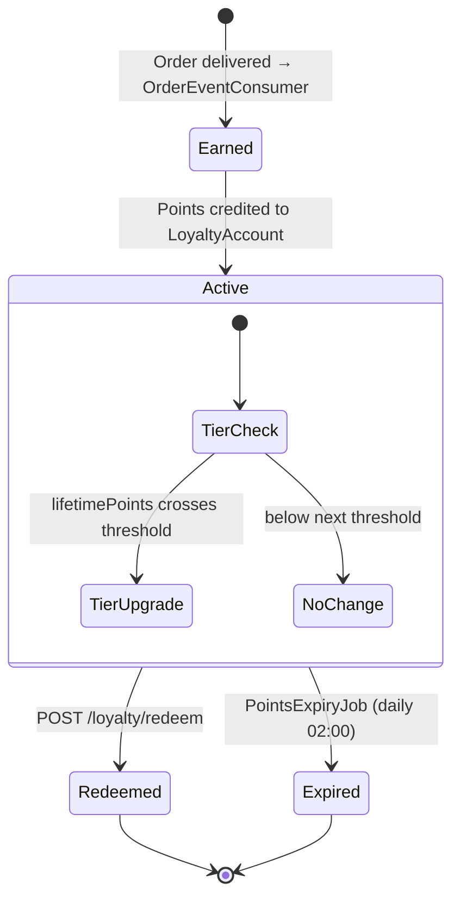
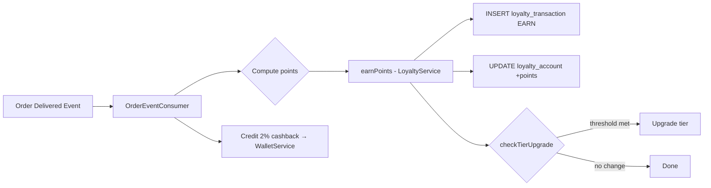
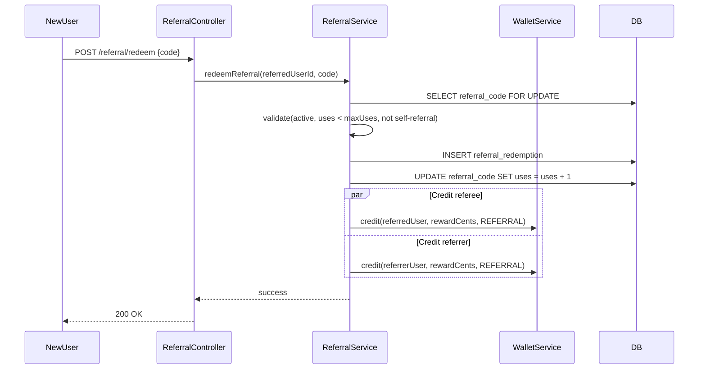
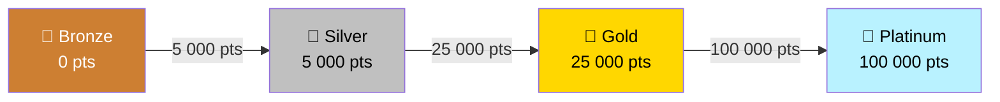

# Wallet & Loyalty Service

Digital wallet management, loyalty-points engine, and referral programme for InstaCommerce.
Every monetary mutation is recorded via a **double-entry ledger** so wallet balances are always provably correct.

## Table of Contents

- [Architecture Overview](#architecture-overview)
- [Component Map](#component-map)
- [Flow Diagrams](#flow-diagrams)
  - [Wallet Transaction Flow](#wallet-transaction-flow)
  - [Loyalty Points Lifecycle](#loyalty-points-lifecycle)
  - [Referral Chain](#referral-chain)
  - [Loyalty Tier System](#loyalty-tier-system)
- [API Reference](#api-reference)
- [Kafka Consumers](#kafka-consumers)
- [Database Schema](#database-schema)
- [Scheduled Jobs](#scheduled-jobs)
- [Configuration](#configuration)
- [Known Limitations](#known-limitations)
- [Running Locally](#running-locally)

---

## Architecture Overview

```
┌──────────────┐   REST    ┌────────────────────────────┐   JPA    ┌────────────┐
│  API Gateway │ ────────▶ │  wallet-loyalty-service     │ ───────▶│ PostgreSQL │
└──────────────┘           │  (Spring Boot 3 / Java)     │         └────────────┘
                           │                              │
   Kafka (order.events / orders.events) ──▶ │  OrderEventConsumer    │
   Kafka (payment.events / payments.events) ▶ │ PaymentEventConsumer │
                           │                              │
                           │  Outbox → CDC relay ─────────┼──▶ Kafka (wallet.events)
                           └────────────────────────────┘
```

**Key qualities:** pessimistic locking for wallet mutations, Caffeine in-memory cache, ShedLock for distributed job safety, OpenTelemetry tracing, Flyway migrations.

---

## Component Map

| Layer | Class | Responsibility |
|-------|-------|----------------|
| **Controller** | `WalletController` | Balance lookup, top-up, debit, transaction history |
| | `LoyaltyController` | Points balance, redeem points |
| | `ReferralController` | Get/generate referral code, redeem referral |
| **Service** | `WalletService` | Wallet CRUD, credit/debit with pessimistic lock, caching |
| | `LoyaltyService` | Earn/redeem points, tier upgrade checks |
| | `ReferralService` | Code generation (SecureRandom), redemption with dual rewards |
| | `WalletLedgerService` | Double-entry bookkeeping (top-up, purchase, refund, promo) |
| | `OutboxService` | Transactional outbox writes (propagation = MANDATORY) |
| **Kafka** | `OrderEventConsumer` | Listens `order.events` / `orders.events` — earns points + 2% cashback on delivery |
| | `PaymentEventConsumer` | Listens `payment.events` / `payments.events` — processes refunds back to wallet |
| **Jobs** | `PointsExpiryJob` | Daily 02:00 — expires stale loyalty points |
| | `OutboxCleanupJob` | Every 6 h — purges sent outbox rows (7-day retention) |
| **Domain** | `Wallet`, `WalletTransaction`, `WalletLedgerEntry`, `LoyaltyAccount`, `LoyaltyTransaction`, `LoyaltyTier`, `ReferralCode`, `ReferralRedemption`, `OutboxEvent` | JPA entities |
| **Security** | `JwtAuthenticationFilter`, `DefaultJwtService`, `JwtKeyLoader` | RSA JWT validation, role extraction |

---

## Flow Diagrams

### Wallet Transaction Flow



### Loyalty Points Lifecycle





### Referral Chain



### Loyalty Tier System



Tier is determined by `lifetimePoints` and is checked after every `earnPoints` call.

---

## API Reference

### Wallet

| Method | Path | Auth | Description |
|--------|------|------|-------------|
| `GET` | `/wallet/balance` | `USER` | Current balance (cached) |
| `POST` | `/wallet/topup` | `USER` | Top-up wallet after payment-service verification (`TopUpRequest`) |
| `POST` | `/wallet/debit` | `USER` | Debit wallet (`DebitRequest`) |
| `GET` | `/wallet/transactions` | `USER` | Paginated transaction history |

**TopUpRequest**

```json
{ "amountCents": 5000, "paymentReference": "pay_abc123" }
```

**DebitRequest**

```json
{ "amountCents": 1200, "referenceType": "ORDER", "referenceId": "ord_xyz" }
```

**Top-up / debit response**

```json
{
  "type": "CREDIT",
  "amountCents": 5000,
  "balanceAfterCents": 8500,
  "referenceType": "TOPUP",
  "referenceId": "topup-pay_abc123",
  "description": "Wallet top-up via payment pay_abc123",
  "createdAt": "2025-01-15T10:30:00Z"
}
```

### Loyalty

| Method | Path | Auth | Description |
|--------|------|------|-------------|
| `GET` | `/loyalty/points` | `USER` | Points balance, tier, lifetime points |
| `POST` | `/loyalty/redeem` | `USER` | Redeem points (`RedeemPointsRequest`) |

**LoyaltyResponse**

```json
{ "pointsBalance": 4200, "tier": "SILVER", "lifetimePoints": 12300 }
```

### Referral

| Method | Path | Auth | Description |
|--------|------|------|-------------|
| `GET` | `/referral/code` | `USER` | Get or generate referral code |
| `POST` | `/referral/redeem` | `USER` | Redeem a referral code (`RedeemReferralRequest`) |

**ReferralCodeResponse**

```json
{ "code": "A7X9K2Q9", "uses": 3, "maxUses": 10, "rewardCents": 5000 }
```

### Common Error Response

```json
{
  "code": "INSUFFICIENT_BALANCE",
  "message": "Wallet balance too low",
  "traceId": "abc123",
  "timestamp": "2025-01-15T10:30:00Z",
  "details": []
}
```

| HTTP Status | Code | Meaning |
|-------------|------|---------|
| 404 | `WALLET_NOT_FOUND` | Wallet does not exist for user |
| 409 | `DUPLICATE_TRANSACTION` | Idempotency conflict |
| 422 | `INSUFFICIENT_BALANCE` | Not enough funds |

---

## Kafka Consumers

| Consumer | Topic | Trigger Event | Action |
|----------|-------|---------------|--------|
| `OrderEventConsumer` | `order.events`, `orders.events` | `OrderDelivered` | Earns loyalty points + credits 2% cashback to wallet |
| `PaymentEventConsumer` | `payment.events`, `payments.events` | `PaymentRefunded` | Credits refund amount back to wallet |

Both consumers deserialise an `EventEnvelope` and delegate to `WalletService` / `LoyaltyService`.

---

## Database Schema

### Core Tables

```
wallets
  id              UUID  PK
  user_id         UUID  UNIQUE
  balance_cents   BIGINT
  currency        VARCHAR(3)  DEFAULT 'INR'
  created_at      TIMESTAMPTZ
  updated_at      TIMESTAMPTZ
  version         BIGINT      -- @Version optimistic lock

wallet_transactions
  id                  UUID  PK
  wallet_id           UUID  FK → wallets
  type                VARCHAR  (CREDIT | DEBIT)
  amount_cents        BIGINT
  balance_after_cents BIGINT
  reference_type      VARCHAR  (ORDER | REFUND | TOPUP | CASHBACK | REFERRAL | PROMOTION | ADMIN_ADJUSTMENT)
  reference_id        VARCHAR
  description         TEXT
  created_at          TIMESTAMPTZ

wallet_ledger_entries        -- double-entry bookkeeping
  id                UUID  PK
  wallet_id         UUID  FK → wallets
  debit_account     VARCHAR
  credit_account    VARCHAR
  amount_cents      BIGINT
  transaction_type  VARCHAR
  reference_id      VARCHAR
  created_at        TIMESTAMPTZ

loyalty_accounts
  id              UUID  PK
  user_id         UUID  UNIQUE
  points_balance  BIGINT
  lifetime_points BIGINT
  tier            VARCHAR  (BRONZE | SILVER | GOLD | PLATINUM)
  created_at      TIMESTAMPTZ
  updated_at      TIMESTAMPTZ

loyalty_transactions
  id              UUID  PK
  account_id      UUID  FK → loyalty_accounts
  type            VARCHAR  (EARN | REDEEM | EXPIRE)
  points          INT
  reference_type  VARCHAR
  reference_id    VARCHAR
  created_at      TIMESTAMPTZ

referral_codes
  id          UUID  PK
  user_id     UUID
  code        VARCHAR  UNIQUE
  uses        INT  DEFAULT 0
  max_uses    INT
  reward_cents BIGINT
  active      BOOLEAN
  created_at  TIMESTAMPTZ

referral_redemptions
  id               UUID  PK
  referral_code_id UUID  FK → referral_codes
  referred_user_id UUID
  reward_credited  BOOLEAN
  created_at       TIMESTAMPTZ

outbox_events
  id             UUID  PK
  aggregate_type VARCHAR
  aggregate_id   VARCHAR
  event_type     VARCHAR
  payload        JSONB
  created_at     TIMESTAMPTZ
  sent           BOOLEAN  DEFAULT FALSE
```

Migrations managed by **Flyway** (`db/migration/V*.sql`).

---

## Scheduled Jobs

| Job | Schedule | Lock | Description |
|-----|----------|------|-------------|
| `PointsExpiryJob` | `0 0 2 * * *` (daily 02:00) | ShedLock | Expires stale `EARN` transactions and adjusts `pointsBalance` |
| `OutboxCleanupJob` | `0 0 */6 * * *` (every 6 h) | ShedLock | Deletes `sent = true` outbox rows older than 7 days |

---

## Configuration

Key properties in `application.yml` / environment:

| Property | Default | Description |
|----------|---------|-------------|
| `wallet.jwt.issuer` | — | Expected JWT issuer |
| `wallet.jwt.public-key` | — | RSA public key (PEM or Base64) |
| `wallet.loyalty.points-per-rupee` | `1` | Loyalty earn rate (`orderTotalCents / 100`) |
| `wallet.referral.reward-cents` | — | Reward per referral |
| `spring.datasource.url` | — | PostgreSQL JDBC URL |
| `spring.kafka.bootstrap-servers` | — | Kafka broker list |
| `spring.kafka.consumer.group-id` | — | Consumer group |

### Dependencies

- Java 17+, Spring Boot 3, Spring Kafka
- PostgreSQL 15+, Flyway
- Caffeine cache, ShedLock
- JJWT 0.12.5 (RSA JWT)
- Micrometer + OpenTelemetry
- Google Cloud SQL socket factory, Secret Manager

---

## Known Limitations

- `payment-service.base-url` exists in `application.yml`, but the current
  `PaymentClient` still hardcodes `http://payment-service:8080`
- the top-up path is intentionally fail-closed on payment verification
  unavailability; callers should expect `PAYMENT_SERVICE_UNAVAILABLE`
- referral codes are 8 characters long in the current implementation

---

## Running Locally

```bash
# Start dependencies
docker compose up -d postgres kafka

# Run the service
./gradlew :services:wallet-loyalty-service:bootRun

# Health check
curl http://localhost:8093/actuator/health
```
