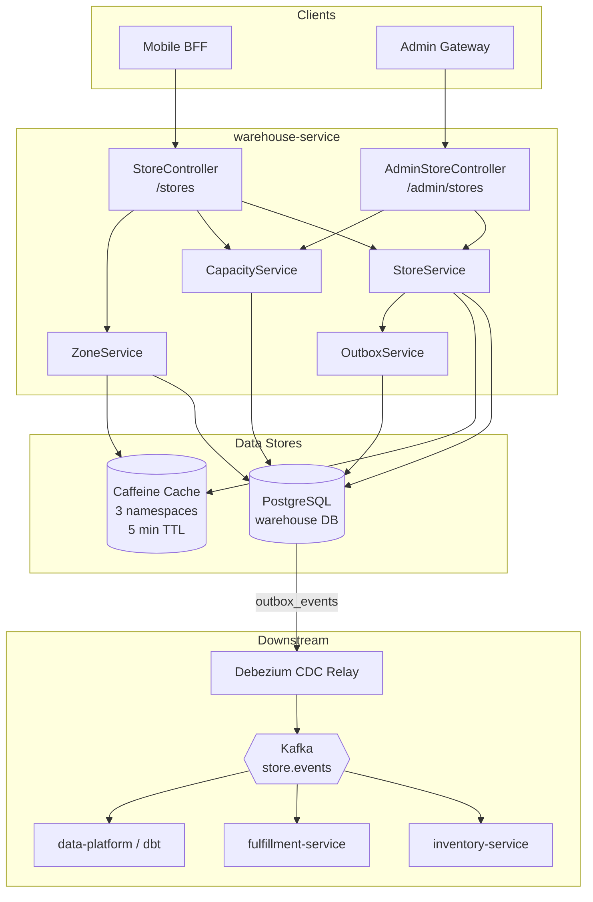
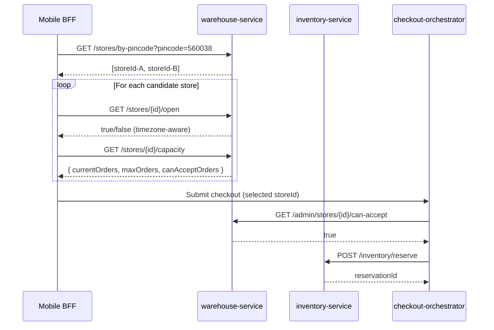
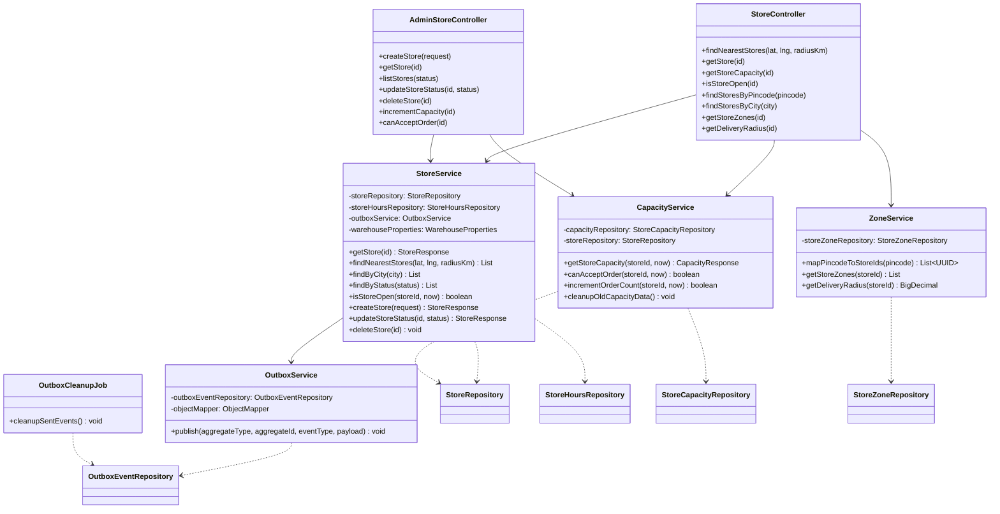
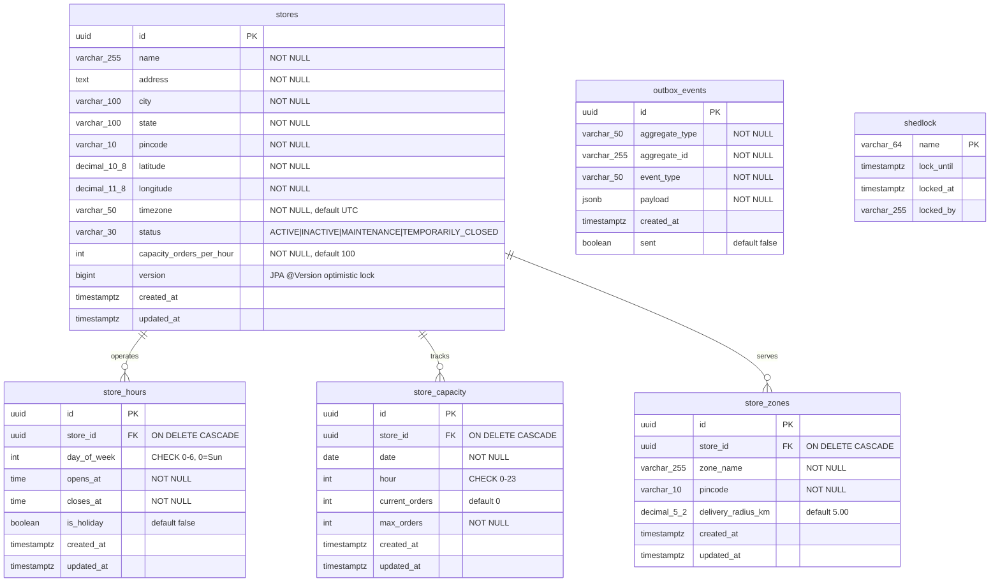
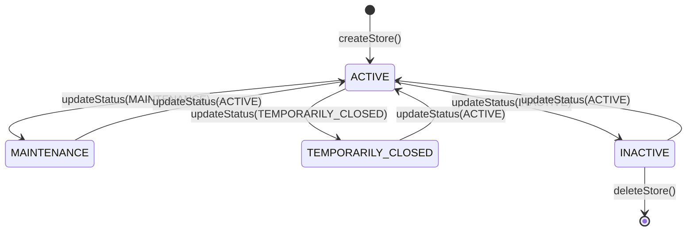
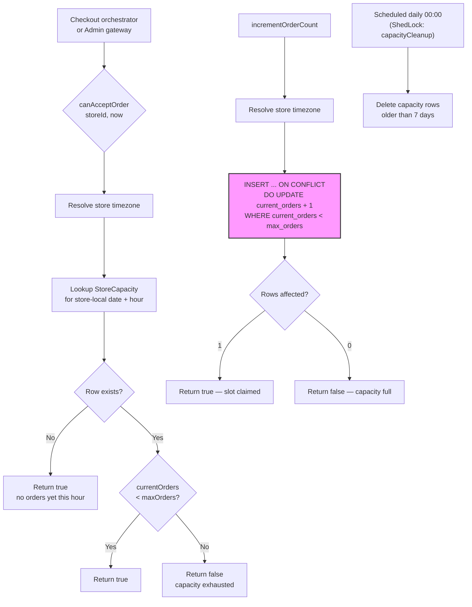
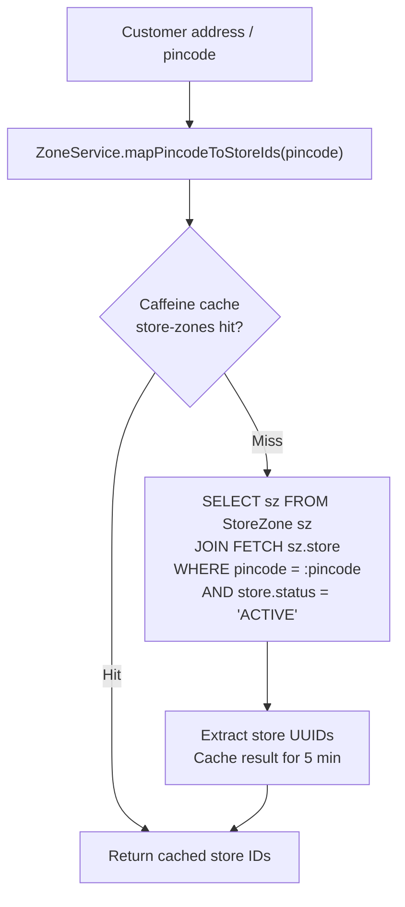

# Warehouse Service

> **Java 21 · Spring Boot 3 · Dark-Store Registry, Capacity Control & Delivery Zones**

| Attribute | Value |
|---|---|
| **Module path** | `services/warehouse-service` (canonical ID in `settings.gradle.kts`) |
| **Port** | `8090` |
| **Database** | PostgreSQL — `warehouse` |
| **Kafka topic** | `store.events` (via outbox + CDC relay) |
| **Flyway migrations** | V1–V7 |
| **Runtime** | JDK 21, ZGC, Eclipse Temurin Alpine |

---

## 1. Service Role and Boundaries

warehouse-service is the **authoritative owner of the physical dark-store entity** in InstaCommerce. It manages:

- **Store registry** — CRUD lifecycle with status machine (`ACTIVE`, `INACTIVE`, `MAINTENANCE`, `TEMPORARILY_CLOSED`).
- **Operating hours** — per-day-of-week open/close times with timezone-aware open-status checks (including overnight-span handling).
- **Hourly order capacity** — per-store, per-date, per-hour slot tracking with atomic UPSERT increment.
- **Delivery zones** — pincode-to-store mapping with per-zone delivery radius, supporting nearest-store queries via Haversine distance.
- **Outbox events** — `StoreCreated`, `StoreStatusChanged`, `StoreDeleted` published transactionally; externalized by Debezium CDC relay to Kafka.

**What this service does NOT own:**

| Concern | Owner | Integration |
|---|---|---|
| Per-SKU per-store stock counts | `inventory-service` | Separate DB; `store_id` identity gap documented in §12 |
| Reservation lifecycle (reserve/confirm/cancel) | `inventory-service` | Checkout-orchestrator calls both services |
| Picking/packing workflows | `fulfillment-service` | Consumes `StoreStatusChanged` events |
| Rider dispatch and ETA | `rider-fleet-service`, `routing-eta-service` | Downstream of order placement |

> **Key architectural note:** inventory-service's `store_id` (VARCHAR 50) has no referential link to warehouse-service's `stores.id` (UUID). This identity gap means reservations can today be created against non-existent or inactive stores. See `docs/reviews/iter3/services/inventory-dark-store.md` §4 for the planned `dark_stores` local-table fix.

---

## 2. High-Level Design (HLD)

### 2.1 System Context



### 2.2 Request Flow — Store Selection for Checkout



---

## 3. Low-Level Design (LLD)

### 3.1 Component Diagram



### 3.2 Domain Model (Entity-Relationship)



**Key database constraints and indexes:**

| Table | Constraint / Index | Purpose |
|---|---|---|
| `stores` | `idx_stores_status`, `idx_stores_city`, `idx_stores_pincode`, `idx_stores_lat_lng` | Filtered lookups, bounding-box pre-filter for Haversine |
| `store_hours` | `UNIQUE (store_id, day_of_week)` | One schedule entry per day per store |
| `store_capacity` | `UNIQUE (store_id, date, hour)` | Enables atomic UPSERT via `ON CONFLICT` |
| `store_zones` | `UNIQUE (store_id, pincode)`, `idx_store_zones_pincode` | One zone-mapping per pincode per store |
| `outbox_events` | `idx_outbox_unsent WHERE sent = false` | Partial index for CDC relay polling |

---

## 4. Store Lifecycle and Status Machine



**Notes from code (`StoreService.java`, `StoreStatus.java`):**

- `createStore()` sets initial status to `ACTIVE` (not `INACTIVE` — see `StoreService.createStore()` line 118).
- The status enum has four values: `ACTIVE`, `INACTIVE`, `MAINTENANCE`, `TEMPORARILY_CLOSED`.
- `updateStoreStatus()` does **not enforce transition guards** — any status can be set from any other status. The state diagram above shows the *intended* transitions; the code does not restrict them.
- `deleteStore()` performs a hard delete via JPA (`storeRepository.delete(store)`), not a soft delete. Cascading `ON DELETE CASCADE` removes related `store_hours`, `store_capacity`, and `store_zones` rows.
- Each status change emits a `StoreStatusChanged` outbox event with `{ storeId, previousStatus, newStatus }`.
- The `Store` entity uses `@Version` for JPA optimistic locking, protecting against concurrent status updates.

---

## 5. Capacity Management Flow



**Implementation details (`CapacityService.java`, `StoreCapacityRepository.java`):**

- Capacity tracking is per-store, per-date, per-hour using the store's configured timezone.
- `incrementOrderCount()` uses a PostgreSQL `INSERT ... ON CONFLICT DO UPDATE` (UPSERT) that atomically creates or increments the row. The `WHERE current_orders < max_orders` clause in the `DO UPDATE` branch makes the increment conditional — if the store is at capacity, 0 rows are affected and the method returns `false`.
- `maxOrders` for each hourly slot is derived from `stores.capacity_orders_per_hour` at increment time.
- The cleanup job runs daily at midnight with a ShedLock guard (`lockAtMostFor = PT30M`, `lockAtLeastFor = PT5M`) and deletes records older than 7 days.

---

## 6. Delivery Zone and Nearest-Store Lookup

### 6.1 Pincode-to-Store Resolution



### 6.2 Nearest-Store Query

The `StoreRepository.findNearestStores()` uses a native SQL query with:

1. **Bounding-box pre-filter** — `latitude BETWEEN lat ± (radiusKm / 111.0)` and longitude equivalent, converting km to approximate degrees for index-backed filtering.
2. **Haversine distance** — Full spherical distance calculation: `6371 * acos(cos·cos·cos + sin·sin)` with `LEAST(1.0, ...)` to clamp floating-point edge cases.
3. **Post-filter** — `WHERE distance_km <= :radiusKm` after the subquery, then `ORDER BY distance_km LIMIT :maxResults`.

Default radius is 10.0 km, max results is 5 (configurable via `WarehouseProperties`).

### 6.3 Delivery Radius

`ZoneService.getDeliveryRadius(storeId)` returns the `MAX(delivery_radius_km)` across all zones for a store. Default per-zone radius is `5.00 km` (from the `store_zones.delivery_radius_km` column default).

---

## 7. API Reference

### 7.1 StoreController — `/stores` (Public / Authenticated)

| Method | Path | Auth | Description |
|---|---|---|---|
| `GET` | `/nearest?lat=&lng=&radiusKm=` | Public | Nearest stores by Haversine (default 10 km, max 5) |
| `GET` | `/{id}` | Public | Store details with zones and hours |
| `GET` | `/{id}/capacity` | Authenticated | Current-hour capacity for the store |
| `GET` | `/{id}/open` | Authenticated | Timezone-aware open status check |
| `GET` | `/by-pincode?pincode=` | Authenticated | Map pincode → list of active store IDs |
| `GET` | `/by-city?city=` | Authenticated | All stores in a city |
| `GET` | `/{id}/zones` | Authenticated | Delivery zones for store |
| `GET` | `/{id}/delivery-radius` | Authenticated | Max delivery radius (km) across zones |

**Input validation on `/nearest`:** `lat` ∈ [-90, 90], `lng` ∈ [-180, 180] (Jakarta Validation annotations on `StoreController`).

### 7.2 AdminStoreController — `/admin/stores` (ADMIN role required)

| Method | Path | Description |
|---|---|---|
| `POST` | `/` | Create store (default capacity: 100 orders/hour) |
| `GET` | `/` | List stores (optional `?status=` filter; defaults to `ACTIVE`) |
| `GET` | `/{id}` | Get store by ID |
| `PATCH` | `/{id}/status?status=` | Update store status (emits `StoreStatusChanged` event) |
| `DELETE` | `/{id}` | Hard delete store + cascade (emits `StoreDeleted` event) |
| `POST` | `/{id}/capacity/increment` | Atomic increment of current-hour order count |
| `GET` | `/{id}/can-accept` | Check if store can accept one more order this hour |

### 7.3 Response Shapes

**StoreResponse** (from `StoreMapper.toResponse`):
```json
{
  "id": "uuid",
  "name": "Indiranagar Dark Store",
  "address": "100 Feet Road, Indiranagar",
  "city": "Bangalore",
  "state": "Karnataka",
  "pincode": "560038",
  "latitude": 12.97160000,
  "longitude": 77.64120000,
  "timezone": "Asia/Kolkata",
  "status": "ACTIVE",
  "capacityOrdersPerHour": 50,
  "zones": [{ "id": "uuid", "zoneName": "Zone A", "pincode": "560038", "deliveryRadiusKm": 5.00 }],
  "hours": [{ "id": "uuid", "dayOfWeek": 1, "opensAt": "06:00", "closesAt": "23:00", "isHoliday": false }],
  "createdAt": "2025-01-01T00:00:00Z",
  "updatedAt": "2025-01-15T10:00:00Z"
}
```

**CapacityResponse**:
```json
{
  "storeId": "uuid",
  "date": "2025-01-15",
  "hour": 10,
  "currentOrders": 32,
  "maxOrders": 50,
  "canAcceptOrders": true
}
```

**ErrorResponse** (structured, with trace ID):
```json
{
  "code": "STORE_NOT_FOUND",
  "message": "Store not found: <uuid>",
  "traceId": "abc123...",
  "timestamp": "2025-01-15T10:00:00Z",
  "details": []
}
```

---

## 8. Event Publishing (Outbox Pattern)

| Event | Trigger | Payload fields |
|---|---|---|
| `StoreCreated` | `POST /admin/stores` | `storeId`, `name`, `city`, `status` |
| `StoreStatusChanged` | `PATCH /admin/stores/{id}/status` | `storeId`, `previousStatus`, `newStatus` |
| `StoreDeleted` | `DELETE /admin/stores/{id}` | `storeId`, `name` |

**Mechanism:** `OutboxService.publish()` is annotated `@Transactional(propagation = MANDATORY)` — it can only execute within an existing transaction. Events are serialized to JSON and inserted into the `outbox_events` table with `sent = false`. The Debezium CDC connector reads from this table and publishes to Kafka topic `store.events`.

**Cleanup:** `OutboxCleanupJob` runs daily at 03:00 (ShedLock-guarded: `lockAtMostFor = PT30M`, `lockAtLeastFor = PT5M`) and deletes events where `sent = true AND created_at < now() - 30 days`.

**Downstream consumers** (from `docs/reviews/iter3/diagrams/lld/inventory-warehouse-reservation.md`):
- `inventory-service` — planned to consume `StoreStatusChanged` to populate a local `dark_stores` table for store-validation on the reserve path.
- `fulfillment-service` — consumes status changes to pause dispatch to maintenance/closed stores.
- `data-platform` — CDC pipeline feeds dbt staging models for store analytics.

---

## 9. Runtime and Configuration

### 9.1 Environment Variables

| Variable | Default | Source |
|---|---|---|
| `SERVER_PORT` | `8090` | application.yml |
| `WAREHOUSE_DB_URL` | `jdbc:postgresql://localhost:5432/warehouse` | application.yml |
| `WAREHOUSE_DB_USER` | `postgres` | application.yml |
| `WAREHOUSE_DB_PASSWORD` | — | GCP Secret Manager (`sm://db-password-warehouse`) |
| `WAREHOUSE_JWT_ISSUER` | `instacommerce-identity` | application.yml |
| `WAREHOUSE_JWT_PUBLIC_KEY` | — | GCP Secret Manager (`sm://jwt-rsa-public-key`) |
| `OTEL_EXPORTER_OTLP_TRACES_ENDPOINT` | `http://otel-collector.monitoring:4318/v1/traces` | application.yml |
| `OTEL_EXPORTER_OTLP_METRICS_ENDPOINT` | `http://otel-collector.monitoring:4318/v1/metrics` | application.yml |
| `TRACING_PROBABILITY` | `1.0` | application.yml |
| `ENVIRONMENT` | `dev` | application.yml |
| `LOG_LEVEL_ROOT` | `INFO` | logback-spring.xml |

### 9.2 Connection Pool (HikariCP)

| Setting | Value |
|---|---|
| `maximum-pool-size` | 20 |
| `minimum-idle` | 5 |
| `connection-timeout` | 5000 ms |
| `max-lifetime` | 1800000 ms (30 min) |

### 9.3 Caching

Caffeine cache with `recordStats()` enabled:

| Namespace | Key | Eviction |
|---|---|---|
| `stores` | Store UUID | 2000 entries max, 5-minute write-expiry |
| `store-zones` | Pincode string | Same |
| `store-hours` | (used by StoreService lookups) | Same |

Cache invalidation: `@CacheEvict(value = "stores", key = "#id")` on `updateStoreStatus`, `deleteStore`; `@CacheEvict(value = "stores", key = "#result.id()")` on `createStore`.

### 9.4 Scheduled Jobs

| Job | Cron | ShedLock name | Lock bounds | Action |
|---|---|---|---|---|
| `CapacityService.cleanupOldCapacityData` | `0 0 0 * * *` (midnight) | `capacityCleanup` | `PT5M` – `PT30M` | Delete capacity rows older than 7 days |
| `OutboxCleanupJob.cleanupSentEvents` | `0 0 3 * * *` (03:00) | `outboxCleanup` | `PT5M` – `PT30M` | Delete sent outbox events older than 30 days |

### 9.5 Security

| Endpoint pattern | Auth level |
|---|---|
| `/actuator/**`, `/error` | Permit all |
| `GET /stores/nearest`, `GET /stores/{id}` | Public |
| `GET /stores/{id}/capacity` | Authenticated (any valid JWT) |
| All other `/stores/**` | Authenticated |
| `/admin/**` | `ROLE_ADMIN` required |

**JWT validation:** RSA public key loaded at startup by `JwtKeyLoader` from GCP Secret Manager. Issuer must match `warehouse.jwt.issuer` (default: `instacommerce-identity`). Roles extracted from `roles` claim and prefixed with `ROLE_`.

**CORS:** Origins configurable via `warehouse.cors.allowed-origins`, defaults to `http://localhost:3000,https://*.instacommerce.dev`. Allowed headers include `Authorization`, `Content-Type`, `X-Request-Id`, `X-Idempotency-Key`.

### 9.6 Graceful Shutdown

- `server.shutdown: graceful` with `timeout-per-shutdown-phase: 30s`.
- Docker `HEALTHCHECK` uses `/actuator/health/liveness` with 30s interval, 5s timeout, 3 retries.

### 9.7 JVM and Container

From `Dockerfile`:
- Multi-stage build: Gradle 9.4 + JDK 21 → Eclipse Temurin 25 JRE Alpine.
- Non-root user (`app:1001`).
- JVM flags: `-XX:MaxRAMPercentage=75.0 -XX:+UseZGC`.

---

## 10. Dependencies

### 10.1 Runtime

| Dependency | Version | Purpose |
|---|---|---|
| Spring Boot Starter Web | 3.x (BOM) | REST controllers, embedded Tomcat |
| Spring Boot Starter Data JPA | 3.x | Hibernate 6, repository abstractions |
| Spring Boot Starter Security | 3.x | Filter chain, method security |
| Spring Boot Starter Validation | 3.x | Jakarta Validation annotations |
| Spring Boot Starter Actuator | 3.x | Health probes, Prometheus metrics |
| Spring Boot Starter Cache | 3.x | `@Cacheable` / `@CacheEvict` |
| Caffeine | 3.1.8 | In-process cache with stats |
| ShedLock Spring + JDBC | 5.12.0 | Distributed scheduled-job coordination |
| JJWT (api + impl + jackson) | 0.12.5 | JWT parsing and RSA signature verification |
| Flyway Core + PostgreSQL | BOM | Schema migration |
| PostgreSQL JDBC | Runtime | Database driver |
| Micrometer Tracing Bridge OTEL | BOM | Distributed tracing via OTLP |
| Micrometer Registry OTLP | BOM | Metrics export via OTLP |
| Logstash Logback Encoder | 7.4 | Structured JSON logging |
| GCP Spring Cloud SecretManager | BOM | `sm://` secret references in YAML |
| Cloud SQL Socket Factory | 1.15.0 | GCP Cloud SQL connectivity |
| `contracts` (project dependency) | Local | Shared Protobuf / event schemas |

### 10.2 Test

| Dependency | Purpose |
|---|---|
| Spring Boot Starter Test | JUnit 5 + MockMvc + AssertJ |
| Spring Security Test | `@WithMockUser`, `SecurityMockMvcRequestPostProcessors` |
| Testcontainers PostgreSQL | 1.19.3 — containerized PostgreSQL for integration tests |
| Testcontainers JUnit Jupiter | 1.19.3 — JUnit 5 lifecycle |

---

## 11. Observability

### 11.1 Health Probes

| Endpoint | Purpose | Includes |
|---|---|---|
| `/actuator/health/liveness` | Kubernetes liveness probe | `livenessState` |
| `/actuator/health/readiness` | Kubernetes readiness probe | `readinessState`, `db` (datasource check) |
| `/actuator/health` | Full health with details | All indicators (`show-details: always`) |

### 11.2 Metrics

- **Prometheus endpoint:** `/actuator/prometheus` (exposed via `management.endpoints.web.exposure.include`).
- **OTLP export:** Metrics pushed to OTLP collector at configured endpoint.
- **Tags:** `service=warehouse-service`, `environment=${ENVIRONMENT}`.
- **Cache stats:** Caffeine configured with `recordStats()` — exposes `cache.gets`, `cache.puts`, `cache.evictions` via Micrometer.

### 11.3 Tracing

- Micrometer OTEL bridge with configurable sampling probability (default `1.0` — 100% in dev).
- Traces exported to OTLP endpoint (HTTP, not gRPC).
- `TraceIdProvider` resolves trace IDs from `traceId` MDC, `X-B3-TraceId`, `X-Trace-Id`, `traceparent`, or `X-Request-Id` headers (in that order). Falls back to random UUID.
- All error responses include the resolved `traceId` for correlation.

### 11.4 Structured Logging

`logback-spring.xml` uses `LogstashEncoder` for JSON-structured log output with custom fields `service` and `environment`. Root level controlled by `LOG_LEVEL_ROOT` env var.

---

## 12. Testing

### 12.1 Test Infrastructure

The `build.gradle.kts` wires Testcontainers (PostgreSQL 1.19.3) and `spring-boot-starter-test`. Tests use JUnit Platform (`useJUnitPlatform()`).

### 12.2 Running Tests

```bash
# All warehouse-service tests
./gradlew :services:warehouse-service:test

# Single test class
./gradlew :services:warehouse-service:test --tests "com.instacommerce.warehouse.<ClassName>"

# Single test method
./gradlew :services:warehouse-service:test --tests "com.instacommerce.warehouse.<ClassName>.<method>"
```

### 12.3 Current State

**No test source directory exists** (`src/test/` is absent). The Testcontainers dependency is declared but unused. This is a significant gap — the service has no automated test coverage. Priority test targets should include:

- `CapacityService.incrementOrderCount()` — UPSERT atomicity and capacity-exceeded behavior.
- `StoreService.isStoreOpen()` — timezone conversion, overnight-span hours, holiday flag.
- `StoreRepository.findNearestStores()` — Haversine correctness at boundary distances.
- `SecurityConfig` — public vs authenticated vs ADMIN endpoint access.
- `OutboxService.publish()` — transactional guarantee (must fail if no enclosing transaction).

---

## 13. Failure Modes and Error Handling

| Failure | Behavior | Error code | HTTP status |
|---|---|---|---|
| Store not found | `StoreNotFoundException` → `ApiException` | `STORE_NOT_FOUND` | 404 |
| Capacity exceeded | `CapacityExceededException` | `CAPACITY_EXCEEDED` | 429 |
| Invalid JWT | `JwtAuthenticationFilter` catches `JwtException` | `TOKEN_INVALID` | 401 |
| Missing JWT on protected endpoint | `RestAuthenticationEntryPoint` | `AUTHENTICATION_REQUIRED` | 401 |
| Insufficient role | `RestAccessDeniedHandler` | `ACCESS_DENIED` | 403 |
| Validation error (body/params) | `MethodArgumentNotValidException` / `ConstraintViolationException` | `VALIDATION_ERROR` | 400 |
| Invalid timezone string | `IllegalArgumentException` caught by `GlobalExceptionHandler` | `VALIDATION_ERROR` | 400 |
| Unhandled exception | `GlobalExceptionHandler.handleFallback()` logs full stack trace | `INTERNAL_ERROR` | 500 |
| Database unreachable | Readiness probe (`/actuator/health/readiness`) fails; liveness stays up | — | — |
| Optimistic lock conflict (`@Version`) | Spring `ObjectOptimisticLockingFailureException` → unhandled → 500 | `INTERNAL_ERROR` | 500 |
| HikariCP pool exhaustion | Connection timeout after 5000 ms → unhandled → 500 | `INTERNAL_ERROR` | 500 |

**Gaps in error handling:**
- `ObjectOptimisticLockingFailureException` is not explicitly caught by `GlobalExceptionHandler`. Concurrent status updates on the same store will surface as 500 instead of 409 Conflict.
- `DataIntegrityViolationException` (e.g., duplicate zone pincode) is not handled — falls through to the generic 500 handler.
- `OutboxService.publish()` uses `Propagation.MANDATORY` — calling it without an enclosing transaction throws `IllegalTransactionStateException`, caught as 500.

---

## 14. Rollout and Rollback Notes

### 14.1 Deployment

- **CI:** `.github/workflows/ci.yml` path filter `services/warehouse-service/**` triggers Java build/test job. Service is in the `all_services` full-validation list.
- **Helm:** `deploy/helm/values-dev.yaml` key `warehouse-service` maps to the GitOps deploy target.
- **Docker:** Multi-stage Dockerfile, non-root, ZGC, health-checked.

### 14.2 Flyway Migration Safety

Migrations V1–V7 are applied on startup (`spring.flyway.enabled: true`, `spring.jpa.hibernate.ddl-auto: validate`). Rolling forward a new migration requires:

1. New `V8__*.sql` file in `src/main/resources/db/migration/`.
2. Migration must be backward-compatible (additive columns with defaults, new tables) to support blue-green deploy.
3. For breaking schema changes, use a two-phase approach: add in V(N), backfill, then drop old column in V(N+1) after all instances are on V(N).

### 14.3 Rollback Considerations

- **Stateless app layer** — rolling back to a prior container image is safe as long as the database schema is backward-compatible.
- **Outbox events** — rolling back does not retract published events. Downstream consumers must be idempotent.
- **Cache** — Caffeine is in-process; rollback clears cache implicitly on pod restart.
- **ShedLock** — lock entries auto-expire (`lock_until`). No manual cleanup needed on rollback.

---

## 15. Known Limitations

| # | Limitation | Impact | Reference |
|---|---|---|---|
| 1 | **No referential link between warehouse `stores.id` (UUID) and inventory `store_id` (VARCHAR)** | Reservations can target nonexistent/inactive stores | `docs/reviews/iter3/services/inventory-dark-store.md` §4 |
| 2 | **No status transition guards** | Any status can be set from any other; no validation of allowed transitions | `StoreService.updateStoreStatus()` |
| 3 | **Hard delete, not soft delete** | `deleteStore()` removes the row and cascades; no audit trail or undo | `StoreService.deleteStore()` |
| 4 | **No test coverage** | `src/test/` directory does not exist despite Testcontainers dependency | `build.gradle.kts` |
| 5 | **Optimistic lock conflicts surface as 500** | `@Version` on `Store` can cause `ObjectOptimisticLockingFailureException` not caught by handler | `GlobalExceptionHandler.java` |
| 6 | **No pagination on list endpoints** | `findByCity()`, `findByStatus()` return all rows | `StoreRepository.java` |
| 7 | **Capacity UPSERT uses store-local time but `canAcceptOrder` reads may race** | Two threads checking then incrementing can both succeed if close to `maxOrders` | `CapacityService.java` |
| 8 | **Zone cache uses pincode as key but does not evict on zone CRUD** | Stale zone-to-store mappings persist for up to 5 minutes after zone changes | `ZoneService.java` |
| 9 | **No zone/hours CRUD API** | Admin can only create stores; no endpoints to manage zones or hours post-creation | `AdminStoreController.java` |
| 10 | **No unified "which store serves this cart" API** | Store selection requires multiple sequential calls from BFF or checkout-orchestrator | `docs/reviews/iter3/diagrams/lld/inventory-warehouse-reservation.md` §2.4 |

---

## 16. Q-Commerce Warehouse Pattern Comparison

The following comparison is grounded in public signals documented in `docs/reviews/iter3/benchmarks/india-operator-patterns.md` and cross-referenced against this service's implementation.

| Capability | Blinkit / Zepto / Swiggy Instamart (public signals) | InstaCommerce warehouse-service |
|---|---|---|
| **Store registry with capacity** | Per-store ops dashboards, dynamic capacity adjustment | ✅ Hourly capacity tracking with atomic UPSERT |
| **Timezone-aware operating hours** | Implied by multi-city ops across IST/regional zones | ✅ Per-store timezone, overnight-span handling |
| **Nearest-store by geo** | Hyperlocal store selection by lat/lng + zone | ✅ Haversine with bounding-box pre-filter |
| **Pincode → store mapping** | Zone-based delivery assignment | ✅ `store_zones` with pincode + radius |
| **Stock truth (3+ bucket model)** | `available` / `promised` / `actual` / `in_transit` | ❌ Not in warehouse-service scope (see inventory-service) |
| **FEFO / lot-level picking** | Lot ID + expiry-driven pick guidance | ❌ Not implemented anywhere in the monorepo |
| **Barcode-driven GRN receiving** | PO-receive event on scan | ❌ No receiving workflow |
| **Cycle-count reconciliation** | Daily/shift-end mandatory counts | ❌ No cycle-count workflow |
| **Unified store-selection API** | Single call resolving zone + capacity + stock | ❌ Requires multi-call orchestration |

The warehouse-service covers the **store registry and operational capacity** layer well. The major q-commerce gaps (stock truth, FEFO, receiving, cycle counts) are in inventory-service's domain and documented in the iter3 review as 🔴 blocking items.

---

## 17. Build and Run

```bash
# Build (skip tests — no tests exist yet)
./gradlew :services:warehouse-service:build -x test

# Run locally (requires PostgreSQL on localhost:5432/warehouse + JWT key)
./gradlew :services:warehouse-service:bootRun

# Docker build and run
docker build -t warehouse-service -f services/warehouse-service/Dockerfile .
docker run -p 8090:8090 \
  -e WAREHOUSE_DB_URL=jdbc:postgresql://host.docker.internal:5432/warehouse \
  -e WAREHOUSE_JWT_PUBLIC_KEY="$(cat public-key.pem)" \
  warehouse-service

# Run tests (when test sources exist)
./gradlew :services:warehouse-service:test
```

Local infrastructure (PostgreSQL, Kafka, etc.) can be started with `docker-compose up -d` from the repo root.
