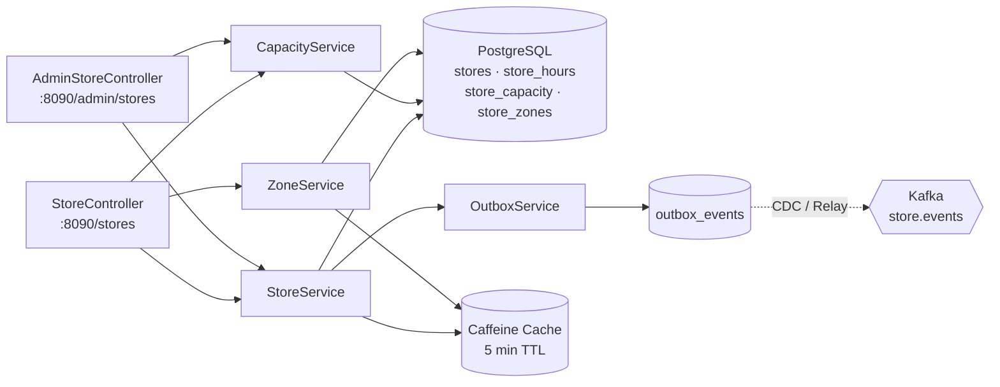
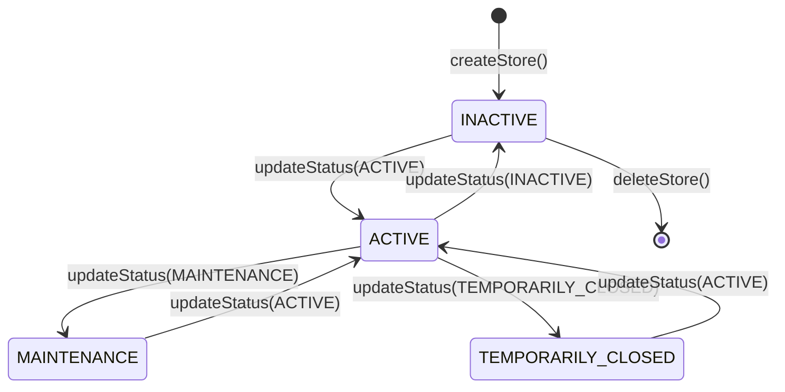
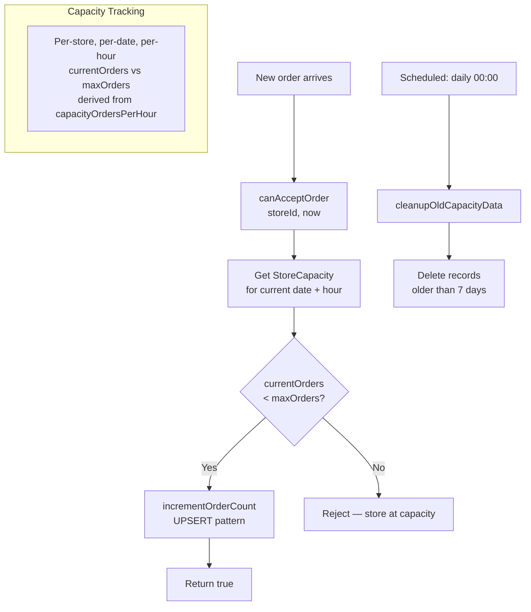
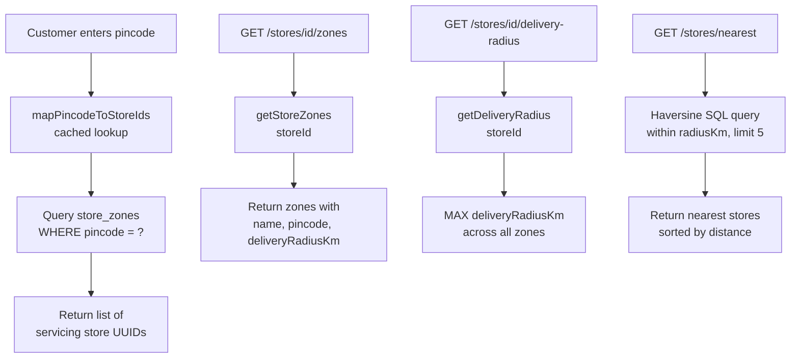
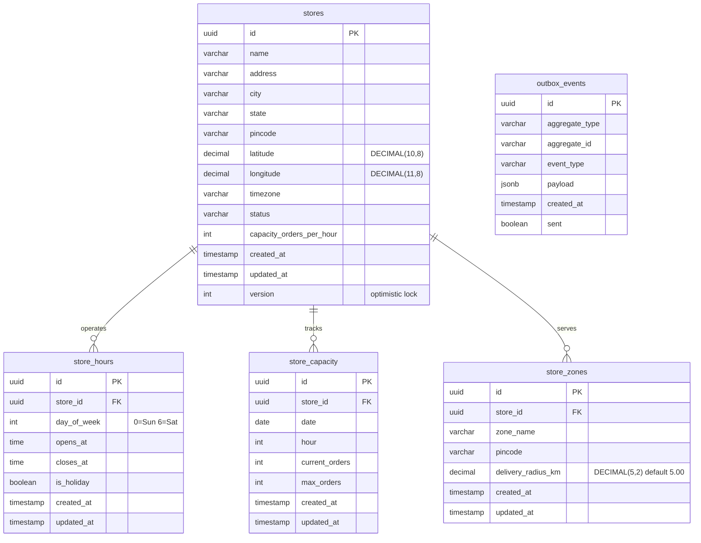

# Warehouse Service

> **Java · Spring Boot · Dark Store Management, Capacity Planning & Zones**

Manages dark store (warehouse) lifecycle, hourly order-capacity tracking, operating-hours enforcement with timezone awareness, and delivery-zone configuration with pincode-based store lookup. Events are published via the transactional outbox pattern. Nearest-store discovery uses Haversine distance with configurable radius.

## Architecture



## Store Lifecycle



## Capacity Management



## Zone Configuration



## API Reference

### StoreController — `/stores` (Public / Authenticated)

| Method | Path | Auth | Description |
|--------|------|------|-------------|
| `GET` | `/nearest?lat=&lng=&radiusKm=` | None | Find nearest stores (default 10 km, max 5 results) |
| `GET` | `/{id}` | None | Get store details |
| `GET` | `/{id}/capacity` | Authenticated | Get current hour capacity |
| `GET` | `/{id}/open` | Authenticated | Check if store is currently open (timezone-aware) |
| `GET` | `/by-pincode?pincode=` | Authenticated | Map pincode to store IDs |
| `GET` | `/by-city?city=` | Authenticated | List stores in a city |
| `GET` | `/{id}/zones` | Authenticated | List delivery zones for store |
| `GET` | `/{id}/delivery-radius` | Authenticated | Get max delivery radius (km) |

**Store Response:**
```json
{
  "id": "uuid",
  "name": "Indiranagar Dark Store",
  "address": "100 Feet Road, Indiranagar",
  "city": "Bangalore",
  "state": "Karnataka",
  "pincode": "560038",
  "latitude": 12.9716,
  "longitude": 77.6412,
  "timezone": "Asia/Kolkata",
  "status": "ACTIVE",
  "capacityOrdersPerHour": 50,
  "createdAt": "2025-01-01T00:00:00Z",
  "updatedAt": "2025-01-15T10:00:00Z"
}
```

**Capacity Response:**
```json
{
  "storeId": "uuid",
  "date": "2025-01-15",
  "hour": 10,
  "currentOrders": 32,
  "maxOrders": 50
}
```

### AdminStoreController — `/admin/stores` (ADMIN only)

| Method | Path | Auth | Description |
|--------|------|------|-------------|
| `POST` | `/` | ADMIN | Create a new store |
| `GET` | `/` | ADMIN | List all stores (optional `?status=` filter) |
| `GET` | `/{id}` | ADMIN | Get store details |
| `PATCH` | `/{id}/status?status=` | ADMIN | Update store status |
| `DELETE` | `/{id}` | ADMIN | Delete a store (soft) |
| `POST` | `/{id}/capacity/increment` | ADMIN | Increment current-hour order count |
| `GET` | `/{id}/can-accept` | ADMIN | Check if store can accept another order |

**Create Store Request:**
```json
{
  "name": "Koramangala Dark Store",
  "address": "80 Feet Road, Koramangala",
  "city": "Bangalore",
  "state": "Karnataka",
  "pincode": "560034",
  "latitude": 12.9352,
  "longitude": 77.6245,
  "timezone": "Asia/Kolkata",
  "capacityOrdersPerHour": 60
}
```

## Database Schema



**Indexes:** `store_capacity(store_id, date, hour)` composite index. `stores` queried via Haversine native SQL for proximity lookups.

## Event Publishing (Outbox Pattern)

| Event | Trigger | Payload |
|-------|---------|---------|
| `StoreCreated` | `POST /admin/stores` | `{ storeId, name, city, status }` |
| `StoreStatusChanged` | `PATCH /admin/stores/{id}/status` | `{ storeId, previousStatus, newStatus }` |
| `StoreDeleted` | `DELETE /admin/stores/{id}` | `{ storeId, name }` |

Events are written to the `outbox_events` table within the same transaction as the business operation, then externalized by an outbox relay / CDC process.

## Configuration

| Variable | Default | Description |
|----------|---------|-------------|
| `SERVER_PORT` | `8090` | HTTP listen port |
| `SPRING_DATASOURCE_URL` | — | PostgreSQL JDBC URL |
| `WAREHOUSE_NEAREST_RADIUS_KM` | `10` | Default radius for nearest-store queries |
| `WAREHOUSE_NEAREST_MAX_RESULTS` | `5` | Max stores returned by nearest query |
| `JWT_PUBLIC_KEY` | — | RSA public key (GCP Secret Manager) |
| `OTEL_EXPORTER_OTLP_ENDPOINT` | `otel-collector.monitoring:4318` | OpenTelemetry collector |

### Caching

Caffeine cache with 3 namespaces: `stores`, `store-zones`, `store-hours` — 2 000 entries max, 5-minute write-expiry TTL.

### Scheduled Jobs

| Job | Schedule | Lock | Description |
|-----|----------|------|-------------|
| `CapacityService.cleanupOldCapacityData` | Daily 00:00 | ShedLock | Deletes capacity records older than 7 days |
| `OutboxCleanupJob.cleanupSentEvents` | Daily 03:00 | ShedLock | Deletes sent outbox events older than 30 days |

### Security

- **Public endpoints:** `GET /stores/nearest`, `GET /stores/{id}`
- **Authenticated:** All other `/stores/**` endpoints
- **Admin only:** All `/admin/**` endpoints
- **CORS:** `http://localhost:3000`, `https://*.instacommerce.dev`

## Build & Run

```bash
# Local
./gradlew :services:warehouse-service:bootRun

# Docker
docker build -t warehouse-service .
docker run -p 8090:8090 warehouse-service
```

## Dependencies

- Java 21, Spring Boot 3 (Web, Data JPA, Security, Validation, Actuator, Cache)
- PostgreSQL + Flyway migrations
- Caffeine 3.1.8 (multi-namespace caching)
- ShedLock 5.12.0 (distributed scheduling)
- JJWT 0.12.5 (JWT authentication)
- Micrometer + OTLP (tracing & metrics)
- GCP Secret Manager, Cloud SQL socket factory
- Testcontainers (PostgreSQL integration tests)
